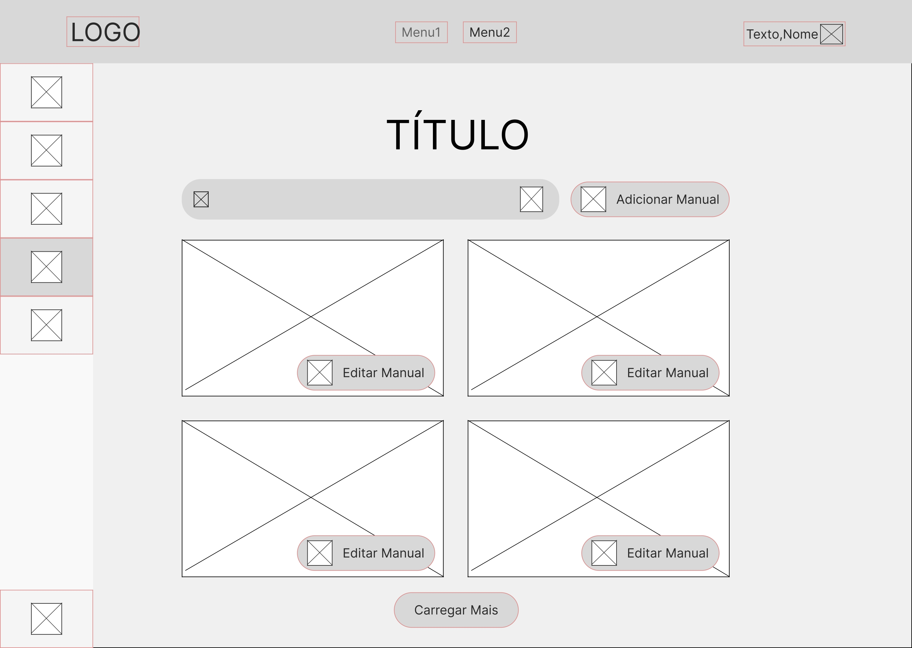
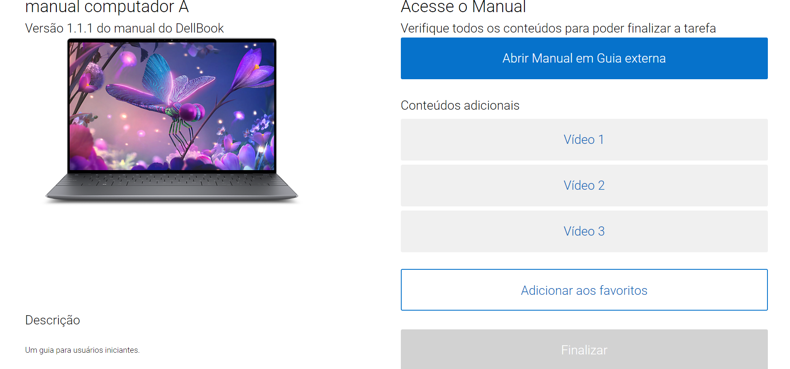

# WAD - Web Application Document - Módulo 2 - Inteli

## Dellvelopers

### Integrantes

<a href="https://www.linkedin.com/in/anacdejesus/">Ana Carolina Pacheco Jesus</a> - Estudante de Ciência da Computação

<a href="https://www.linkedin.com/in/enzo-barci-a7631b2b4/">Enzo Salvador Barci</a> - Estudante de Engenharia de Software

<a href="https://www.linkedin.com/in/kesneylucas/">Kesney Lucas Ferro de Oliveira</a> - Estudante de Engenharia de Software

<a href="https://www.linkedin.com/in/matheusjorgerosa/">Matheus Jorge Rosa</a> - Estudante de Engenharia de Software

<a href="https://www.linkedin.com/in/roberto-dbf/">Roberto Diniz Branco Filho</a> - Estudante de Engenharia da Computação

<a href="https://www.linkedin.com/in/yanoma-konwski-970ab22b2/">Yanomã Fernandes Konwski</a> - Estudante de Engenharia de Software

<a href="https://www.linkedin.com/in/yasmin-minario/">Yasmin Ingrid Silva Minário</a> - Estudante de Sistemas da Informação

<br>

## Sumário

[1. Introdução](#c1)

[2. Visão Geral da Aplicação Web](#c2)

[3. Projeto Técnico da Aplicação Web](#c3)

[4. Desenvolvimento da Aplicação Web](#c4)

[5. Testes da Aplicação Web](#c5)

[6. Conclusões e trabalhos futuros](#c6)

[7. Referências](#c7)

[Anexos](#c8)

<br>

# <a name="c1"></a>1. Introdução

&nbsp;&nbsp;&nbsp;&nbsp;
Atualmente, observa-se uma deficiência nos métodos de treinamento adotados pela empresa Dell Technologies. Essa lacuna é refletida na ineficácia do processo de aprendizagem, resultando em períodos prolongados de familiarização com novas tarefas ou processos, acompanhados por uma alta incidência de erros. Consequentemente, a produtividade do treinamento é comprometida, exercendo um impacto negativo nas linhas de montagem e estendendo desnecessariamente os prazos de conclusão das montagens (TAPI, 2024).

&nbsp;&nbsp;&nbsp;&nbsp;
Após uma análise do desafio enfrentado pela empresa, tornou-se evidente que uma solução para otimizar a produtividade e a eficiência do treinamento seria a implementação de uma Aplicação _Web_ dedicada. Esta plataforma tem a missão de fornecer acesso facilitado a manuais abrangentes que abordam todos os aspectos do processo de montagem de diversos produtos da empresa. Assim, os processos de montagem seriam otimizados não só ao tornar o aprendizado de procedimentos mais acessével, mas também ao diminuir os erros passíveis de acontecerem no processo de montagem.

<div align="center">
<sub>Figura 1 - Logo Dell Technologies</sub>

<sup>Fonte: Logotipo disponibilizada no wikipédia (2024)</sup>
</div>

# <a name="c2"></a>2. Visão Geral da Aplicação Web

## 2.1. Escopo do Projeto

### 2.1.1. Contexto da indústria

&nbsp;&nbsp;&nbsp;&nbsp;
O mercado tecnológico, área de atuação da Dell Technologies, é dinâmico e está em constante evolução, com uma demanda crescente por inovações e soluções que impulsionem a eficiência em diversos segmentos. No setor de montagem de computadores e servidores, essa busca por aprimoramentos visa criar dispositivos cada vez mais aptos a atender as exigências dos clientes. Consequentemente, a geração contínua de soluções que integrem as novas tendências do mercado, como o surgimento das Inteligências Artificiais e o Aprendizado de Máquinas, resultou na necessidade de aprimorar o sistema de hardware dos dispositivos.

&nbsp;&nbsp;&nbsp;&nbsp;
Atualmente, no mercado de montagem, várias empresas operam de forma semelhante, incluindo gigantes como Apple Inc., Lenovo e Dell Technologies. No caso específico da Dell, sua atuação é global, abrangendo tanto a produção quanto a distribuição, com principais polos localizados nos Estados Unidos e Índia, onde são conduzidas pesquisas, desenvolvimento e, principalmente, fabricação.

&nbsp;&nbsp;&nbsp;&nbsp;
Uma das estratégias fundamentais que diferenciam a Dell das demais no mercado é o Modelo Direto de Negócios, que estabelece uma relação direta com os clientes, facilitando a fidelização. Além disso, a empresa demonstra uma notável capacidade de adaptação, mantendo-se como protagonista do setor por mais de 30 anos. Para esse projeto, a área de montagem de computadores terá o maior destaque.

### 2.1.2. Modelo de 5 Forças de Porter

&nbsp;&nbsp;&nbsp;&nbsp;
De acordo com Porter, o modelo de 5 forças analisa a competitividade de um setor, destacando as ameaças dos concorrentes, o poder dos fornecedores e compradores, bem como as ameaças de novos entrantes e produtos substitutos. Essa abordagem visa proporcionar uma compreensão aprofundada do ambiente mercadológico em que a empresa opera (MAGRETTA, 2019).

&nbsp;&nbsp;&nbsp;&nbsp;Na figura 2, apresentamos um template de como as 5 Forças de Porter se relacionam.

<div align="center">
<sub>Figura 2 — Template 5 Forças de Porter</sub>

<sup>Fonte: Material produzido pelos autores (2024)</sup>
</div>

**Poder de barganha dos clientes (Baixo)**:
A Dell alcança um grande número de consumidores diretamente. Além de oferecer uma série de benefícios que contribuem para um poder de barganha dos clientes ser considerado baixo. A oferta de produtos altamente customizáveis, permitindo que os usuários escolham as especificações de hardware de acordo com suas necessidades. Além disso, possui programas de fidelidade e estratégias de marketing que visam manter os clientes satisfeitos e fiéis à marca, criando uma experiência que atende às suas necessidades pessoais, reduzindo a disposição destes em negociar preços.

**Poder de barganha do fornecedor (Alto)**:
A Dell é uma montadora de computadores que compra todos seus componentes de fornecedores. Nesse contexto, a empresa depende de provedores estratégicos para a construção de seus computadores. Por exemplo, fornecedores de componentes , carcaças, matérias-primas exclusivas ou essenciais, como chips, placas de vídeo e processadores. A vista disso, o poder de barganha dos fornecedores é alto devido a intensa dependência dos abastecedores.

**Rivalidade entre concorrentes (Alto)**:
Existe uma intensa rivalidade entre as empresas como: Samsung, Apple, HP , Lenovo, etc, que operam neste mercado tecnológico. Isso ocorre porque todas elas estão constantemente buscando lucros e melhores resultados. Consequentemente, estão sempre desenvolvendo suas atividades para atrair o maior número possível de clientes e, assim, superar seus concorrentes em vendas. Para alcançar esses resultados significativos, é crucial ter diferenciais e destacar-se em relação a outras empresas que oferecem produtos e soluções semelhantes.

**Ameaça de novos entrantes (Baixo)**:
A ameaça de novos entrantes é baixa devido à natureza altamente competitiva do mercado tecnológico, caracterizado como um verdadeiro "mar vermelho", com a presença de grandes empresas neste seguimento de negócio. Entrar nesse nicho, conhecido por sua intensa competição, é complexo devido à considerável necessidade de capital exigida para rivalizar com essas marcas consolidadas, que desfrutam de reputação sólida, infraestrutura estabelecida e tecnologias avançadas.

**Ameaça de produtos substitutos (Alta)**:
A ameaça de produtos substitutos é alta, uma vez que se trata de um mercado altamente competitivo e dinâmico. Isso ocorre porque constantemente novas tecnologias estão sendo inventadas e atualizadas, demandando atualizações contínuas na capacidade de processamento dos sistemas operacionais. Desta forma, caso a Dell não acompanhe constantemente as tecnologias emergentes, ela poderá perder espaço no mercado e sofrer com a substituição de seus produtos.

### 2.1.3. Análise SWOT 

&nbsp;&nbsp;&nbsp;&nbsp;
A análise SWOT, ou FOFA, é uma ferramenta que estuda os aspectos internos e externos de uma empresa, proporcionando uma visão abrangente do projeto em questão. Por meio dela, são identificadas as forças, fraquezas, oportunidades e ameaças, possibilitando uma avaliação estratégica detalhada (FERNANDES, 2015).

<div align="center">
<sub>Figura 3 - Análise SWOT</sub>

<sup>Fonte: Material produzido pelos autores (2024)</sup>
</div>

#### Forças:

- Serviços pós-compra: <br> &nbsp;&nbsp;&nbsp;&nbsp; Atualmente, a Dell Technologies oferece um extenso suporte pós-venda, composto por sistemas dedicados à manutenção dos produtos. Essa abordagem não apenas eleva a satisfação do cliente, mas também reforça a credibilidade da marca.

- Inovação em processos internos: <br> &nbsp;&nbsp;&nbsp;&nbsp;Com uma constante busca de como aprimorar sua eficácia nas linhas de montagem, a Dell busca desenvolver soluções para melhoria de seus processos internos de produção através da modularização de suas linhas de montagem. Assim, a companhia é capaz de responder a pedidos sob demanda, evitando grandes estoques.

#### Fraquezas:

- Dependência em relação aos fornecedores: <br> &nbsp;&nbsp;&nbsp;&nbsp; A linha de montagem na fábrica da Dell depende de diversas peças fornecidas por outras empresas, que precisam ser entregues com pontualidade e qualidade para evitar atrasos e falhas nas montagens. Caso não seja possível adquirir o material do fornecedor a tempo, a empresa terá que buscar outras opções e isso pode atrasar processos.

- Externalização dos serviços pós-compra: <br> &nbsp;&nbsp;&nbsp;&nbsp; Com os serviços externalizados, a empresa estabelece uma ligação entre o fornecedor e o cliente, resultando na terceirização e na perda de controle direto sobre essa área de serviço.

- Produção escassa de novas tecnologias de hardware: <br> &nbsp;&nbsp;&nbsp;&nbsp; Como uma empresa centrada na fabricação e montagem de computadores, a Dell não tem desfrutado de um protagonismo pronunciado no desenvolvimento de tecnologias e serviços que impulsionam a inovação no setor. Isso a torna dependente das novidades externas para poder aplicar em seus produtos.

#### Oportunidades:

- Promoção em redes sociais:<br> &nbsp;&nbsp;&nbsp;&nbsp; Com o atual poder de propagação advindo das redes sociais, é conveniente para a Dell fazer uso dessa estratégia para estabelecer a visão do público, principalmente dos usuários finais, sobre a empresa.

- Diferença nos custos de produção:<br> &nbsp;&nbsp;&nbsp;&nbsp; Pela Dell ter alta variedade na área de instalações, é de conveniência que se analise os custos de produção em diferentes polos industriais, para definir as melhores oportunidades de negócio.

- Parcerias com iniciativas do ramo educacional e corporativo:<br> &nbsp;&nbsp;&nbsp;&nbsp; Com a disponibilização de recursos para instituições acadêmicas e corporativas, a empresa parceira tem a oportunidade de fazer um investimento em futuros profissionais que podem atuar na área de tecnologia e, ao mesmo tempo, estabelecer a credibilidade da marca.

#### Ameaças:

- Crescimento de outras marcas:<br> &nbsp;&nbsp;&nbsp;&nbsp; O vasto e dinâmico mercado tem visto um aumento na influência de diversos concorrentes nas últimas duas décadas, o que pode deixar a Dell em segundo plano como opção do cliente.

- Volatilidade de mercado:<br> &nbsp;&nbsp;&nbsp;&nbsp; A empresa Dell enfrenta uma alta taxa de importação, tornando as questões alfandegárias uma ameaça quando mudanças financeiras de alto impacto e imprevisíveis ocorrem. Por exemplo, em caso de inflação, as taxas de câmbio aumentam, elevando o custo de importação para a empresa.

### 2.1.4. Solução :

#### 1. Problema a ser resolvido

&nbsp;&nbsp;&nbsp;&nbsp;
Notou-se uma lacuna nos métodos de capacitação adotados pela empresa, refletida na limitação do aprendizado e em períodos prolongados de adaptação, com erros significativos. Isso compromete a eficácia do treinamento, afetando as linhas de montagem e estendendo os prazos (TAPI, 2024).

#### 2. Dados disponíveis

&nbsp;&nbsp;&nbsp;&nbsp;
Além da disponibilização do padrão de design a ser seguido ao longo do projeto (DELL Design System), também tem-se a descrição dos dados feita pelos representantes da empresa de como é a rotina dos usuários finais da aplicação. Além disso, foi viabilizado um exemplo de manual de produto e as categorias dos produtos ofercidos pela Dell, com suas respectivas versões (DDS, 2024).

#### 3. Solução proposta

&nbsp;&nbsp;&nbsp;&nbsp;
A solução contempla uma Aplicação _Web_ que fornecerá acesso a manuais pertencentes à empresa, abordando todos os aspectos do processo de montagem. Esse projeto contemplará desde funcionários novos até os mais experientes, permitindo revisão, aprimoramento e atualização de procedimentos que realizam diariamente.

#### 4. Utilização da solução

&nbsp;&nbsp;&nbsp;&nbsp;
A solução será implementada na fábrica da Dell, disponibilizando uma plataforma de treinamento individual para os funcionários que trabalham nas linhas de montagem da empresa. Esta plataforma irá conter manuais de montagem que descrevem o funcionamento e a logística proposta pela Dell. Através da solução proposta, os funcionários terão acesso a uma plataforma que concentra todas as informações importantes sobre o processo de montagem de cada equipamento, permitindo que aprendam novos processos e revisem conceitos já estudados para melhorar seu desempenho.

#### 5. Benefícios

&nbsp;&nbsp;&nbsp;&nbsp;
A aplicação _web_ terá o objetivo de aumentar a eficiência dos processos da fábrica, proporcionando fácil acesso, conteúdo completo e atualizado, além de ser de fácil manuseio e acessível para qualquer dispositivo. Ela oferecerá um grande leque de tutoriais, atividades atribuídas e recursos para o gerenciamento de contas e tarefas, com a intenção de acelerar a disponibilidade de informações aos montadores, melhorando a jornada de trabalho e a qualidade da produção dos funcionários da Dell.

#### 6. Critério de sucesso e medidas de avaliação

&nbsp;&nbsp;&nbsp;&nbsp;
Os critérios de sucesso e medidas de avaliação são fundamentais para o MVP, conforme definido no TAPI da Dell. Incluem requisitos sugeridos pelos parceiros, como funcionalidades de cadastro, _login_ de usuários, perfis de membros e administradores, catálogo de manuais detalhados sobre produtos, lista de tarefas e marcação de manuais como estudados/visualizados. Agilidade na disponibilização de informações e adaptação positiva dos funcionários à aplicação são cruciais.

### 2.1.5. Proposta de Valor

&nbsp;&nbsp;&nbsp;&nbsp;
O Canvas de Proposta de Valor pode ser definido como um diagrama visual que ajuda no entendimento do que torna um produto ou serviço valioso para os clientes.

&nbsp;&nbsp;&nbsp;&nbsp;
Ele traz em perspectiva o Perfil do Cliente frente a Proposta de Valor apresentada. No Perfil do Cliente, destacam-se as tarefas realizadas atualmente pelo parceiro e as dores ao realizar tais tarefas. Analogamente, na Proposta de Valor, é apresentada a Solução para o problema do cliente explicitando pontos cruciais quanto ao alívio das dores levantadas pelo parceiro e multiplicadores dos ganhos já obtidos (OSTERWALDER, PIGNEUR, BERNARDA, et al., 2014).

&nbsp;&nbsp;&nbsp;&nbsp;
Analisamos o perfil da Dell Technologies e apresentamos nossa proposta de valor no diagrama abaixo:

<div align="center">
<sub>Figura 4 - Canvas Proposta de Valor</sub>

<sup>Fonte: Material produzido pelos autores (2024)</sup>
</div>

&nbsp;&nbsp;&nbsp;&nbsp;
Com o uso do CPV, conseguimos coletar dados essenciais para a análise da proposta de solução dos parceiros. O cliente expressou frustrações quanto a maneira que os manuais são disponibilizados para os funcionários da linha de montagem da fábrica. Atualmente, os funcionários são retirados de suas respectivas funções e redirecionados para uma sala, onde os manuais são disponibilizados por seus engenheiros. Além disso, quando são feitas alterações, ainda que mínimas, os administradores precisam realizar outra reunião com os colaboradores para apresentar as mudanças, interrompendo a linha de montagem.

&nbsp;&nbsp;&nbsp;&nbsp;
Na perspectiva dos engenheiros, responsáveis pelo treinamento e atualizações dos produtos da linha de montagem, a principal queixa está relacionada à dificuldade no gerenciamento do acesso dos funcionários aos manuais necessários para treinamento.

&nbsp;&nbsp;&nbsp;&nbsp;
Por meio da análise da proposta, a equipe irá desenvolver uma solução para suprir as necessidades do cliente e disponibilizar os manuais de forma mais intuitiva e acessível. Isso será feito por meio de uma Aplicação _web_ que permite aos supervisores da fábrica publicar, excluir, atualizar e atribuir manuais de estudo personalizado para cada integrante da linha de montagem.

### 2.1.6. Matriz de Riscos

&nbsp;&nbsp;&nbsp;&nbsp;
A matriz de risco é uma representação abrangente dos eventos que podem ocorrer durante um projeto, classificados com base na probabilidade e no impacto. Essa análise facilita a identificação das estratégias mais eficazes para gerenciamento e tomada de decisões. (MINETTO, 2019)


<div align="center">
<sub>Figura 6 - Matriz de Risco - Ameaças </sub>

<sup>Fonte: Material produzido pelos autores (2024)</sup>
</div>

**Risco 01:** Atraso de Entrega por falta de planejamento

- Aplicar a Metodologia Ágil e Scrum, para aumentar a produtividade e a gestão do tempo dos membros do grupo. Por meio da realização de Daily Plannings e Sprint Plannings efetivas e distribuir equitativamente as tarefas para os membros do projeto, evitando o descontrole da organização das Sprints;

**Risco 02:** Alterações no escopo do projeto

- Os parceiros criaram um TAPI, ainda não definitivo. Portanto, é importante adaptar-se aos imprevistos de forma a minimizar os impactos no andamento do projeto;
  Negociação com o parceiro com o objetivo de não gerar mudanças bruscas no que já foi proposto;
- Um TAPI robusto e detalhado pode dificultar o alcance das expectativas dos parceiros. É essencial que a equipe se alinhe com o parceiro sobre o que será viável desenvolver no MVP. Dessa forma, é essencial que a equipes alinhe-se com o parceiro o que será viável desenvolver no MVP para mitigar a falta de alinhamento entre ambas as partes;

**Risco 03:** Tela da aplicação não ser intuitiva e dificilmente entendível

- Baixa Adoção do Usuário: Se os usuários acharem a interface confusa ou difícil de navegar, eles podem desistir de usar o aplicativo completamente. Isso reduz a taxa de adoção e pode afetar negativamente a popularidade e a viabilidade do produto;
- Barreiras à Acessibilidade: Uma interface que não é intuitiva pode ser especialmente problemática para usuários com deficiências ou aqueles que não são tecnicamente adeptos. Isso pode excluir um segmento significativo de potenciais usuários e limitar a acessibilidade;

**Risco 04:** Sistema de banco de dados mal otimizado

- Escalabilidade Comprometida: Um banco de dados mal otimizado pode ter dificuldades para lidar com aumentos no volume de dados ou no número de usuários, limitando a capacidade de uma empresa de crescer ou responder a picos de demanda.
- Dificuldade na Manutenção: Bancos de dados que não são otimizados podem se tornar complexos e difíceis de gerenciar, aumentando o risco de erros durante atualizações e manutenção e elevando os custos com pessoal especializado;

<div align="center">
<sub>Figura 7 - Matriz de Risco - Oportunidades </sub>

<sup>Fonte: Material produzido pelos autores (2024)</sup>
</div>

**Risco 01:** Tela da aplicação possibilitando acessibilidade aos usuários

- Estabelecer uma comunicação clara e regular com o parceiro para entender suas propostas. Realizar reuniões periódicas para alinhar expectativas e identificar possíveis mudanças nas propostas. Avaliar o impacto das propostas do parceiro no projeto e adaptar a aplicação para suprir as dores e dificuldades do usuário final;

**Risco 02:** Incorporar recursos de análise de dados

- Selecionar e implementar ferramentas ou bibliotecas adequadas para análise de dados. Desenvolver um dashboard que disponibilizará recursos de análise de dados à aplicação e realizar testes de integração, realizar testes de desempenho e usabilidade dos recursos de análise de dados;

**Risco 03:** Banco de dados suportar vários tipos de arquivos

- A aplicação visa disponibilizar manuais em vários tipos de arquivos destintos, porém se o banco de dados suportar a quantidade de arquivos sem problemas será possível lidar com aumentos no volume de dados ou no número de usuários, proporcionando a escalabilidade da aplicação capacitando o crescer ou responder a picos de demanda;

## 2.2. Personas

&nbsp;&nbsp;&nbsp;&nbsp;
Persona de usuário é uma representação fictícia de um cliente ideal, baseada em necessidades específicas, utilizada para orientar estratégias de marketing e desenvolvimento de produtos. Ela personifica os principais atributos e características do público-alvo, permitindo uma compreensão mais profunda das necessidades e desejos dos usuários (AURORA, 2015). A seguir, pode ser observada as duas personas criadas, ambas colaboradores da empresa Dell: Mateus Silva, Colaborador da equipe de montagem e Helena Nascicmento, Engenheira de produção.

### Mateus Silva

<div align="center">
<sub>Figura 8 - Persona: Mateus Silva</sub>

<sup>Fonte: Material produzido pelos autores (2024)</sup>
</div>

## Informações

- Idade: 33 anos;
- Mora em Hortolândia-SP;
- Cargo: Colaborador da equipe de montagem da Dell;
- Status civil: Casado.

## Biografia

&nbsp;&nbsp;&nbsp;&nbsp;
Mateus Silva tem 33 anos e trabalha na fábrica da Dell
Technologies em Hortolândia, São Paulo, desde os 21
anos. Ele iniciou sua carreira como operador de linha de
montagem e ao longo dos anos demonstrou grande
habilidade técnica e comprometimento com a empresa, o
que o levou a ser promovido a montador de produtos de
alta complexidade, como servidores e workstations.
Mateus é um profissional dedicado, sempre em busca de
aprimoramento e novos conhecimentos para melhorar
sua eficiência no trabalho.Technologies em Hortolândia, São Paulo, desde os 21
anos. Ele iniciou sua carreira como operador de linha de
montagem e ao longo dos anos demonstrou grande
habilidade técnica e comprometimento com a empresa, o
que o levou a ser promovido a montador de produtos de
alta complexidade, como servidores e workstations.
Mateus é um profissional dedicado, sempre em busca de
aprimoramento e novos conhecimentos para melhorar
sua eficiência no trabalho.

## Metas

- Se desenvolver dentro da empresa;
- Maximizar a sua eficiência na jornada profissional;
- Melhor organizar seus autoestados da fábrica.

## Solução

- oferece acesso fácil e rápido a materiais técnicos, como manuais de montagem e vídeos explicativos.
- Recursos de busca, favoritos e notificações de atualização dos materias

## Desafios

- Dificuldade em encontrar rapidamente materiais técnicos
  relevantes durante o trabalho.
- Desafios para reter informações devido à quantidade de
  procedimentos e produtos.
- Falta de recursos para se manter atualizado acerca de
  manuais de montagem.

## Interesses

- Estudo sobre hardware;
- Leitura de revistas de tendências tecnológicas;
- Criação de carros de controle remoto.

### Helena Nascicmento

<div align="center">
<sub>Figura 9 - Persona: Helena Nascimento</sub>

<sup>Fonte: Material produzido pelos autores (2024)</sup>
</div>

## Informações

- Idade: 38 anos;
- Mora em Hortolândia-SP;
- Cargo: Engenharia de Produção;
- Status civil: Noiva.

## Biografia

&nbsp;&nbsp;&nbsp;&nbsp;
Helena Nascimento, engenheira de produção da Dell Technologies em Hortolândia. Está em busca de otimizar os processos de sua equipe para atingir as metas e garantir a eficiência da linha de produção. Para alcançar o bônus desejado para o seu casamento, ela tem gostaria de ter uma aplicação _web_ que me ajude a gerenciar o treinamento dos meus funcionários e manter o controle sobre as atualizações de produtos. Entendo que uma plataforma com essas funcionalidades será essencial para monitorar o progresso de aprendizado da equipe, garantindo que estejamos bem preparados para enfrentar os desafios diários na fábrica. Além disso, a aplicação _web_ me permitirá acompanhar o progresso da produção, garantindo que os processos estejam otimizados e que a equipe esteja atingindo nossos objetivos. Meus interesses em gestão de equipe e desenvolvimento de projetos de planners se alinham perfeitamente com as funcionalidades oferecidas pela aplicação _web_, tornando-a uma ferramenta essencial para o sucesso da equipe e para alcançar minhas metas pessoais e profissionais.

## Metas

- Gerenciar o treinamento de seus funcionários;
- Diminuir retrabalho na linha;
- Otimizar montagens.

## Solução

- A aplicação _web_ de treinamento, voltada para o gerenciamento de manuais e o monitoramento dos funcionários, oferece uma plataforma completa e integrada. Os administradores podem adicionar, editar e excluir manuais de montagem, vídeos explicativos e modelos 3D, organizando-os por tipo de produto ou procedimento. A plataforma inclui uma seção dedicada ao monitoramento do progresso de aprendizado dos funcionários, permitindo visualizar quais materiais foram acessados e marcados como favoritos, além do progresso geral de cada funcionário. Relatórios e análises sobre o uso da plataforma, como  o progresso médio dos funcionários, estão disponíveis. Os administradores podem gerenciar contas de funcionários, atribuindo diferentes cargos conforme a hierarquia da empresa. Essa visão do administrador complementa a experiência do usuário final, garantindo que os materiais técnicos estejam sempre atualizados e que os funcionários recebam o treinamento necessário para realizar suas tarefas com eficiência.

## Desafios

- Manter o controle do treinamento dos funcionários;
- Manter os funcionários ciente das atualizações de produtos.

## Interesses

- Ler livros de gestão de equipe;
- Desenvolver projetos de planners.

## 2.3. _User Stories_

&nbsp;&nbsp;&nbsp;&nbsp;
_User stories_ são breves descrições de funcionalidades do ponto de vista do usuário, geralmente escritas em linguagem natural e utilizadas no desenvolvimento ágil de software para capturar requisitos e comunicar as necessidades dos usuários à equipe de desenvolvimento. (DOMINGOS, 2021)

&nbsp;&nbsp;&nbsp;&nbsp;
Identificação | US01
--- | ---
Persona | Usuários da aplicação _web_ a ser desenvolvida
_User Story_ | "Como um funcionário da Dell Technologies, eu gostaria de ter uma tela de _login_ com acesso rápido, seguro e direto, para que eu possa usar os recursos da aplicação de forma protegida."
Critério de aceite 01 | A página de _login_ deve conter campos de email e senha, além de um botão de entrar. Validação: O usuário consegue ver e digitar no campos de email e senha, além de validar as informações ao clicar no botão de entrar.
Critério de aceite 02 | A página de _login_ deve conter um botão de entrada com método SSO. Validação: A página de _login_ deve conter um botão de entrada com método SSO.
Critério de aceite 03 | A página de _login_ deve proporcionar segurança aos usuários ao validar seus dados. Validação: Os dados dos usuários são armazenados de forma criptografada no banco de dados.

&nbsp;&nbsp;&nbsp;&nbsp;
Identificação | US02
--- | ---
Persona | Mateus Silva
_User Story_ | "Como um funcionário da linha de montagem, eu gostaria de poder ver de maneira clara os materiais técnicos que preciso ler, para que eu possa ter melhor controle das minhas atividades pendentes e do meu progresso."
Critério de aceite 01 | A tela de progresso deve conter as atividades pendentes de forma personalizada para cada funcionário. Validação: Os manuais que foram direcionados a um funcionário devem aparecer na área de “Pendentes”.
Critério de aceite 02 | A página de progresso deve conter as atividades que já foram feitas pelo funcionário. Validação: Os manuais que foram feitos devem estar na área de Finalizados.
Critério de aceite 03 | A página de progresso deve se relacionar com as mudanças feitas na página de “Manual Aberto”. Validação: Ao apertar o botão de “Finalizar” na página de “Manual Aberto”, o manual mudará seu status de pendente para finalizado, então, sua posição na tela também mudará de seção.
Critério de aceite 04 | A página de progresso deve conter uma área onde é possível visualizar manuais vistos recentemente. Validação: Essa área deve apresentar os manuais que o usuário acabou de acessar.

&nbsp;&nbsp;&nbsp;&nbsp;
Identificação | US03
--- | ---
Persona | Mateus Silva
_User Story_ | "Como montador na fábrica da Dell, eu quero poder marcar materiais técnicos como favoritos, para facilitar o acesso rápido aos recursos que foram mais importantes para mim ao acessar."
Critério de aceite 01 | A página de manual aberto deve conter um botão que favorite o manual em questão. Validação: O campo deve ser clicável e, ao clicar, o manual deve ser adicionado aos favoritos.
Critério de aceite 02 | Os favoritos devem estar listados na página de perfil. Validação: Ao clicar no botão de favoritar, o manual será transportado para a área de “Meus Favoritos” na página de perfil.

&nbsp;&nbsp;&nbsp;&nbsp;
Identificação | US04
--- | ---
Persona | Mateus Silva
_User Story_ | "Como um funcionário da linha de montagem, eu gostaria de poder buscar por palavras-chave nos materiais técnicos, para encontrar rapidamente a informação que preciso durante o trabalho de montagem dos produtos."
Critério de aceite 01 | A página de busca deve conter um campo para buscar palavras-chave, como nome dos manuais, versão, ano de postagem ou linha de montagem. Validação: O campo deve ser digitável e os manuais referentes à busca devem aparecer ao pesquisar.
Critério de aceite 02 | A página de busca deve conter uma área que possua um filtro para facilitar a pesquisa. Validação: Ao selecionar os tópicos do filtro, os manuais devem aparecer conforme o que foi selecionado.

&nbsp;&nbsp;&nbsp;&nbsp;
Identificação | US05
--- | ---
Persona | Helena Nascimento
_User Story_ | "Como Engenheira de Produção na fábrica da DELL, eu gostaria de ter um guia de informações que ensinasse como fazer processos dentro do _site_, para que eu possa sempre consultar os procedimentos caso eu os esqueça."
Critério de aceite 01 | A página de guia deve conter um campo para buscar perguntas ou palavras-chave de processos. Validação: O campo deve ser digitável e as informações referentes à busca devem aparecer ao pesquisar.
Critério de aceite 02 | A página de guia deve conter uma aba com as principais perguntas e suas respostas. Validação: As perguntas devem aparecer na tela e, ao clicá-las, suas respostas, que incluem passo-a-passo dos procedimentos, devem aparecer.

&nbsp;&nbsp;&nbsp;&nbsp;
Identificação | US06
--- | ---
Persona | Helena Nascimento
_User Story_ | "Como administradora dos processos de montagem, eu gostaria de ter uma visão clara das informações dos funcionários e seu progresso em porcentagem, para garantir que estão atingindo os objetivos estabelecidos e contribuindo para a melhoria contínua dos processos na fábrica."
Critério de aceite 01 | A página de funcionários deve conter um campo para buscar palavras-chave, como nome, grupo, cargo ou identificação. Validação: O campo deve ser digitável e as informações referentes à busca devem aparecer ao pesquisar.
Critério de aceite 02 | A página de funcionários deve conter uma área que possua um filtro para facilitar a pesquisa. Validação: Ao selecionar os tópicos do filtro, os funcionários devem aparecer conforme o que foi selecionado.
Critério de aceite 03 | A página de funcionários deve conter um botão de adicionar funcionário. Validação: Ao clicar no botão, ocorrerá uma transição de tela que levará o usuário a tela de “Adicionar linhas de montagem”.
Critério de aceite 04 | A página de funcionários deve conter uma tabela de funcionários com suas informações principais. Validação: O administrador consegue ver a tabela contendo dados como nome, cargo e, principalmente, o progresso em porcentagem do funcionário.
Critério de aceite 05 | A página de funcionários deve conter uma tabela de funcionários com um botão de editar. Validação: Ao clicar no botão, o usuário será levado a página de “Editar funcionário”.
Critério de aceite 06 | A página de funcionários deve conter uma tabela de funcionários com um botão de desativar funcionário. Validação: Ao clicar no botão, o funcionário será excluído da aplicação e os administradores não poderão mais visualizá-lo.

&nbsp;&nbsp;&nbsp;&nbsp;
Identificação | US07
--- | ---
Persona | Helena Nascimento
_User Story_ | "Como administradora dos processos de montagem, eu gostaria de ter uma visão clara das linhas de montagem e seu progresso em porcentagem, para manter gerenciamento constante das linhas e fazer possíveis mudanças de alocação de funcionários."
Critério de aceite 01 | A página de linhas de montagem deve conter um campo para buscar palavras-chave, como tipo de produto. Validação: O campo deve ser digitável e as informações referentes à busca devem aparecer ao pesquisar.
Critério de aceite 02 | A página de linhas de montagem deve conter uma área que possua um filtro para facilitar a pesquisa. Validação: Ao selecionar os tópicos do filtro, as linhas devem aparecer conforme o que foi selecionado.
Critério de aceite 03 | A página de linhas de montagem deve conter um botão de adicionar linha de montagem. Validação: Ao clicar no botão, ocorrerá uma transição de tela que levará o usuário a tela de “Adicionar linhas de montagem”.
Critério de aceite 04 | A página de linhas de montagem deve conter cards das linhas com um botão de editar. Validação: Ao clicar no botão, o usuário será levado a página de “Editar linha de montagem”.
Critério de aceite 05 | A página de linhas de montagem deve conter cards das linhas com um botão de excluir linha. Validação: Ao clicar no botão, o manual será excluído da aplicação e os funcionários não poderão mais visualizá-lo.
Critério de aceite 06 | A página deve conter cards com as principais informações da linha. Validação: O administrador consegue ver os cards contendo dados como nome da linha, tipo de produto sendo montado e, principalmente, o progresso em porcentagem daquela equipe.

&nbsp;&nbsp;&nbsp;&nbsp;
Identificação | US08
--- | ---
Persona | Helena Nascimento
_User Story_ | "Como administradora dos processos de montagem, eu quero um _site_ que me permite buscar manuais de forma facilitada e alterá-los, para que eu possa fazer constante mudança dos materiais disponibilizados aos funcionários."
Critério de aceite 01 | A página de manuais deve conter um campo para buscar palavras-chave, nome dos manuais, versão, ano de postagem ou linha de montagem. Validação: O campo deve ser digitável e as informações referentes à busca devem aparecer ao pesquisar.
Critério de aceite 02 | A página de manuais deve conter uma área que possua um filtro para facilitar a pesquisa. Validação: Ao selecionar os tópicos do filtro, os manuais devem aparecer conforme o que foi selecionado.
Critério de aceite 03 | A página de manuais deve conter um botão de adicionar manual. Validação: Ao clicar no botão, ocorrerá uma transição de tela que levará o usuário a tela de “Adicionar manuais”.
Critério de aceite 04 | A página de manuais deve conter cards dos manuais com um botão de favoritar manual. Validação: Ao clicar no botão, o manual irá para a lista de manuais favoritos dos administradores, para que ele tenha acesso facilitado a manuais específicos.
Critério de aceite 05 | A página de manuais deve conter cards dos manuais com um botão de editar manual. Validação: Ao clicar no botão, o usuário será levado a página de “Editar manual”.
Critério de aceite 06 | A página de manuais deve conter cards dos manuais com um botão de excluir manual. Validação: Ao clicar no botão, o manual será excluído da aplicação e os funcionários não poderão mais visualizá-lo.

&nbsp;&nbsp;&nbsp;&nbsp;
Identificação | US09
--- | ---
Persona | Helena Nascimento
_User Story_ | "Como administradora dos processos de montagem, eu quero um _site_ que me permite adicionar manuais, para que eu possa sempre disponibilizar materiais novos e ampliar a aprendizagem dos funcionários."
Critério de aceite 01 | A página de adicionar manuais deve conter campos de inserção de dados dos manuais. Validação: O administrador consegue adicionar o nome do produto, selecionar os metadados e a linha de montagem, além de anexar uma imagem relacionada ao manual.
Critério de aceite 02 | A página de adicionar manuais deve conter uma área onde é possível adicionar arquivos. Validação: O administrador consegue fazer upload de diversos arquivos de formatos diferentes e esses manuais estão relacionados aos dados digitados.
Critério de aceite 03 | A página de adicionar manuais deve conter um botão de “Adicionar manual”. Validação: Ao clicar no botão, as informações e arquivos dos manuais entrarão na aplicação e poderão ser visualizados pelos funcionários e administradores.

# <a name="c3"></a>3. Projeto da Aplicação Web

## 3.1. Arquitetura

&nbsp;&nbsp;&nbsp;&nbsp;Para elaboração da arquitetura da aplicação _web_ de nosso projeto, foi utilizado o padrão MVC (_Model-View-Controller_), o qual permite uma organização mais clara e modular do código, facilitando a manutenção e o desenvolvimento de aplicações. Esse modelo é um padrão arquitetural utilizado no desenvolvimento de software para separar a lógica de negócios (_Model_), a apresentação dos dados (_View_) e a interação do usuário (_Controller_). (ALVES, 2024)

Vejamos a descrição das funções de cada camada de uma arquitetura MVC, a partir da arquiterura apresentada na figura abaixo:


<div align="center">
<sub>Figura 10 - Arquitetura MVC do projeto com Dell Technologies</sub>

<sup>Fonte: Material produzido pelos autores (2024)</sup>
</div>

&nbsp;&nbsp;&nbsp;&nbsp;O Modelo (_Model_) representa a camada responsável pela lógica de negócios e manipulação dos dados em uma aplicação. Ele encapsula a estrutura de dados, regras de negócios, operações de acesso ao banco de dados e lógica de processamento. Os modelos são independentes da interface do usuário e interagem com o controlador para receber solicitações, processá-las e retornar os resultados para serem apresentados na visualização. Eles desempenham um papel crucial na separação de preocupações, promovendo a modularidade e a manutenibilidade do código, facilitando também a reutilização e os testes automatizados. **Havera uma explicação mais detalhada das entidades e seus atributos na sessão 3.5.1. (Modelo relacional, tópico de Modelagem Relacional do Banco de Dados)**

**Entidades da camada _Models_**

### User:
- **createdAt**
- **updatedAt**
- **id** 
- **name** 
- **gender**
- **email** 
- **password** 
- **accessLevel** 
- **isActive** 
- **id_associatedAssembleLine**


### Task:
- **createdAt**
- **updatedAt**
- **id** 
- **isFinished**
- **uploadDate** 
- **priority**
- **id_associatedHandbook**
- **id_associatedAssembleLine** 

### Favorite:
- **createdAt**
- **updatedAt**
- **id** 
- **id_associatedHandbook**
- **id_associatedUser**


### Handbook:
- **createdAt**
- **updatedAt**
- **id** 
- **name**
- **description**
- **uploadDate**
- **publicationDate**
- **productName**
- **images**
- **id_associatedAssembleLine**


### AssembleLine:
- **createdAt**
- **updatedAt**
- **id** 
- **name**
- **description**
- **productType**


### AdditionalFile:
- **createdAt**
- **updatedAt**
- **id** 
- **typeOfFile**
- **filesPath**
- **id_associatedHandbook**


### Controladores (_Controllers_):

O Controlador (_Controller_) é a camada responsável por receber as solicitações do usuário, interpretá-las e coordenar as ações necessárias. Ele atua como intermediário entre as visualizações (Views) e os modelos (_Models_), direcionando o fluxo de dados e controlando a lógica de apresentação. Os _controllers_ manipulam eventos do usuário, como cliques de botão ou envio de formulários, e decidem quais ações devem ser tomadas com base nessas interações. Eles são responsáveis por invocar métodos nos modelos, processar os dados resultantes e, em seguida, atualizar as visualizações correspondentes para refletir as alterações. Os _controllers_ desempenham um papel fundamental na coordenação das operações da aplicação, garantindo uma interação eficiente entre os modelos e as visualizações. Em vista disso, a proposta da equipe Dellvelopers toma como centrais os seguintes controladores:

#### AuthController (Controlador de Autenticação)
O _controller_ AuthController é responsável por lidar com as requisições relacionadas à autenticação de usuários em um sistema. Ele possui duas actions principais: `login` e `logout`.

A action `login` recebe um email e uma senha como parâmetros da requisição. Ela verifica se existe um usuário com o email fornecido no banco de dados. Caso não exista, retorna um erro de credenciais inválidas. Se o usuário existir, ele verifica se a senha fornecida corresponde à senha armazenada no banco de dados usando a função `bcrypt.compareSync`. Se as senhas não coincidirem, também retorna um erro de credenciais inválidas.

Se as credenciais estiverem corretas, o _controller_ gera um token de autenticação usando o pacote `jsonwebtoken`, assinando-o com uma chave secreta e definindo um tempo de expiração de 8 horas. Em seguida, o token é armazenado em um cookie seguro (`httpOnly` e `secure`) e o ID do usuário é armazenado na sessão do servidor. Por fim, retorna um JSON indicando sucesso no _login_, juntamente com o nível de acesso do usuário.

A action `logout` simplesmente limpa o cookie que armazena o token de autenticação e remove o ID do usuário da sessão do servidor, indicando que o usuário foi desconectado com sucesso.

#### UsersController (Controlador de Usuário)
O _controller_ UsersController é responsável por gerenciar as operações relacionadas aos usuários em um sistema, como listar usuários, adicionar novos usuários, atualizar informações de usuários existentes e excluir usuários. Além disso, ele inclui funcionalidades de autenticação, como verificar se um token de autenticação é válido e se o usuário tem permissão para acessar determinadas páginas ou executar determinadas ações.

A action `list` retorna uma lista de usuários do sistema, excluindo a senha de cada usuário para proteger informações sensíveis. A action `userlist` realiza uma consulta complexa para obter informações específicas sobre os usuários e suas linhas de montagem associadas. A action `viewAddUserPage` renderiza a página de adição de usuários, verificando se o usuário autenticado possui os privilégios necessários para acessá-la. A action `findOne` busca um usuário específico pelo seu ID e verifica se o usuário autenticado tem permissão para visualizar as informações desse usuário.

As actions `create`, `update` e `destroy` são responsáveis por adicionar, atualizar e excluir usuários, respectivamente. Elas verificam se todos os campos obrigatórios foram preenchidos corretamente e se o e-mail fornecido já está em uso por outro usuário antes de realizar as operações no banco de dados. Além disso, a action `update` retorna um erro 404 se o usuário não for encontrado e retorna os dados atualizados do usuário após a atualização.

Em resumo, este _controller_ implementa funcionalidades completas de gerenciamento de usuários, incluindo autenticação, listagem, adição, edição e exclusão de usuários, garantindo que apenas usuários autenticados e autorizados possam realizar determinadas operações no sistema.

#### TasksController (Controlador de Tarefa)
O _controller_ TasksController gerencia as operações relacionadas às tarefas em um sistema. Este _controller_ tem quatro principais funções:

`create`: Cria uma nova tarefa com base nos dados recebidos e a salva no banco de dados, retornando os dados da tarefa criada.

`list`: Lista todas as tarefas cadastradas no sistema, retornando uma lista de objetos JSON com as informações de cada tarefa.

`findOne`: Busca uma tarefa específica pelo ID fornecido e retorna seus dados em formato JSON. Se a tarefa não for encontrada, retorna um erro 404.

`finished`: Atualiza o status de uma tarefa (concluída ou não) com base no ID fornecido e nos dados recebidos, retornando os dados da tarefa atualizada.

#### HandbooksController (Controlador de Manuais)
Este _controller_ é responsável por gerenciar as operações relacionadas aos manuais de produtos em um sistema. Ele inclui as seguintes funcionalidades:

`list`: Lista todos os manuais de produtos cadastrados no sistema, populando o campo `id_associatedAssembleLine` para exibir informações sobre a linha de montagem associada a cada manual.

`findOne`: Busca um manual de produto específico pelo seu ID e, se encontrado, retorna a visualização do manual na página `verManual`, juntamente com informações sobre o usuário autenticado.

`create`: Cria um novo manual de produto com base nos dados fornecidos no corpo da requisição. Antes de criar o manual, verifica se todos os campos obrigatórios foram preenchidos corretamente e, se não, retorna um erro indicando os campos faltantes. Em seguida, cria o manual com as informações fornecidas e retorna os dados do manual criado.

`update`: Atualiza as informações de um manual de produto existente com base no ID fornecido na URL e nos dados do corpo da requisição. Retorna os dados do manual atualizado.

`destroy`: Exclui um manual de produto do sistema com base no ID fornecido na URL.

Além disso, o _controller_ inclui a função `verifyToken` para verificar a validade do token de autenticação presente nos cookies da requisição, garantindo que apenas usuários autenticados possam realizar operações nos manuais de produtos.

#### AssembleLinesController (Controlador da Linha de Montagem)
Este _controller_ é responsável por gerenciar as operações relacionadas às linhas de montagem em um sistema de gerenciamento de produção. Ele inclui as seguintes funcionalidades:

`create`: Cria uma nova linha de montagem com base nos dados fornecidos no corpo da requisição. Após a criação, atualiza o ID da linha de montagem para todos os usuários associados a ela. Retorna os dados da nova linha de montagem.

`delete`: Exclui uma linha de montagem com base no ID fornecido na URL.

`list`: Lista todas as linhas de montagem cadastradas no sistema.

`getQuery`: Executa consultas SQL nativas para obter informações específicas relacionadas às linhas de montagem. Isso inclui consultar as linhas de montagem associadas a tarefas concluídas e pendentes, bem como obter os nomes dos produtos associados a cada linha de montagem.

Em caso de sucesso, as consultas retornam os resultados das consultas em formato JSON. Em caso de erro, são retornados os respectivos status HTTP e mensagens de erro.

#### FavoritesController (Controlador de Favoritos)
`verifyToken`: Função para verificar o token de autenticação do usuário. Ele verifica se o token está presente nos cookies da requisição e, se estiver, decodifica o token para obter os dados do usuário autenticado. Se o token não for válido, ele lança uma exceção.

`create`: Cria um novo registro de favorito com base nos dados fornecidos no corpo da requisição. Retorna os dados do favorito criado.

`listFavorites`: Lista todos os favoritos de um usuário específico. Utiliza o token de autenticação para obter o ID do usuário autenticado e, em seguida, busca os favoritos associados a esse usuário.

`favoriteHandbook`: Adiciona ou remove um manual (_handbook_) aos favoritos de um usuário. Primeiro, verifica se o manual já está nos favoritos do usuário. Se estiver, remove o manual dos favoritos; caso contrário, adiciona o manual aos favoritos. Retorna uma mensagem indicando se o manual foi adicionado ou removido com sucesso, juntamente com o status atual do manual nos favoritos e o ID do favorito criado.

Em caso de sucesso, as operações retornam os dados relevantes em formato JSON. Em caso de erro, são retornados os respectivos status HTTP e mensagens de erro.

#### AdditionalFilesController (Controlador de Arquivos adicionais)
Este _controller_ é responsável por lidar com as operações relacionadas aos arquivos adicionais em um sistema. Ele inclui as seguintes funcionalidades:

`create`: Cria um novo arquivo adicional com base nos dados fornecidos no corpo da requisição. O método `create` do modelo `AdditionalFile` é utilizado para persistir o novo arquivo no banco de dados, e em seguida, os dados do arquivo criado são retornados como resposta em formato JSON.

`list`: Lista todos os arquivos adicionais cadastrados no sistema. O método `find`  do modelo `AdditionalFile` é utilizado para obter todos os registros de arquivos adicionais no banco de dados, que são então retornados como resposta em formato JSON.

Ambas as funções utilizam blocos try-catch para capturar erros durante a execução das operações. Em caso de erro, é retornado um código de erro de servidor (status 500) juntamente com a mensagem de erro correspondente.


#### KanbanController (Controlador de Kanban)

Esse _controller_ lida com as operações relacionadas às tarefas do sistema, fornecendo duas funcionalidades principais:

`tasksUnfinished`: Retorna todas as tarefas que ainda não foram concluídas. O método executa uma consulta SQL para obter informações detalhadas sobre cada tarefa não concluída, incluindo o usuário associado, o manual ao qual a tarefa está vinculada, a prioridade da tarefa, a linha de montagem associada e outros detalhes relevantes. Se não houver tarefas não concluídas, ele retorna uma mensagem indicando que todas as tarefas estão completas.

`tasksFinished`: Retorna todas as tarefas que foram concluídas. Da mesma forma que a função anterior, esta executa uma consulta SQL para obter informações detalhadas sobre cada tarefa concluída. Se não houver tarefas concluídas, também retorna uma mensagem indicando que todas as tarefas estão completas.

Ambas as funções utilizam blocos try-catch para capturar erros durante a execução das consultas. Em caso de erro, é retornado um código de erro de servidor (status 500) juntamente com a mensagem de erro correspondente.


#### ViewController (Controlador de Verificação)
Esse _controller_ lida com a autorização de acesso às páginas da aplicação com base no token JWT presente nos cookies da requisição. Ele fornece três funcionalidades principais:

`isAuthorizedPage`: Verifica se o usuário está autorizado a acessar a página. Se o token JWT for válido e corresponder a um usuário existente, a página é renderizada com as informações do usuário. Caso contrário, o usuário é redirecionado para a página de _login_ com a URL de redirecionamento preservada.

`isPublicPage`: Verifica se a página é pública, ou seja, pode ser acessada por qualquer usuário, mesmo sem autenticação. Se um token JWT válido estiver presente, as informações do usuário são passadas para a página. Caso contrário, o usuário é tratado como nulo.

`isAdminPage`: Verifica se o usuário é um administrador (com `accessLevel` igual a 'adm' ou '2') para acessar a página. Se o usuário for um administrador, a página é renderizada com as informações do usuário. Caso contrário, o usuário é redirecionado para a página de erro 404 ou para a página de _login_ com a URL de redirecionamento preservada, dependendo do caso.

Todas as funções utilizam a função `verifyToken` para validar o token JWT presente nos cookies da requisição e obter os dados do usuário autenticado. Em caso de erro na validação do token, o usuário é redirecionado para a página de _login_.


### Visualizações (_Views_):
#### Todos os usuários
- Tela de _login_:
   - Inputs: email, senha e _login_ 
   - Function: Permite que o usuário faça _login_ na plataforma.
#### Montadores
- Meu Progresso:
   - Section: Kanban (Tabela com tarefas (Botões)) e Manuais recentes (Carrossel) .
   - Function: Permite que o usuário organize as suas tarefas e veja manuais recentes.
- Explorar Manuais:
   - Section: Vizualizar todos os manuais (Galeria) e Manuais de cada uma das linhas de montagem (vários Carroséis).
   - Function: Permite explorar diferentes manuais e auxilia o usuário a conhecer partes diferentes das linhas de montagem.
- Perfil (Usuário):
   - Section: Vizualizar informações do perfil (Formulário não editável) e Manuais adicionados a lista de favoritos (Carrosel).
   - Function: Permite ver o perfil do usuário onde todas as informações importantes de indentificação do usuário podem ser encontradas, além de que a lista de favoritos pode ser acessada para facilitar o acesso de manuais importantes para o usuário.
- Ver manual:
   - Section: Aacesso à _links_ externos de estudo (Botão com redirecionamento) e opção para finalizar o estudo (Botão que atualiza o atributo de finalização do manual).
   - Function: Permite a visualização de informações sobre o manual, acesso à informações de estudo e redirecionamento à materiais externos, botão para finalização do estudo do manual.

#### Admins
- Funcionários: 
    - Section: Controle dos funcionários por meio de uma tabela com os usuários da plataforma.
    - Function: Permite adicionar/excluir/editar funcionários, seus cargos e atividades designadas.

- Adicionar Funcionário:
    - Section: Formulário para inclusão das informações cadastrais do usuário na plataforma.
    - Function: Permite a inclusão de usuários e criação de vínculo com linha de montagem.

- Linhas de Montagem:
    - Section: Visualização das linhas de montagem (Tabela), adição de linha de montagem (Botão com redirecionamento), exclusão de linha de montagem (Botão), edição de linha de montagem (Botão com redirecionamento), atribuição de tarefas a linha de montagem (Botão com redirecionamento), adicionar e excluir funcionários vinculados (Botão).
    - Function: Permite adicionar/excluir/editar linhas de montagem e os funcionários atribuídos a elas.

- Adicionar Linha de Montagem:
    - Section: Formulário para criação de um novo registro de linha de montagem na aplicação e seleção de funcionários vinculados à linha criada (Dropdown).
    - Function: Permite a adição de uma nova linha de montagem na plataforma.

- Associar Tarefa:
    - Section: Formulário para vincular uma linha de montagem à um estudo de manual com prioridade definida (Dropdown).
    - Function: Permite a atribuição de manuais para estudo às linhas de montagem.

- Manuais:
    - Section: Visualização de todos os manuais da plataforma (Galeria), edição de manuais (Botão com redirecionamento), adicionar manuais (Botão com redirecionamento), exclusão de manuais (Botão com pop-up) e adição do manual aos favoritos (Botão).
    - Function: Permite adicionar/excluir/editar/vizualizar manuais e os materiais associados à eles.

- Adicionar Manuais:
    - Section: Formulário para inclusão de informações sobre o novo manual, associação com linhas de montagem (Dropdown) e data de publicação (Calendário).
    - Function: Permite a adição de um novo manual em nossa plataforma.

- Editar Manuais:
    - Section: Formulário para alteração de informações de um manual específico, associação à linha de montagem (Dropdown) e data de atualização (Calendário).
    - Function: Permite a edição de um manual específico.

- Guia:
    - Section: Perguntas Frequentes (Dropdown) e Busca por funcionalidade da aplicação (Campo de busca)
    - Function: Seção de guia ao usuário administrador na navegação da plataforma.


### Infraestrutura e o MVC:

A infraestrutura de uma aplicação _web_ engloba diversos componentes essenciais para seu funcionamento eficiente. Cada parte desempenha um papel crucial na operação e no desempenho geral da aplicação. Nesse sentido, algumas das tecnologias previstas para o desenvolvimento da plataforma são:

- **Banco de Dados PostgreSQL**: O banco de dados PostgreSQL desempenha um papel fundamental no armazenamento de informações críticas da aplicação, como dados de cursos, usuários e outros. No contexto do MVC, o PostgreSQL é a base de dados que representa o Modelo da aplicação, onde entidades são representadas e manipuladas pelos controladores para realizar operações de CRUD.

- **DBeaver**: DBeaver é uma ferramenta de gerenciamento de banco de dados altamente versátil, conhecida por sua compatibilidade abrangente com várias bases de dados e sistemas operacionais. 

- **API de Single Sign-On (SSO)**: Integrar um sistema de Single Sign-On (SSO) da Dell através de uma API permite aos usuários autenticarem-se na aplicação utilizando as credenciais de suas contas corporativas. Essa integração facilita o acesso dos usuários à aplicação, simplificando o processo de _login_. No MVC, essa API representa uma parte crucial do controle de acesso, intermediando a autenticação dos usuários antes de encaminhá-los para as ações apropriadas dos controladores.

- **Serviço de Armazenamento de Arquivos**: Um serviço de armazenamento de arquivos interno da Dell, pode ser utilizado para guardar documentos, imagens, vídeos e outros recursos associados aos cursos da aplicação. No contexto do MVC, esse serviço complementa o Modelo, permitindo armazenar e recuperar arquivos conforme necessário pelos controladores para apresentação aos usuários.

- **Microsserviços e Containers**: A arquitetura baseada em microsserviços e containers oferece escalabilidade e flexibilidade para a aplicação. Utilizando tecnologias como Docker e Kubernetes, os microsserviços são distribuídos em vários servidores, permitindo uma melhor gestão e escalabilidade dos serviços. No MVC, cada microsserviço pode ser considerado uma parte do Modelo ou Controlador, dependendo de sua função na aplicação.

- **Sistema de Cache**: Implementar um sistema de cache é crucial para melhorar o desempenho da aplicação, armazenando conteúdos mais acessados e reduzindo a carga nos servidores. No MVC, o sistema de cache pode ser considerado uma extensão do Modelo, auxiliando os controladores na recuperação eficiente de dados para apresentação nas _Views_.

- **HTML**: HTML é a linguagem de marcação usada para estruturar e organizar o conteúdo de uma página _web_. No contexto do MVC, as estruturas HTML representam as _Views_, responsáveis por apresentar os dados aos usuários de forma adequada.

- **CSS**: CSS (Cascading Style Sheets) é uma linguagem de estilo utilizada para definir a apresentação e o layout dos elementos HTML em uma página _web_. No MVC, o CSS é aplicado nas _Views_ para estilizar e formatar os elementos HTML, garantindo uma apresentação visualmente atraente e consistente.

- **JavaScript**: JavaScript é uma linguagem de programação utilizada para adicionar interatividade e dinamismo às páginas _web_. No contexto do MVC, o JavaScript pode ser usado nas _Views_ para manipular elementos da página e realizar operações assíncronas, interagindo com os Controladores conforme necessário.

- **Node.js**: Node.js é um ambiente de execução JavaScript que permite executar código JavaScript no servidor. No MVC, Node.js é frequentemente usado para implementar os Controladores, que recebem as requisições dos clientes, manipulam os dados no Modelo e determinam qual Visão deve ser apresentada como resposta.

- **Sails.js**: Sails.js é um framework Node.js que facilita o desenvolvimento de aplicativos da _web_ e APIs RESTful. No contexto do MVC, Sails.js é utilizado para implementar os Controladores e rotear as requisições HTTP para as ações adequadas, como autenticação de usuários, manipulação de cursos, etc.

- **Tailwind**: Tailwind é um framework CSS que facilita o design responsivo e o desenvolvimento de aplicações _web_. Ele fornece uma abordagem flexível e modular para estilizar componentes e layouts, tornando mais fácil criar interfaces de usuário atraentes e funcionais.

- **Browsers**: Também conhecidos como navegadores, estes são programas responsáveis pelo acesso à internet. São eles que interpretam as páginas feitas por meio do HTML e as deixam visíveis de forma ilustrativa ao usuário, transformando linhas de código em imagens, letras e outros elementos visuais. Desta forma, cria uma ambiente atrativo aos olhos do cliente que estará utilizando a aplicação _web_. A título de representatividade, foram colocados os ícones do Google Chrome e do Mozilla Firefox.

- **Dell Design System**:  O Dell Design System é um conjunto de diretrizes e componentes para design de interface de usuário (UI) e experiência do usuário (UX) que ajudam a garantir consistência e coesão em aplicações desenvolvidas pela Dell. Ele fornece uma estrutura para criar interfaces de usuário atraentes e funcionais, tornando mais fácil o desenvolvimento de aplicações _web_ e mobile.


### Escolha de arquitetura

- **Backend: Node.js com Sails.js**
    - A escolha do Node.js como plataforma de backend oferece diversas vantagens. Sendo baseado em JavaScript, Node.js proporciona uma transição suave entre o frontend e o backend, permitindo que os desenvolvedores utilizem a mesma linguagem em ambas as partes da aplicação, o que facilita a colaboração e o entendimento do código. Além disso, a natureza assíncrona do Node.js é ideal para operações de entrada/saída intensivas, como requisições HTTP e acesso a bancos de dados, garantindo um desempenho escalável. Já o Sails.js, como um framework MVC para Node.js, oferece uma estrutura organizada e predefinida para o desenvolvimento de aplicativos _web_ e APIs RESTful, acelerando o processo de desenvolvimento e promovendo a modularidade do código. Sua abordagem orientada a convenções simplifica a configuração e o roteamento das rotas HTTP, tornando-o uma escolha sólida para a construção de aplicações _web_ robustas e escaláveis.

- **Banco de Dados: PostgreSQL e Dbeaver**
    - O PostgreSQL é uma escolha confiável para o armazenamento de dados em uma aplicação, oferecendo uma ampla gama de recursos avançados, como suporte a chaves estrangeiras, integridade referencial, transações ACID e capacidade de expansão para lidar com grandes volumes de dados. Sua robustez e confiabilidade são fundamentais para garantir a integridade e consistência dos dados em ambientes de produção. Além disso, o PostgreSQL é conhecido por sua compatibilidade com os padrões SQL, facilitando a migração de sistemas legados e a interoperabilidade com outras ferramentas e tecnologias. Com uma comunidade ativa e uma vasta gama de extensões disponíveis, o PostgreSQL oferece flexibilidade e escalabilidade para atender às necessidades de uma aplicação _web_ em crescimento.
    - DBeaver é uma ferramenta de gerenciamento de banco de dados altamente versátil, conhecida por sua compatibilidade abrangente com várias bases de dados e sistemas operacionais. Com uma interface gráfica intuitiva e recursos avançados, facilita a manipulação, consulta e administração de dados, apoiando-se em funcionalidades como suporte a consultas SQL, edição de dados, e visualização das estruturas de banco de dados. Sua habilidade para se conectar com diversos sistemas de banco de dados, como PostgreSQL, MySQL e Oracle, torna-o uma escolha indispensável para desenvolvedores e administradores que lidam com ambientes de dados divengentes.

- **Frontend: HTML, CSS, JS e Tailwind**
    - A combinação de HTML, CSS, JavaScript, Tailwind e Dell Design System é uma escolha poderosa para o desenvolvimento do frontend de uma aplicação _web_. HTML fornece a estrutura básica para organizar o conteúdo da página, enquanto CSS permite estilizar e formatar os elementos HTML de acordo com as diretrizes de design da aplicação. JavaScript adiciona interatividade e dinamismo à página, permitindo manipular elementos e responder a eventos do usuário. Além disso, o Tailwind oferece um conjunto de componentes e estilos pré-construídos que facilitam o desenvolvimento de interfaces _web_ responsivas e visualmente atraentes. Sua grade responsiva e biblioteca de componentes economizam tempo de desenvolvimento e garantem uma experiência consistente em diferentes dispositivos e navegadores. Essa combinação de tecnologias proporciona uma base sólida para criar interfaces de usuário modernas e intuitivas, garantindo uma experiência agradável para os usuários finais.
    
## 3.2. Wireframes

&nbsp;&nbsp;&nbsp;&nbsp;Desenvolvidos durante as fases iniciais do design de uma aplicação, os Wireframes são representações visuais primitivas das interfaces de usuário. Através deles, podemos diagramar as estruturas das interfaces de usuário e validar planejamentos de Design, mapeando o layout da aplicação sem aprofundamento em detalhes como imagens, ícones, cores e fontes. (AELA, 2024)

&nbsp;&nbsp;&nbsp;&nbsp;Através dos wireframes, é possível comunicar a disposição dos elementos das interfaces de usuário e o fluxo de navegação entre diferentes telas, facilitando o entendimento da arquitetura visual do projeto entre as partes interessadas em seu desenvolvimento. (MIRO, 2024)

#### Wireframes Projeto Dell Technologies

##### Wireflow dos Montadores

<div align="center">
<sub>Figura 11 - Wireframe da Tela de Login</sub>

<sup>Fonte: Material produzido pelos autores (2024)</sup>
</div>

&nbsp;&nbsp;&nbsp;&nbsp;A tela acima é a página inicial que os usuários veem ao acessar o _site_, servindo como a Tela de _login_. A empresa implementará um sistema de cadastro automático para os usuários, exigindo apenas um email específico da empresa para acesso. Dessa forma, não será necessário disponibilizar uma tela separada para cadastro. Nessa tela, os usuários encontrarão campos para inserir seu email e senha, juntamente com um botão "Esqueceu a senha". Ao clicar nesse botão, a senha será enviada automaticamente para o email associado à conta do usuário. Além disso, tem-se o botão de “_login_” que valida as informações digitadas e dá acesso ao _site_ para o usuário.

<div align="center">
<sub>Figura 12 - Wireframe da Tela de Progresso</sub>

<sup>Fonte: Material produzido pelos autores (2024)</sup>
</div>

&nbsp;&nbsp;&nbsp;&nbsp;Essa tela representa a página principal do funcionário, a Tela de Progresso. Nela, encontramos elementos consistentes em todas as páginas, como o Header (cabeçalho) e o Footer (rodapé). O Header inclui a barra de tarefas principais que direcionam o usuário para outras telas, enquanto o Footer serve como um espaço para informações gerais, como números de telefone para contato ou _links_ úteis para orientar o funcionário. Na seção principal da página, destacam-se dois campos principais. O primeiro é o "kanban", uma ferramenta composta por três segmentos: "A fazer", "Fazendo" e "Feito", permitindo ao funcionário acompanhar o status de cada tarefa. Além disso, as tarefas incluídas nesses segmentos oferecem acesso rápido aos manuais. Ao clicar neles, os funcionários são direcionados para a Tela de Manual, onde podem encontrar informações detalhadas. O segundo campo refere-se à aba "Recentes", que exibe os manuais acessados mais recentemente pelos usuários, facilitando o acesso rápido às informações mais relevantes.

&nbsp;&nbsp;&nbsp;&nbsp;Vale ressaltar que essa tela se alinha com a persona Mateus abordada anteriormente, uma vez que este busca eficiência no trabalho, além disso ele espera que com a solução consiga fazer um melhor aproveitamento de seu tempo de aprendizado, para isso essa wireframe apresenta logo de início os manuais dos quais ele deve ler, além disso todos os manuais disponível. Desta forma, sem muitos cliques o usuário consegue acessar os manuais e assim otimizar o seu tempo de aprendizado, o que evidencia o sucesso do seu desenvolvimento para com seu usuário.

<div align="center">
<sub>Figura 13 - Wireframe da Tela de Manual</sub>

<sup>Fonte: Material produzido pelos autores (2024)</sup>
</div>

&nbsp;&nbsp;&nbsp;&nbsp;Já a Tela de Manual corresponde ao local onde o manual estará acessível e todos os campos podem ser alterados pelos administradores. Assim, possui um campo de título e subtítulo contendo o nome e a versão do manual, respectivamente. Adicionalmente, inclui um campo de descrição, fornecendo um breve resumo do conteúdo abordado no manual. Ademais, há uma aba contendo o _link_ para acesso do manual (se houver mais de um arquivo anexado, serão exibidos mais _links_). Por último, quando o usuário acessa o _link_ e permanece por um determinado tempo na página, o botão de “Tarefa Finalizada” é destacado e seu clique se torna possível, mudando o status da tarefa para “Feito” no Kanban da Tela de Progresso.

<div align="center">
<sub>Figura 14 - Wireframe da Tela de Busca</sub>

<sup>Fonte: Material produzido pelos autores (2024)</sup>
</div>

&nbsp;&nbsp;&nbsp;&nbsp;A Tela de Busca refere-se a um setor onde o usuário poderá fazer uma busca de manuais de forma digitada ou através de filtros. Na opção de busca filtrada, eles podem selecionar diversas características, como versão, produto e área de montagem, para refinar sua busca. Além disso, há uma seção onde alguns dos manuais “em tendência” serão adicionados, ou seja, aqueles com maior taxa de acesso recente. Por fim, ao clicar no botão de “Ver mais”, uma série de outros manuais serão exibidos abaixo.

<div align="center">
<sub>Figura 15 - Wireframe da Tela de Perfil</sub>

<sup>Fonte: Material produzido pelos autores (2024)</sup>
</div>

&nbsp;&nbsp;&nbsp;&nbsp;Na última tela da perspectiva do funcionário ao navegar pela aplicação _web_, tem-se a Tela de Perfil. Nessa página, o funcionário terá acesso aos seus dados pessoais. Na seção superior, será exibida uma foto do funcionário junto com quatro campos que conterão seu nome completo, CPF, email e linha de montagem. Na parte inferior, uma aba apresenta os manuais que foram marcados como favoritos pelo usuário, oferecendo um acesso rápido e conveniente às informações mais relevantes para ele.

##### Wireflow dos Administradores

<div align="center">
<sub>Figura 16 - Wireframe da Tela de Faq</sub>

<sup>Fonte: Material produzido pelos autores (2024)</sup>
</div>

&nbsp;&nbsp;&nbsp;&nbsp;Na primeira tela após o _login_, caso o usuário seja um administrador, terá um barra de menu vertical, com algumas opções de escolhas para acessar algumas outras páginas com outras funções disponíveis na aplicação _web_. Já no Header terá a logo do _site_, bem com um botão de perfil no extremo do canto direito. Indo para o conteúdo principal do _site_, tem-se o título que irá representar o conteúdo de forma concisa. Neste caso será algo relacionado a função principal que é de visualizar as perguntas frequentes. Logo abaixo, tem um Search Bar (Barra de Pesquisa) interativo onde o usuário pode pesquisar sobre um assunto ou uma pergunta específica. Já abaixo do campo apresentado acima, teremos as perguntas mais frequentes, das quais o administrador poderá visualizar assim que entrar na página. Para visualizar a resposta para a pergunta frequente, basta clicar no botão disponível no canto direito do mesmo retângulo referente ao FAQ que escolher.

<div align="center">
<sub>Figura 17 - Wireframe da Tela de Funcionários</sub>

<sup>Fonte: Material produzido pelos autores (2024)</sup>
</div>

&nbsp;&nbsp;&nbsp;&nbsp;Após clicar no segundo botão de “Menu”, o administrador será direcionado para uma segunda tela. Na tela em questão serão exibidos os funcionários e as suas informações, desta forma o título estaria relacionado a este contexto. Após o título, terá o search bar, no qual pode ser feita uma pesquisa por meio do nome do funcionário. A seguir, tem-se uma Table Employees (Tabela de Funcionários), que apresenta as seguintes informações de um funcionário, respectivamente: Nome, ID, Cargo, Grupos e Progresso. No botão ao lado da Coluna 5, tem o botão editar do qual o administrador pode editar as informações do colaborador em questão. No espaço abaixo, representado pelo nome “Tabela Funcionários”, etária todas as informações de outros funcionários, seguindo a mesma sequência apresentada na Table Employees.

<div align="center">
<sub>Figura 18 - Wireframe da Tela de Grupos</sub>

<sup>Fonte: Material produzido pelos autores (2024)</sup>
</div>

&nbsp;&nbsp;&nbsp;&nbsp;Na terceira tela, tem-se todas as informações que apresenta o segundo wireframe, mudando o título, uma vez que esta página irá se referir aos grupos de funcionários, ou seja, seria direcionado a uma linha específica. A última mudança está ligada a tabela, que será referente aos grupos, ao invés dos funcionários. Além disso, vale ressaltar que mesmo tendo a função de pesquisar, a search bar terá a função de encontrar os grupos, dos quais o administrador irá pesquisar.

&nbsp;&nbsp;&nbsp;&nbsp; Nessa tela é possível ver uma ligação com a persona Helena, pois com a ferramenta de tabela de grupos ela consegue identificar e visualizar todos todos os funcionários, tendo o controle da divisão de tarefas e das linhas que estão em andamento, bem como a possibilidade de dividir as tarefas de modo rápido e preciso, uma vez que se torna possível atribuir diretamente para o grupo ao invés de ser de pessoa por pessoa.

<div align="center">
<sub>Figura 19 - Wireframe da Tela de Edição de Manuais</sub>

<sup>Fonte: Material produzido pelos autores (2024)</sup>
</div>

&nbsp;&nbsp;&nbsp;&nbsp;Na quarta tela, referente ao quarto botão do menu. O usuário poderá editar, adicionar e excluir manuais. Desta forma o título passa a ser algo que engloba essas funções. Abaixo do título, tem-se o search bar, do qual o administrador pode pesquisar um manual específico. Do lado direito, tem-se o botão “Adicionar Manual”, do qual direciona para outra página que realiza a ação em que nomeia o botão. Após isso, tem-se quatro manuais, dos quais podem ser editados ao clicar no botão editar e assim substituir o manual. Abaixo dos manuais disponíveis, há um botão “Carregar Mais”, que exibe mais uma série de outros manuais.

<div align="center">
<sub>Figura 20 - Wireframe da Tela de Adicionar Manuais</sub>

<sup>Fonte: Material produzido pelos autores (2024)</sup>
</div>

&nbsp;&nbsp;&nbsp;&nbsp;Como citado anteriormente, após clicar no botão “Adicionar Manual”, o usuário será redirecionado para outra tela, sendo essa a tela em questão. Nela, terá um título “Adicionar Manuais”. Logo abaixo, terá a imagem que irá representar o manual. Ao lado terá os espaços nomeados em: Informação 1, Informação 2 e Informação 3, dos quais serão atribuídas algumas nomeações para exemplificar quais informações o usuário deve alocar neste espaço. Logo abaixo, terá um título nomeado em conteúdo adicional e abaixo um espaço do qual o administrador pode colocar arquivos adicionais, por exemplo vídeo e PDFs. Por último, tem-se o botão “Adicionar Manual”, do qual após o clique irá adicionar o manual a todos já existentes, tornando-o visível aos membros.

&nbsp;&nbsp;&nbsp;&nbsp;Com relação a persona Helena, essa é a wireframe que melhor representa seus objetivos e espectativas com relação à aplicação _web_ em questão, uma vez que se torna possível acompanhar o treinamento dos funicionários em tempo real, o que acarreta em uma maior controle dos resultados futuros, pois se os funcionários estiverem melhor preparados e treinados, maior será a produtividade e os resultados promissores.

## 3.3. Guia de estilos

&nbsp;&nbsp;&nbsp;&nbsp;Aqui estão algumas orientações gerais sobre o Guia de Estilo com base no DELL Design System, uma das seções chave do _site_ desnevolvido nesse processo. O _site_ foi desenvolvido visando a inclusividade e a intuição em sua navegação, buscando transmitir uma imagem de comprometimento. Foi escolhido o azul como a cor principal da plataforma a fim de seguir os parâmetros especificados pela Dell. Além disso, foi adotada uma tipografia de tamanho ampliado para facilitar a leitura, complementada por ícones e componentes de fácil compreensão, especialmente projetados para os funcionários da fábrica da Dell. O guia de estilo que foi desenvolvido está presente nesse _link_:

[Clique aqui para acessar o link](https://www.figma.com/design/JITh4W6CsOVFhWkelnUxW5/Dellvelopers?node-id=57-186&t=MzRkFl5uL1oEEC1q-1)

### 3.3.1 Cores

<div align="center">
<sub>Figura 21 - Paleta com as cores principais</sub>

<sup>Fonte: Material produzido pelos autores (2024)</sup>
</div>


&nbsp;&nbsp;&nbsp;&nbsp;A paleta de cores refere-se à seleção e combinação de cores utilizadas em um projeto. Essa prática é essencial na criação de documentos e outros tipos de projetos visuais. Neste documento, serão discutidas as diversas tonalidades, suas combinações harmônicas e suas respectivas aplicações.

**Cores Primárias:**
&nbsp;&nbsp;&nbsp;&nbsp;Utilizadas predominantemente em planos de fundo, botões, bordas, coloração de ícones e alguns textos para criar uma identidade visual forte e coerente.

- Azul 100 - #D9F5FD: Usado principalmente para fundos claros e elementos de baixo contraste.
- Azul 600 - #0672CB: Ideal para botões, _links_ e ícones ativos e nossa cor principal.
- Azul 800 - #00468B: Aplicado em cabeçalhos e textos importantes para destacar informações.
- Azul 900 - #002A58: Usado em textos e elementos que exigem o máximo contraste.

**Cores Neutras:**
&nbsp;&nbsp;&nbsp;&nbsp;Empregadas como cores de apoio para garantir equilíbrio e sofisticação visual, adequadas para fundos, textos e componentes secundários.

- Branco - #FFFFFF: Base para fundos, textos e elementos de interface para maximizar a legibilidade.
- Cinza 100 - #F5F6F7: Utilizado em fundos e campos de entrada para criar separação sutil entre os elementos.
- Cinza 800 - #636363: Ideal para textos secundários e ícones menos proeminentes.
- Cinza 900 - #0E0E0E: Usado em textos e títulos onde se necessita forte contraste.

**Cores Secundárias:**
&nbsp;&nbsp;&nbsp;&nbsp;Destinadas a funções específicas dentro do _site_ para facilitar a navegação e a interpretação visual dos usuários.

- Verde 500 - #5D8C00: Designado para botões de "Concluído" e indicadores de sucesso.
- Amarelo 300 - #E6AC28: Aplicado em avisos e alertas leves dentro do _site_.
- Vermelho 700 - #8C161F: Utilizado para notificações de erro, destacando a necessidade de atenção do usuário.

**Cor Principal:**

Azul 600 - #0672CB: Ideal para botões, _links_ e ícones ativos e nossa cor principal.

### 3.3.2 Tipografia

&nbsp;&nbsp;&nbsp;&nbsp;Trata do estilo ou da aparência do texto e também pode ser referida como a arte de trabalhar com textos, e isso é algo que se faz o tempo todo ao criar documentos ou outros projetos. Desta forma, serão apresentadas as famílias de fontes, tamanhos e suas respectivas funções.

&nbsp;&nbsp;&nbsp;&nbsp; A fonte que será utilizada é a da familia Roboto. Agora que já se tem a fonte definida, é abordada os pesos destas, sendo utilizado os seguintes pesos que pode ser representados por números ou nomes:

| Número | Nome                   |
| ------ | ---------------------- |
| 300    | Light                  |
| 400    | Normal ou Regular      |
| 500    | Medium                 |
| 600    | Semi Bold ou Demi Bold |
| 700    | Bold                   |

&nbsp;&nbsp;&nbsp;&nbsp;Vale ressaltar que os pesos servem para oferecer variações visuais dentro de uma família de fontes. Cada peso representa uma variação na espessura dos caracteres, indo desde leve até negrito. Isso permite aos designers terem mais flexibilidade ao criar designs tipográficos, destacando diferentes partes do texto ou dando ênfase a determinadas palavras ou frases.

&nbsp;&nbsp;&nbsp;&nbsp;Por exemplo, em um texto, títulos podem ser exibidos em negrito para chamar a atenção, enquanto o corpo do texto pode ser exibido em um peso mais leve para facilitar a leitura. Sendo assim, uma ferramenta valiosa para a hierarquia visual e legibilidade do texto em diversos contextos de design, desde impressos até digitais.

&nbsp;&nbsp;&nbsp;&nbsp; Agora com relação ao tamanho de fonte, é importante ressaltar a importancia dessa disponibilidade de variações. Isso ocorre, porque esse mecanismo tem papéis fundamentais em um documento ou aplicação _web_, que é o caso, sendo esses: legibilidade e hierarquia visual de um design. Sendo assim, vale agora apresentar os tamanhos que serão utilizados, bem como suas funções em uma hierarquia.

<div align="center">
<sub>Figura 22 - Tipografia - Headings</sub>

<sup>Fonte: Material produzido pela Dell Design System (2018)</sup>
</div>

<div align="center">
<sub>Figura 23 - Tipografia - Body</sub>

<sup>Fonte: Material produzido pela Dell Design System (2018)</sup>
</div>

#### Descrição da Tipografia

| Tamanho | Nome | Função
| ------ | ------ | -------
| 48pt | Header 1 | Usado para o título principal da página ou seção. <br> Deve ser utilizado apenas uma vez por página <br> Expoe muita atenção
| 40pt | Header 2 | Usado para subtítulos da página, geralmente após o H1. <br> Mesmo abaixo do H1, ainda recebe grande destaque na página apresentada. Deve-se analisar o posicionamento deste com o H1, para não proporcionar disputa pelo destaque
| 32pt | Header 3 | Abaixo do H2, representa subseções menos importantes mas ainda relevantes ao tema
| 56pt | Header 4 | Usado para subtítulos de uma seção, onde já foi usado o H3
| 56pt | Header 5     | Geralmente usado para representar subseções menos importantes, continuando a hierarquia de títulos. Usado para subtítulos de uma seção, onde já foi usado o H4
| 20pt | Header 6     | O menos comum dos títulos. Usado para subdividir seções dentro de h5. Representa subseções de menor importância, mantendo a hierarquia de títulos |
| 24pt | Subtitle 1 | Introduz seções principais e divisões de conteúdo.
| 16pt | Subtitle 2 | Por noções hierárquicas, se mantém a um nível abaixo do Subtitle 1, ou seja, introduz seções secundárias ou divisões de menor importância de conteúdos |
| 24pt | Body 1 | O tamanho padrão ou médio para a leitura confortável de textos. Usado como corpo principal do texto, e frequentemente utilizado ao longo do conteúdo |
| 16pt | Body 2 | Seu objetivo se assemelha ao do body 1, mas utilizado para textos com informações secundárias. Pode ser usado para legendas, descrições curtas ou outros blocos de texto que precisam ser um pouco menores do que o texto principal
| 14pt | Body 3 | Ainda menor, utilizado para contextualizar informações menos relevantes, como alguns detalhes do Footer|
| 16pt | Button 1 | O texto presente nos botões devem estar formatados dessa maneira. Isso pois características como sua grossura proporciona o melhor destaque e legibilidade da informação |
| 14pt | Button 2 | Com a mesma função de compor um botão, mas para botões secundários com de importância reduzida |
| 12pt | Caption | A função do caption é fornecer contexto ou explicação adicional sobre o conteúdo visual, ajudando os espectadores a entender melhor o que estão vendo |


### 3.3.3 Iconografia e imagens

&nbsp;&nbsp;&nbsp;&nbsp;A iconografia trata do estilo ou da aparência das imagens e símbolos, e também pode ser referida como a arte de trabalhar com elementos visuais. Isso é algo que se faz o tempo todo ao criar documentos ou outros projetos. Desta forma, serão apresentados os principais símbolos, suas variações e seus respectivos significados.

&nbsp;&nbsp;&nbsp;&nbsp;Prezamos por manter a pradonização com o DELL Design System, dessa forma utilizamos os ícones disponibilizados na documentação da Dell, abaixo é possível ver os ícones que foram utilizados na aplicação e seus significados.
<div align="center">
<sub>Figura 24 - Paleta com as cores secundárias</sub>

<sup>Fonte: Material produzido pela Dell Design System (2018)</sup>
</div>


## 3.4 Protótipo de alta fidelidade

&nbsp;&nbsp;&nbsp;&nbsp;Um protótipo de alta fidelidade é uma representação interativa do produto, baseada no computador ou em dispositivos móveis. Esse protótipo já apresenta maior semelhança com o design final em termos de detalhes e funcionalidade. (MEDIUM, 2020)

&nbsp;&nbsp;&nbsp;&nbsp;Nesse sentido, foi feito um protótipo para o projeto em parceria com a empresa Dell Technologies que simula as principais funcionalidades da aplicação desenvolvida respeitando o critério de alta fidelidade. A seguir, as páginas de maior importância serão apresentadas e explicadas. O trabalho completo em questão está disponível no seguinte acesso:

[ Clique aqui para acessar o figma do protótipo de alta fidelidade ](https://www.figma.com/design/JITh4W6CsOVFhWkelnUxW5/Dellvelopers?node-id=57-186&t=LiYRP0tOwXiCLcoG-0^)

### Visualização geral

<div align="center">
<sub>Figura 25 - Página de Login</sub>

<sup>Fonte: Material produzido pelos autores (2024)</sup>
</div>

&nbsp;&nbsp;&nbsp;&nbsp;A página inicial do _site_ é também a Tela de _Login_, onde os usuários poderão se cadastrar automaticamente usando um email específico da empresa. Não haverá necessidade de uma tela de cadastro separada. Nela, os usuários encontrarão campos para email e senha, além de um botão para recuperação de senha, que será enviada automaticamente para o email associado à conta. O botão _"Login"_ valida as informações e concede acesso ao _site_. O método de entrada por SSO será disponibilizado para os administradores. A Tela de _login_ está de acordo com a _User Story_ US01 pois se refere ao acesso seguro dentro da aplicação ao criptografar a senha no banco de dados.

### Visualização dos Montadores

<div align="center">
<sub>Figura 26 - Página de Progresso</sub>

<sup>Fonte: Material produzido pelos autores (2024)</sup>
</div>

&nbsp;&nbsp;&nbsp;&nbsp;Essa é a página principal do funcionário, conhecida como Tela de Progresso. Nela, estão presentes o Header e o Footer, que contêm direcionamento para outras telas e informações de contato. Na parte central, destacam-se dois elementos principais. O primeiro é o "kanban", dividido em "Pendente" e "Finalizado", para acompanhar as tarefas, que, ao serem clicadas, oferecem acesso rápido aos manuais. Por solicitação da empresa, deixamos o kanban dividido em apenas duas partes ao invés de três. O segundo elemento é a aba "Visto por último", mostrando os manuais acessados recentemente para fácil referência.

&nbsp;&nbsp;&nbsp;&nbsp;Como mencionado anteriormente, esta tela foi projetada com base na _User Story_ de Mateus, um funcionário da linha de montagem que busca eficiência em seu trabalho. Ele espera encontrar uma solução que lhe permita aproveitar melhor seu tempo de aprendizado e ter maior controle de suas atividades. Assim, a página apresenta de imediato os manuais que ele precisa ler, facilitando seu acesso. Isso permite que Mateus otimize seu tempo de aprendizado sem a necessidade de muitos cliques.

<div align="center">
<sub>Figura 27 - Página de Busca</sub>

<sup>Fonte: Material produzido pelos autores (2024)</sup>
</div>

&nbsp;&nbsp;&nbsp;&nbsp;A Tela de Busca permite ao usuário procurar manuais usando texto ou filtros. Os filtros incluem versão, produto e área de montagem. Alguns manuais populares são destacados, e mais estão disponíveis ao clicar em "Ver mais".

&nbsp;&nbsp;&nbsp;&nbsp;Esta tela foi elaborada também com base na _User Story_ de Mateus. Ele busca uma solução que o ajude a localizar informações necessárias durante o processo de montagem dos produtos. Assim, a página oferece uma função de busca por palavras-chave nos materiais técnicos, permitindo que Mateus encontre as informações necessárias durante suas atividades de montagem.

### Visualização dos Administradores

<div align="center">
<sub>Figura 28 - Página de Funcionários</sub>

<sup>Fonte: Material produzido pelos autores (2024)</sup>
</div>

&nbsp;&nbsp;&nbsp;&nbsp;Após acessar o botão “Funcionários” na Header, o administrador será redirecionado para uma tela diferente, onde serão exibidas as informações dos funcionários. Esta tela terá uma barra de pesquisa que permite buscar funcionários pelo nome, cargo, ID ou setor. Logo abaixo, há uma tabela de funcionários que mostra seus nomes, IDs, cargos, grupos e progresso. Há também um botão de edição para modificar as informações de um funcionário específico. Por último, seguindo a coluna, há o botão de desativar um funcionário, que não estava presente no Wireframe, mas foi adicionado nessa última etapa. Abaixo da tabela, estão listadas as informações de outros funcionários, seguindo a mesma ordem da tabela principal.

&nbsp;&nbsp;&nbsp;&nbsp;Nesta tela, a tabela de funcionários permite que Helena identifique todos os funcionários, controlando a distribuição de tarefas e monitorando o progresso. A página oferece um campo de busca e filtro para localizar informações específicas. A tabela exibe o progresso em porcentagem de cada funcionário, essencial para monitorar o desempenho e contribuição para os objetivos da fábrica, cumprindo com a _User Story_ US06 de Helena.

<div align="center">
<sub>Figura 29 - Página de Linhas de montagem</sub>

<sup>Fonte: Material produzido pelos autores (2024)</sup>
</div>

&nbsp;&nbsp;&nbsp;&nbsp;Nessa página, há uma proposta parecida com a Tela de Funcionários, porém com um outro título referindo-se às Linhas Montagens. A tabela agora exibe informações sobre os grupos, em vez dos funcionários. A barra de pesquisa permite encontrar os grupos, em vez dos funcionários. Dentro dos cards das linhas de montagem, o administrador tem algumas funções de alteração dos grupos como edição e exclusão. Além disso, há a possibilidade de adicionar novas linhas de montagem.

&nbsp;&nbsp;&nbsp;&nbsp;Nesta tela, há uma conexão com a persona Helena, uma vez que a tabela de grupos permite que ela identifique e visualize o progresso das linhas de montagem. Além disso, Helena pode atribuir tarefas diretamente para grupos, agilizando o processo de alocação de trabalho.

<div align="center">
<sub>Figura 30 - Página de Manuais</sub>

<sup>Fonte: Material produzido pelos autores (2024)</sup>
</div>

&nbsp;&nbsp;&nbsp;&nbsp;Na Tela de Manuais, o usuário poderá editar e excluir manuais. Abaixo do título, tem-se o search bar, do qual o administrador pode pesquisar um manual específico. Do lado direito, tem-se o botão “Adicionar Manual”, do qual direciona para outra página que realiza a ação em que nomeia o botão. Após isso, tem-se os manuais, dos quais podem ser editados ao clicar no botão editar e assim substituir o manual. Além disso, há o botão de excluir que permite a remoção do manual da aplicação. Por último, existe um botão denominado “Acessar Manual” que permite a visualização da perspectiva do montador que o administrador poderá ter ao clicar no botão.

&nbsp;&nbsp;&nbsp;&nbsp;Nesta tela, há uma conexão com a _User Story_ de Helena, uma vez que o _site_ permite que ela busque manuais de forma facilitada e os altere. Isso possibilita a Helena fazer constantes mudanças nos materiais disponibilizados aos funcionários, garantindo uma gestão facilitada dos processos de montagem.

<div align="center">
<sub>Figura 31 - Página de Adicionar Manuais</sub>

<sup>Fonte: Material produzido pelos autores (2024)</sup>
</div>

&nbsp;&nbsp;&nbsp;&nbsp;Conforme mencionado anteriormente, ao pressionar o botão "Adicionar Manual", o usuário será redirecionado para outra tela. Nessa tela, haverá o título "Adicionar Manuais" seguido de uma imagem representativa. Abaixo, estão os campos para inserir o nome do produto, os metadados e a linha de montagem associada. Também haverá uma seção para conteúdo adicional e um espaço para o administrador anexar arquivos extras, como vídeos ou PDFs. Por último, o botão "Adicionar Manual" permitirá que o administrador inclua o manual aos já existentes, tornando-o visível para os membros.

&nbsp;&nbsp;&nbsp;&nbsp;Nesta tela, há uma conexão com a _User Story_ de Helena, uma vez que o _site_ permite que ela adicione manuais facilmente. Isso possibilita a Helena disponibilizar constantemente novos materiais e ampliar a aprendizagem dos funcionários.


## 3.5. Modelagem do banco de dados

### 3.5.1. Modelo relacional

#### Modelagem Relacional do Banco de Dados

&nbsp;&nbsp;&nbsp;&nbsp;O modelo de banco de dados relacional foi desenvolvido por EF Codd na década de 1970 e permite que quaisquer tabelas sejam relacionadas umas com as outras através de atributos em comum. Em sua ideia principal, Codd propôs que dados pudessem ser armazenados, relacionados e acessados sem reorganizar as tabelas que sustentam estes dados. Dessa maneira, a combinação de tabelas estabelece vinculações entre informações destas entidades, solidificando a infraestrutura geral das relações o projeto e mitigando redundância de dados.

&nbsp;&nbsp;&nbsp;&nbsp;É importante destacar que, em um modelo relacional de banco de dados, as tabelas são identificadas como **entidades** e, dentro das entidades, as colunas que especificam os dados a serem armazenados são chamadas de **atributos**.
* **Chaves primárias** (id) são atributos de uma tabela que identificam unicamente cada registro incluído, sendo responsável por identificar o atributo por meio de uma sequência de números. Vale ressaltar que através do Id é possível diferenciar todos os atributos, uma vez que cada um terá um número diferente.

* **Chaves estrangeiras**, atributos contidos em outras tabelas que relacionam as entidades, são especificadas
*  **CreatedAt**, representa a data de criação do atributo 
*  **UpdatedAt**, representa a data da última atualização do atributo.

##### Modelo Relacional do Banco de Dados do Projeto Dell

<div align="center">
<sub>Figura 32 - Banco de dados relacional</sub>

<sup>Fonte: Material produzido pelos autores (2024)</sup>
</div>

##### Entidades contidas no Banco de Dados

&nbsp;&nbsp;&nbsp;&nbsp;A entidade **User** se refere aos vários usuários que possuem acesso à aplicação _web_, contendo informações fundamentais para a validação do usuário. Além disso, vale ressaltar que esses usuários podem ser separados em dois grupos a partir dos atributos presentes na tabela, sendo eles: Montado e Administrador.

| Atributo  | Descrição | Tipo 
| ------------- | ------------- |--------
| createdAt | Data de criação do usuário | NUMBER
| updatedAt | Data da última atualização do usuário | NUMBER
| id | Este atributo é a chave primária da tabela | NUMBER
| name | Nome do usuário | STRING
| gender | Gênero do usuário | STRING
| email | Endereço de e-mail do usuário | STRING
| password | Senha do usuário | STRING 
| accessLevel | Este atributo representa o nível de acesso dos funcionários da empresa | STRING
| isActive | Indicador booleano se a conta do usuários está ativada ou não | BOOLEAN
| id_associatedAssembleLine | Identificador a linha de montagem associado ao usuário (chave estrangeira) | NUMBER


&nbsp;&nbsp;&nbsp;&nbsp; A entidade **Task** está relacionada à atribuição de tarefas que podem ser feitas pelo administrador, para os montadores.

| Atributo  | Descrição | Tipo
| ------------- | ------------- |--------
| createdAt | Data de criação da tarefa | NUMBER
| updatedAt | Data da última atualização da tarefa | NUMBER
| id | Este atributo é a chave primária da tabela | NUMBER
| isFinished |Indicador booleano se a tarefa foi concluída | BOOLEAN
| uploadDates |Data em que a tarefa foi publicada | STRING 
| priority | Nível de prioridade da tarefa | STRING
| id_associatedHandbook | Identificador do manual associado à tarefa (chave estrangeira) | NUMBER
| id_associatedAssembleLine | Identificador da linha de montagem associado à tarefa (chave estrangeira) | NUMBER


&nbsp;&nbsp;&nbsp;&nbsp; A entidade **Favorite** está responsável por identificar os manuais favoritados pelo usuário.

| Atributo  | Descrição | Tipo 
| ------------- | ------------- |-------
| createdAt | Data de criação do favorito | NUMBER
| updatedAt | Data da última atualização do favorito | NUMBER
| id | Este atributo é a chave primária da tabela | NUMBER
| id_associatedHandbook | Identificador do manual associado ao favorito (chave estrangeira) | NUMBER
| id_associatedUser | Identificador do usuário que adicionou o favorito (chave estrangeira) | NUMBER


&nbsp;&nbsp;&nbsp;&nbsp;A entidade **Handbook** representa os manuais disponíveis dentro da aplicação _web_.

| Atributo  | Descrição | Tipo 
| ------------- | ------------- |--------
| createdAt | Data de criação do manual | NUMBER
| updatedAt | Data da última atualização do manual | NUMBER
| id | Este atributo é a chave primária da tabela | NUMBER
| name | Nome do manual | STRING
| description | Descrição do manual | STRING
| uploadDate | Data de upload do manual | STRING
| publicationDate | Data de publicação do manual | STRING
| productName | Nome do produto que o manual se refere | STRING
| images | Imagem associada ao produto do manual | STRING
| id_associatedAssembleLine | Identificador da linha de montagem associado ao manual (chave estrangeira) | NUMBER


&nbsp;&nbsp;&nbsp;&nbsp;A entidade **AdditionalFile** representa os arquivos adicionais relacionados a um manual, como vídeos, modelos 3D, etc.

| Atributo  | Descrição | Tipo 
| ------------- | ------------- |--------
| createdAt | Data de criação do arquivo adicional | NUMBER
| updatedAt | Data da última atualização do arquivo adicional | NUMBER
| id | Este atributo é a chave primária da tabela | NUMBER
| typeOfFile | Tipo do arquivo | STRING
| filesPath | Caminho do arquivo | STRING
| id_associatedHandbook | Identificador do manual associado ao arquivo adicional (chave estrangeira) | NUMBER


&nbsp;&nbsp;&nbsp;&nbsp; A entidade **AssembleLine** é responsável por apresentar informações sobre as linhas de montagem.

| Atributo  | Descrição | Tipo 
| ------------- | ------------- |--------
| createdAt | Data de criação da linha de montagem | NUMBER
| updatedAt | Data da última atualização da linhade montagem | NUMBER
| id | Este atributo é a chave primária da tabela | NUMBER
| name | Nome da linha de montagem | STRING
| description | Descrição da linha de montagem | STRING


#### Relacionamentos entre entidades

&nbsp;&nbsp;&nbsp;&nbsp;Em bancos de dados, relacionamentos e cardinalidades referem-se à maneira como as tabelas se conectam entre si. Um relacionamento descreve a associação entre duas tabelas por meio de chaves estrangeiras, estabelecendo vínculos entre os dados. As cardinalidades definem a quantidade de registros que podem estar associados em cada extremidade do relacionamento, indicando se é um-para-um (1,1), um-para-muitos (1,n) ou muitos-para-muitos (n,n). Baseado nisso, os modelos descritos anteriormente apresentam os seguintes relacionamentos e ordens de cardinalidade:

&nbsp;&nbsp;&nbsp;&nbsp;Usualmente, durante o desenvolvimento do banco de dados, relacionamentos (n,n) exigem a criação de outra tabela intermediária chamada de Tabela de Conexão. Esta entidade auxiliar possibilita a conversão do relacionamento (n,n) entre as duas entidades iniciais para dois relacionamentos (1,n) entre a entidade primária, tabela de conexão e a entidade secundária.

##### Relacionamentos em nosso Banco de Dados

&nbsp;&nbsp;&nbsp;&nbsp;Durante a modelagem de nosso banco de dados, relacionamos nossas entidades em congruência com as necessidades levantadas nas _User Stories_ desenvolvidas pelo grupo.


| Entidades relacionadas  | Descrição | Cardinalidade 
| ------------- | ------------- |--------
| _User_ e _AssembleLine_ | &nbsp;&nbsp;&nbsp;&nbsp;Podem haver muitos funcionários se relacionando com  uma (e apenas uma) linha de montagem por vez | (1,n)
| _User_ e _Favorite_ | &nbsp;&nbsp;&nbsp;&nbsp;Podem haver vários manuais favoritados por apenas um usuário  | (1,n)
| _User_ e _Task_ | &nbsp;&nbsp;&nbsp;&nbsp;Uma _Task_ de estudo dos manuais pode ser atribuída para diversos usuários ao mesmo tempo | (1,n)
| _Favorite_ e _Handbook_ | &nbsp;&nbsp;&nbsp;&nbsp;Para cada item favorito adicionado, um único manual é associado ao item | (1,1)
| _Handbook_ e _Task_ | &nbsp;&nbsp;&nbsp;&nbsp;Para cada _handbook_ poderão haver muitos tasks atribuitas diferentes | (1,n)
| _Handbook_ e _AdditionalFile_ | &nbsp;&nbsp;&nbsp;&nbsp;Podem haver muitos arquivos adicionais para cada manual de produto | (1,n)


#### Modelagem Física do Banco de Dados

&nbsp;&nbsp;&nbsp;&nbsp;A modelagem física de um banco de dados deriva de seu modelo relacional e transforma a idealização inicial em estruturas específicas e definidas para o desenvolvimento do banco de dados. Em um Modelo Físico de Banco de Dados, as entidades se transformam em tabelas e os atributos são denominados de colunas das tabelas.

&nbsp;&nbsp;&nbsp;&nbsp;As colunas definidas contém detalhes cruciais para o desenvolvimento do código do banco de dados, contendo o tipo de dado a ser armazenado (strings, inteiros, timestamp, boolean, etc.) e especifica as relações entre **chaves primárias** e **chaves estrangeiras**. Os valores dos dados são alocados nas linhas da tabela.

&nbsp;&nbsp;&nbsp;&nbsp;Os bancos de dados relacionais são uma maneira intuitiva para estruturação de dados, além de facilitar processos CRUD (Criação, Leitura, Atualização e Remoção) nas tabelas. Estas estruturas de dados são frequentemente utilizadas em projetos que lidam com grandes quantidades de dados, uma vez que através da organização dos registros em uma infraestrutura relacional, a realização de consultas complexas torna-se muito mais simples.

&nbsp;&nbsp;&nbsp;&nbsp; Para criação do modelo físico de nosso banco de dados, extraímos o código `.sql` do _site_ _**DB Designer**_, utilizado para a modelagem relacional do banco de dados. O código gerado a partir do modelo relacional é demonstrado abaixo:

```sql
CREATE TABLE "user" (
    id NUMBER PRIMARY KEY,
    createdAt STRING NOT NULL,
    updatedAt STRING NOT NULL,
    name STRING NOT NULL,
    gender STRING,
    email STRING NOT NULL UNIQUE,
    password STRING NOT NULL,
    accessLevel NUMBER NOT NULL,
    is_active BOOLEAN NOT NULL DEFAULT TRUE,

);

CREATE TABLE "assembleLine" (
    id NUMBER PRIMARY KEY,
    createdAt STRING NOT NULL,
    updatedAt STRING NOT NULL,
    name STRING NOT NULL,
    description STRING,
    productType STRING,
    id_associatedUser NUMBER,
    CONSTRAINT fk_user FOREIGN KEY(id_associatedUser) REFERENCES "user"(id)
);

CREATE TABLE "handbook" (
    id NUMBER PRIMARY KEY,
    createdAt STRING NOT NULL,
    updatedAt STRING NOT NULL,
    name STRING NOT NULL,
    description STRING,
    uploadDate STRING,
    publicationDate STRING,
    productName STRING,
    images STRING,
    id_associatedAssembleLine NUMBER,
    CONSTRAINT fk_assembleLine FOREIGN KEY(id_associatedAssembleLine) REFERENCES "assembleLine"(id)
);

CREATE TABLE "task" (
    id NUMBER PRIMARY KEY,
    created_at STRING NOT NULL,
    updated_at STRING NOT NULL,
    is_finished BOOLEAN NOT NULL,
    uploadDate STRING,
    priority NUMBER,
    id_associatedHandbook NUMBER,
    id_associatedUser NUMBER,
    CONSTRAINT fk_handbook FOREIGN KEY(id_associatedHandbook) REFERENCES "handbook"(id),
    CONSTRAINT fk_assembleLine FOREIGN KEY(id_associatedAssembleLine) REFERENCES "assembleLine"(id)
);

CREATE TABLE "additionalFile" (
    id NUMBER PRIMARY KEY,
    createdat STRING NOT NULL,
    updatedat STRING NOT NULL,
    typeOfFile STRING,
    filesPath STRING,
    id_associatedhandbook NUMBER,
    CONSTRAINT fk_handbook FOREIGN KEY(id_associatedHandbook) REFERENCES "handbook"(id)
);

CREATE TABLE "favorite" (
    id NUMBER PRIMARY KEY,
    created_at STRING NOT NULL,
    updated_at STRING NOT NULL,
    id_associatedhandbook NUMBER,
    id_associateduser NUMBER,
    CONSTRAINT fk_handbook FOREIGN KEY(id_associatedHandbook) REFERENCES "handbook"(id),
    CONSTRAINT fk_user FOREIGN KEY(id_associatedUser) REFERENCES "user"(id)
);

```

&nbsp;&nbsp;&nbsp;&nbsp;É importante destacar dois pontos a fim de entender os comandos executados no código:


- O comando `CREATE TABLE` é utilizado para a criação das tabelas, adicionadando informações dos atributos presentes nesta tabela, como: nome, tipo, tamanho e definição de chave primária.

- O comando `ALTER TABLE` utilizado para alteração nas tabelas criadas e desenvolvimento dos relacionamentos, indicando as chaves extrangeiras e com quais atributos de outras tabelas elas possuem conexão.


&nbsp;&nbsp;&nbsp;&nbsp;Após execução do código, o diagrama físico é gerado no software DBeaver e pode ser observado na figura a seguir:

<div align="center">
<sub>Figura 33 - Banco de dados físico</sub>

<sup>Fonte: Material produzido pelos autores (2024)</sup>
</div>

&nbsp;&nbsp;&nbsp;&nbsp;O modelo físico do banco de dados traz informações sobre as tabelas, colunas, tipos, relacionamentos entre tabelas e cardinalidade.

### 3.5.2. Consultas SQL e lógica proposicional

&nbsp;&nbsp;&nbsp;&nbsp; A lógica proposicional lida com a manipulação e análise de proposições: uma afirmação que pode ser atribuída um valor verdadeiro ou falso, mas não ao mesmo tempo. As consultas SQL representam pedidos específicos ao banco de dados, formulados com base nos requisitos da aplicação. Cada consulta é acompanhada por sua lógica proposicional correspondente, onde as proposições representam condições das consultas que devem ser satisfeitas para que a consulta retorne determinado resultado.


#### Consulta 1

&nbsp;&nbsp;&nbsp;&nbsp;Essa **_query_** SQL é uma consulta que junta as tabelas **_handbook_** e **_assembleLine_** com base na coluna **_id_associatedAssembleLine_** da tabela **_handbook_** e na coluna id da tabela **_assembleLine_**. A consulta retorna todas as colunas (*) das linhas que atendem às seguintes condições: a coluna **_id_associatedAssembleLine_** da tabela **_handbook_** é igual à coluna id da tabela **_assembleLine_**, a coluna id da tabela **_handbook_** é igual a 1 ou 2, e a coluna id da tabela **_assembleLine_** é igual a 1.

| CONSULTA 1| HANDBOOK E ASSEMBLELINE |
| --- | --- |
| Expressão SQL | SELECT * <br> FROM handbook <br> JOIN "assembleLine" <br> ON handbook."id_associatedAssembleLine" = "assembleLine".id WHERE (handbook.id = 1 OR handbook.id = 2) <br> AND "assembleLine".id = 1; |
| Proposições lógicas | $A$: O id do manual é 1 (handbook.id = 1) <br> $B$: O id do manual é 2 (handbook.id = 2) <br> $C$: O id da linha de montagem é 1 (assembleLine.id = 1) |
| Expressão lógica proposicional | $(A \lor B)\land C$ |
| Tabela Verdade | <table> <thead> <tr> <th>$A$</th> <th>$B$</th> <th>$C$</th> <th>$(A \lor B)$</th> <th>$(A \lor B)\land C$</th></tr> </thead> <tbody> <tr> <td>V</td> <td>V</td> <td>V</td> <td>V</td> <td>V</td> </tr> <tr> <td>V</td> <td>V</td> <td>F</td> <td>V</td> <td>F</td> </tr> <tr> <td>V</td> <td>F</td> <td>V</td> <td>V</td> <td>V</td> </tr> <tr> <td>V</td> <td>F</td> <td>F</td> <td>V</td> <td>F</td> </tr> <tr> <td>F</td> <td>V</td> <td>V</td> <td>V</td> <td>V</td> </tr> <tr> <td>F</td> <td>V</td> <td>F</td> <td>V</td> <td>F</td> </tr> <tr> <td>F</td> <td>F</td> <td>V</td> <td>F</td> <td>F</td> </tr> <tr> <td>F</td> <td>F</td> <td>F</td> <td>F</td> <td>F</td> </tr> </tbody> </table> |

<br>

#### Consulta 2

&nbsp;&nbsp;&nbsp;&nbsp;Essa **_query_** SQL retorna todas as colunas (*) da tabela **_task_** que atendem a uma das seguintes condições: a tarefa ainda não foi concluída (**_isFinished = false_**) e tem prioridade 'Médio', ou a tarefa já foi concluída (**_isFinished = true_**) e tem prioridade 'Alto'. Essa consulta permite obter informações sobre as tarefas pendentes com prioridade 'Médio' e as tarefas concluídas com prioridade 'Alto'.

| CONSULTA 2 | TASKS |
| --- | --- |
| **Expressão SQL**| SELECT * <br> FROM task <br> WHERE (task."isFinished" = false AND priority = 'Médio') <br> OR (task."isFinished" = true AND priority = 'Alto'); |
| **Proposições lógicas** | $A$: A tarefa não foi finalizada (isFinished = false) <br> $B$: O nível de prioridade da tarefa é médio (priority = 'Médio') <br> $C$: A tarefa foi finalizada (isFinished = true) <br> $D$: O nível de prioridade da tarefa é alto (priority = 'alto') |
| **Expressão lógica proposicional** | $(A \land B) \lor (C \land D)$ |
| **Tabela Verdade** | <table> <thead> <tr> <th>$A$</th> <th>$B$</th> <th>$C$</th> <th>$D$</th> <th>$(A \land B)$</th> <th>$(C \land D)$</th> <th>$(A \land B) \lor (C \land D)$</th> </tr> </thead> <tbody> <tr> <td>V</td> <td>V</td> <td>V</td> <td>V</td> <td>V</td> <td>V</td> <td>V</td> </tr> <tr> <td>V</td> <td>V</td> <td>V</td> <td>F</td> <td>V</td> <td>F</td> <td>V</td> </tr> <tr> <td>V</td> <td>V</td> <td>F</td> <td>V</td> <td>V</td> <td>F</td> <td>V</td> </tr> <tr> <td>V</td> <td>V</td> <td>F</td> <td>F</td> <td>V</td> <td>F</td> <td>V</td> </tr> <tr> <td>V</td> <td>F</td> <td>V</td> <td>V</td> <td>F</td> <td>V</td> <td>V</td> </tr> <tr> <td>V</td> <td>F</td> <td>V</td> <td>F</td> <td>F</td> <td>F</td> <td>F</td> </tr> <tr> <td>V</td> <td>F</td> <td>F</td> <td>V</td> <td>F</td> <td>F</td> <td>F</td> </tr><tr> <td>V</td> <td>F</td> <td>F</td> <td>F</td> <td>F</td> <td>F</td> <td>F</td> </tr><tr> <td>F</td> <td>V</td> <td>V</td> <td>V</td> <td>F</td> <td>V</td> <td>V</td> </tr><tr> <td>F</td> <td>V</td> <td>V</td> <td>F</td> <td>F</td> <td>F</td> <td>F</td> </tr><tr> <td>F</td> <td>V</td> <td>F</td> <td>V</td> <td>F</td> <td>F</td> <td>F</td> </tr><tr> <td>F</td> <td>V</td> <td>F</td> <td>F</td> <td>F</td> <td>F</td> <td>F</td> </tr><tr> <td>F</td> <td>F</td> <td>V</td> <td>V</td> <td>F</td> <td>V</td> <td>V</td> </tr><tr> <td>F</td> <td>F</td> <td>V</td> <td>F</td> <td>F</td> <td>F</td> <td>F</td> </tr><tr> <td>F</td> <td>F</td> <td>F</td> <td>V</td> <td>F</td> <td>F</td> <td>F</td> </tr><tr> <td>F</td> <td>F</td> <td>F</td> <td>F</td> <td>F</td> <td>F</td> <td>F</td> </tr> </tbody> </table> |

<br>

#### Consulta 3

&nbsp;&nbsp;&nbsp;&nbsp;A **_query_** SQL a seguir, é uma sentença de `DELETE` que remove linhas da tabela _favorite_ que estão relacionadas a usuários com o nível de acesso '**_Admin_**' e com e-mail que contenha '@dell.com'. A consulta utiliza uma subconsulta (`USING` user) para acessar a tabela _user_ e verificar as condições de nível de acesso e e-mail do usuário associado a cada linha da tabela _favorite_.

| CUNSULTA 3 | FAVORITE & USER |
| --- | --- |
| Expressão SQL |DELETE FROM favorite <br> USING "user" <br> WHERE favorite."id_associatedUser"  = "user".id <br> AND ("user"."accessLevel"  = 'Admin' AND "user".email LIKE '%@dell.com'); |
| Proposições lógicas | $A$: A condição de junção entre favorite e user (favorite.id_associatedUser = user.id) <br> $B$: O nível de acesso do usuário é 'Admin' (user.accessLevel = 'Admin') <br> $C$: O email do usuário termina com '@dell.com' (user.email LIKE '%@dell.com') |
| Expressão lógica proposicional | $A \land (B \land C)$ |
| Tabela Verdade | <table> <thead> <tr> <th>$A$</th> <th>$B$</th> <th>$C$</th> <th>$(B \land C)$</th> <th>$A \land (B \land C)$</th></tr> </thead> <tbody> <tr> <td>V</td> <td>V</td> <td>V</td> <td>V</td> <td>V</td> </tr><tr> <td>V</td> <td>V</td> <td>F</td> <td>F</td> <td>F</td> </tr> <tr> <td>V</td> <td>F</td> <td>V</td> <td>F</td> <td>F</td> </tr> <tr> <td>V</td> <td>F</td> <td>F</td> <td>F</td> <td>F</td> </tr> <tr> <td>F</td> <td>V</td> <td>V</td> <td>V</td> <td>F</td> </tr> <tr> <td>F</td> <td>V</td> <td>F</td> <td>F</td> <td>F</td> </tr> <tr> <td>F</td> <td>F</td> <td>V</td> <td>F</td> <td>F</td> </tr> <tr> <td>F</td> <td>F</td> <td>F</td> <td>F</td> <td>F</td> </tr> </tbody> </table> |

<br>

#### Consulta 4

&nbsp;&nbsp;&nbsp;&nbsp;Essa **_query_** SQL retorna todas as colunas (*) da tabela **_additionalFile_** que atendem às seguintes condições: a coluna id_associatedHandbook é igual a 5 ou 10, e a coluna **_TypeOfFile_** não é igual a 'imagem'. Essa consulta permite obter informações sobre os arquivos adicionais associados aos manuais com id 5 ou 10, excluindo os arquivos do tipo 'imagem'.

| CONSULTA 4 | ADDITIONALFILE |
| --- | --- |
| **Expressão SQL** | SELECT * <br> FROM "additionalFile" <br> WHERE ("additionalFile"."id_associatedHandbook" = 5 <br> OR "additionalFile"."id_associatedHandbook" = 10) <br> AND NOT ("additionalFile"."typeOfFile"  = 'imagem'); |
| **Proposições lógicas** | $A$: O ID do handbook associado é 5 (id_associatedHandbook = 5) <br> $B$: O ID do handbook associado é 10 (id_associatedHandbook = 10) <br> $C$: O tipo de arquivo não pode ser uma imagem (TypeOfFile = 'imagem') |
| **Expressão lógica proposicional** | $(A \lor B) \land \neg C$ |
| **Tabela Verdade**| <table> <thead> <tr> <th>$A$</th> <th>$B$</th> <th>$C$</th> <th>$\neg C$</th> <th>$(A \lor B)$</th> <th>$(A \lor B) \land \neg C$</th> </tr></thead> <tbody> <tr> <td>V</td> <td>V</td> <td>V</td> <td>F</td> <td>V</td> <td>F</td> </tr><tr> <td>V</td> <td>V</td> <td>F</td> <td>V</td> <td>V</td> <td>V</td> </tr><tr> <td>V</td> <td>F</td> <td>V</td> <td>F</td> <td>V</td> <td>F</td> </tr><tr> <td>V</td> <td>F</td> <td>F</td> <td>V</td> <td>V</td> <td>V</td> </tr><tr> <td>F</td> <td>V</td> <td>V</td> <td>F</td> <td>V</td> <td>F</td> </tr><tr> <td>F</td> <td>V</td> <td>F</td> <td>V</td> <td>V</td> <td>V</td> </tr><tr> <td>F</td> <td>F</td> <td>V</td> <td>F</td> <td>F</td> <td>F</td> </tr><tr> <td>F</td> <td>F</td> <td>F</td> <td>V</td> <td>F</td> <td>F</td> </tr></tr> </tbody></table> |

<br>

#### Consulta 5

&nbsp;&nbsp;&nbsp;&nbsp;A **_query_** SQL a seguir, irá atualizar a coluna **_isFinished_** da tabela **_task_** para **_true_** para as tarefas que ainda não foram concluídas (**_isFinished = false_**) e têm prioridade alta (**_priority_** = 'alta') ou média (**_priority_** = 'média'). Isso significa que as tarefas que estão pendentes e têm prioridade alta ou média serão marcadas como concluídas.

| CONSULTA 5 | TASK |
| --- | --- |
| Expressão SQL | UPDATE task <br> SET "isFinished"  = true <br> WHERE "isFinished" = false <br> AND (priority = 'alta' OR priority = 'média'); |
| Proposições lógicas | $A$: A tarefa ainda não foi finalizada (isFinished = false) <br> $B$: A prioridade da tarefa é alta (priority = 'alta') <br> $C$: A prioridade da tarefa é média (priority = 'média') |
| Expressão lógica proposicional | $A \land (B \lor C)$ |
| Tabela Verdade | <table> <thead> <tr> <th>$A$</th> <th>$B$</th> <th>$C$</th> <th>$(B \lor C)$</th> <th>$A \land (B \lor C)$</th> </tr> </thead> <tbody> <tr> <td>V</td> <td>V</td> <td>V</td> <td>V</td> <td>V</td> </tr><tr> <td>V</td> <td>V</td> <td>F</td> <td>V</td> <td>F</td> </tr><tr> <td>V</td> <td>F</td> <td>V</td> <td>V</td> <td>V</td> </tr><tr> <td>V</td> <td>F</td> <td>F</td> <td>F</td> <td>F</td> </tr><tr> <td>F</td> <td>V</td> <td>V</td> <td>V</td> <td>F</td> </tr><tr> <td>F</td> <td>V</td> <td>F</td> <td>V</td> <td>F</td> </tr><tr> <td>F</td> <td>F</td> <td>V</td> <td>V</td> <td>F</td> </tr><tr> <td>F</td> <td>F</td> <td>F</td> <td>F</td> <td>F</td> </tr></tr> </tbody></table> |


## 3.6. WebAPI e endpoints 

&nbsp;&nbsp;&nbsp;&nbsp;_Web_ API é um conjunto de **_endpoints_** que permitem que diferentes sistemas e aplicações se comuniquem entre si, compartilhando recursos e dados. Os **_endpoints_** são localizados dentro de uma estrutura de diretórios específica e são utilizados para realizar operações como criar, ler, atualizar e deletar dados.

### Tipos de solicitação

&nbsp;&nbsp;&nbsp;&nbsp;Essas são as solicitações comumente utilizadas em APIs para lidar com operações de CRUD (Create, Read, Update, Delete) de dados.

* **GET**: Solicitação para recuperar dados. É utilizada para recuperar informações de uma API, como uma lista de produtos ou detalhes de um produto específico.
* **POST**: Solicitação para criar um novo registro. É utilizada para criar um novo produto, usuário ou qualquer outro tipo de registro.
* **PUT**: Solicitação para atualizar um registro existente. É utilizada para atualizar informações de um produto, usuário ou qualquer outro tipo de registro.
* **DELETE**: Solicitação para deletar um registro. É utilizada para deletar um produto, usuário ou qualquer outro tipo de registro.

&nbsp;&nbsp;&nbsp;&nbsp;Em seguida, serão apresentados os **_endpoints_** criados no `routes.js` do projeto a fim de fazer o CRUD utilizando as funções nos _controllers_ da aplicação.

#### Gerenciamento de _Users_

- _GET /users_

  - _Método_: GET
  - _Finalidade_: Recupera uma lista de usuários
  - _Resposta_: Array JSON de objetos de usuário

- _GET /users/:id_

  - _Método_: GET
  - _Finalidade_: Recupera detalhes de um usuário específico
  - _Resposta_: JSON do usuário especificado

- _POST /users_

  - _Método_: POST
  - _Finalidade_: Cria um novo usuário
  - _Corpo da Solicitação_: JSON com informações do usuário (por exemplo, nome, email)
  - _Resposta_: JSON do usuário criado

- _PUT /users/:id_

  - _Método_: PUT
  - _Finalidade_: Atualiza um usuário existente
  - _Corpo da Solicitação_: JSON com informações atualizadas do usuário
  - _Resposta_: JSON do usuário atualizado

- _DELETE /users/:id_

  - _Método_: DELETE
  - _Finalidade_: Remove um usuário específico do sistema
  - _Resposta_: Mensagem de sucesso ou erro

- _GET /users/list_

  - _Método_: GET
  - _Finalidade_: Lista todos os usuários
  - _Resposta_: Array JSON de objetos de usuário


#### Gerenciamento de _AssembleLines_


- _GET /assembleLines_

  - _Método_: GET
  - _Finalidade_: Lista todas as linhas de montagem
  - _Resposta_: Array JSON de linhas de montagem

- _DELETE /assembleLines/:id_

  - _Método_: DELETE
  - _Finalidade_: Remove uma linha de montagem específica do sistema
  - _Resposta_: Mensagem de sucesso ou erro

- _POST /assembleLines_

  - _Método_: POST
  - _Finalidade_: Cria uma nova linha de montagem
  - _Corpo da Solicitação_: JSON com detalhes da linha de montagem
  - _Resposta_: JSON da linha de montagem criada

#### Gerenciamento de Handbooks

- _GET /handbooks_

  - _Método_: GET
  - _Finalidade_: Lista todos os manuais disponíveis
  - _Resposta_: Array JSON de manuais

- _POST /handbooks_

  - _Método_: POST
  - _Finalidade_: Cria um novo manual
  - _Corpo da Solicitação_: JSON com detalhes do manual
  - _Resposta_: JSON do manual criado

- _GET /handbooks/:id_

  - _Método_: GET
  - _Finalidade_: Recupera detalhes de um manual específico
  - _Resposta_: JSON do manual especificado

- _PUT /handbooks/:id_

  - _Método_: PUT
  - _Finalidade_: Atualiza um manual existente
  - _Corpo da Solicitação_: JSON com informações atualizadas do manual
  - _Resposta_: JSON do manual atualizado

- _DELETE /handbooks/:id_

  - _Método_: DELETE
  - _Finalidade_: Remove um manual específico do sistema
  - _Resposta_: Mensagem de sucesso ou erro

#### Gerenciamento de Favorites

- _GET /favorites_

  - _Método_: GET
  - _Finalidade_: Lista todos os favoritos do usuário
  - _Resposta_: Array JSON de favoritos

- _POST /favorites_

  - _Método_: POST
  - _Finalidade_: Cria um novo item favorito
  - _Corpo da Solicitação_: JSON com detalhes do item a ser favoritado
  - _Resposta_: JSON do item favorito criado

#### Gerenciamento de Tasks

- _GET /tasks_

  - _Método_: GET
  - _Finalidade_: Lista todas as tarefas cadastradas
  - _Resposta_: Array JSON de tarefas

- _GET /tasks/:id_

  - _Método_: GET
  - _Finalidade_: Recupera detalhes de uma tarefa específica
  - _Resposta_: JSON da tarefa especificada

- _POST /tasks_
  
  - _Método_: POST
  - _Finalidade_: Cria uma nova tarefa
  - _Corpo da Solicitação_: JSON com detalhes da tarefa
  - _Resposta_: JSON da tarefa criada

- _PUT /tasks/:id_

  - _Método_: PUT
  - _Finalidade_: Marca uma tarefa como concluída
  - _Corpo da Solicitação_: JSON com informações da conclusão da tarefa
  - _Resposta_: JSON da tarefa concluída


#### Gerenciamento de _AdditionalFiles_

- _POST /additionalFiles_
- 
  - _Método_: POST
  - _Finalidade_: Cria um novo arquivo adicional
  - _Corpo da Solicitação_: JSON com detalhes do arquivo adicional
  - _Resposta_: JSON do arquivo adicional criado

#### _User Stories_ e Correspondência com as Rotas da API

| _User Story_ | Função | Rota |
| --- | --- | --- |
| US01 | Tela de Login Segura | POST /users: Criação de um novo usuário (não especificamente mencionado na _User Story_, mas relacionado ao gerenciamento de usuários).
| US02 | Tela de Progresso das Atividades | GET /tasks: Lista todas as tarefas cadastradas (correspondente à lista de atividades pendentes e finalizadas).
| US03 | Favoritar Manuais | POST /favorites: Cria um novo item favorito (para adicionar manuais aos favoritos).
| US04 | Busca por Palavras-Chave nos Manuais | GET /handbooks: Lista todos os manuais disponíveis (para buscar manuais por nome, versão, etc.).
| US05 | Guia de Informações e Procedimentos | GET /handbooks: Lista todos os manuais disponíveis (para consultar informações e procedimentos).
| US06 | Visão dos Progressos dos Funcionários | GET /users: Recupera uma lista de usuários (para visualizar informações dos funcionários).
| US07 | Visão das Linhas de Montagem e Progressos | GET /assembleLines: Lista todas as linhas de montagem (para visualizar informações das linhas e progresso).
| US08 | Busca e Gerenciamento de Manuais | POST /handbooks: Cria um novo manual (para adicionar novos manuais).
| US09 | Adição de Novos Manuais | POST /handbooks: Cria um novo manual (para adicionar novos manuais).

### Rotas da Interface

- _'/login'_ 
  - _View_: 'pages/login'
  - _Locals_: { layout: 'layouts/no-nav' }

- _'/addAssembleLine'_
  - _Controller_: ViewController.isAdminPage

- _'/explorarManuais'_
  - _Controller_: ViewController.isAuthorizedPage

- _'/addTask'_
  - _Controller_: ViewController.isAdminPage

- _'/addFavorite'_
  - _View_: 'pages/addFavorite'

- _'/assembleLine'_
  - _Controller_: ViewController.isAdminPage

- _'/meuProgresso'_
  - _Controller_: ViewController.isAuthorizedPage

- _'/adicionarFuncionario'_
  - _View_: 'pages/adicionarFuncionario'

- _'/admin'_
  - _Controller_: ViewController.isAdminPage

- _'GET /editarFuncionario/:id'_
  - _Controller_: UsersController.findOne

- _'/manuaisAdmin'_
  - _Controller_: ViewController.isAdminPage

- _'/addManuaisAdmin'_
  - _Controller_: ViewController.isAdminPage

- _'/editAssembleLine'_
  - _Controller_: ViewController.isAdminPage

- _'/perfilFuncionario'_
  - _Controller_: ViewController.isAuthorizedPage

- _'/kanbanteste'_
  - _Controller_: ViewController.isAuthorizedPage

- _'/guia'_
  - _Controller_: ViewController.isAdminPage

### Endpoints da API

| Endpoints | _Controller_ |
| --- | --- |
| _'POST /api/login'_ | AuthController.login
| _'GET /api/logout'_ | AuthController.logout
|  |  |
| _'GET /users'_ | UsersController.list
| _'GET /user'_ | UsersController.userList
| _'POST /users'_ | UsersController.create
| _'PUT /users/:id'_ | UserController.update
| _'GET /users/:id'_ | UsersController.findOne
| _'DELETE /users/:id'_ | UsersController.destroy
| _'POST /users/favorite'_ | FavoritesController.favoriteHandbook
| _'GET /users/favorites'_ | FavoritesController.listFavorites
|  |  |
| _'GET /assembleLines'_ | AssembleLinesController.list
| _'POST /assembleLines'_ | AssembleLinesController.create
| _'DELETE /assembleLines/:id'_ | AssembleLinesController.delete
|  |  |
| _'GET /handbooks'_ | HandbooksController.list
| _'GET /handbooks/:id'_ | HandbooksController.findOne
| _'POST /handbooks'_ | HandbooksController.create
| _'PUT /handbooks/:id'_ | HandbooksController.update
| _'DELETE /handbooks/:id'_ | HandbooksController.destroy
|  |  |
| _'GET /tasks'_ | TasksController.list
| _'GET /tasks/:id'_ | TasksController.findOne
| _'POST /tasks'_ | TasksController.create
| _'PUT /tasks/:id'_ | TasksController.finished
|  |  |
| _'GET /favorites'_ | FavoritesController.list
| _'POST /favorites'_ | FavoritesController.create
|  |  |
| _'POST /additionalFiles'_ |  AdditionalFilesController.create
|  |  |
| _'GET /api/meuProgresso/pendentes'_ | KanbanController.tasksUnfinished
| _'GET /api/meuProgresso/finalizados'_ | KanbanController.tasksFinished

#### Observações Adicionais
* As rotas `GET`, `POST`, `PUT` e `DELETE` para /handbooks/:id estão relacionadas ao gerenciamento detalhado de manuais, incluindo operações como atualização e exclusão, conforme necessário para as funcionalidades administrativas.
* A rota `POST` /additionalFiles é mencionada implicitamente na US09 para permitir o upload de arquivos adicionais relacionados aos manuais.

# <a name="c4"></a>4. Desenvolvimento da Aplicação Web

## 4.1. Primeira versão da aplicação _web_

&nbsp;&nbsp;&nbsp;&nbsp;O trabalho do grupo Dellvelopers na Sprint 3 foi direcionado ao desenvolvimento rudimentar de nossa aplicação _web_ em baixa estilização, trazendo a elaboração do front-end utilizando HTML (Hyper Text Markup Language), JavaScript e CSS (Cascading Style Sheets). Concomitantemente, foi desenvolvida uma breve integração do front-end com o back-end e Banco de Dados.

&nbsp;&nbsp;&nbsp;&nbsp;O HTML (HyperText Markup Language) é a linguagem de marcação utilizada para criar e estruturar páginas na _web_. Portanto, ele define a estrutura básica de um documento _web_ e permite a inclusão de textos, imagens, _links_ e outros tipos de conteúdo.

&nbsp;&nbsp;&nbsp;&nbsp;O CSS (Cascading Style Sheets) é uma linguagem de estilização utilizada para delinear a apresentação de um documento escrito em HTML, ou seja, enquanto o HTML é responsável pela estrutura e conteúdo de uma página _web_, o CSS cuida da sua aparência visual.

&nbsp;&nbsp;&nbsp;&nbsp;Portanto, com base nos estudos e trabalhos realizados nas Sprints 1 e 2, tínhamos para esta sprint o alicerce para o desenvolvimento básico de uma aplicação _web_ que refletisse as necessidades elencadas em nossas User Stories utilizando a modelagem de Banco de Dados Relacional apresentada no tópico 3.5 e baseando-se na arquitetura _Model-View-Controller_ desenvolvida no tópico 3.1 deste documento. Para elaboração desta tarefa, utilizamos nosso Protótipo de Alta Fidelidade, apresentado no tópico 3.4 deste documento, como guia de nosso desenvolvimento.

### Layout (Header e Footer)

&nbsp;&nbsp;&nbsp;&nbsp;Os elementos Header e Footer de um _site_ representam informações que acompanharão o usuário durante a navegação de todas as págianas da plataforma. Geralmente estes elementos trazem _hyperlinks_ para outras páginas, logo da empresa, titulo do _site_, acesso ao perfil do usuário, informações de contato, dentre outras funcionalidades. (DOMAIN, 2024)

#### Header

&nbsp;&nbsp;&nbsp;&nbsp;O elemento Header é localizado no topo da página e traz informações como logo e nome da empresa, _hyperlinks_ para acesso à outras páginas, etc. Em nossa aplicação, o Header traz o logo da Dell Technologies, dois botões para acesso às páginas "Meu Progresso" e "Explorar Manuais", além de fornecer acesso ao perfil do usuário através da interação com a frase "Olá, Usuário" (sendo "Usuário" variável de acordo com o nome do colaborador) e a foto de perfil do colaborador Dell.

<div align="center">
<sub>Figura 34 - Header da Aplicação Web</sub>

<sup>Fonte: Material produzido pelos autores (2024)</sup>
</div>

#### Footer

&nbsp;&nbsp;&nbsp;&nbsp;O elemento Footer se localiza no final da página e traz informações como logo e nome da empresa, _hyperlinks_ para acesso à outros _websites_ de apoio, como termos e condições, informações de contato, etc. Em nossa aplicação, o Footer traz o logo da Dell Technologies, informações de contato, _links_ para redes sociais da empresa Dell, termos e condições de uso da plataforma, _link_ para acesso à equipe de desenvolvedores e _website_ do Inteli.


<div align="center">
<sub>Figura 35 - Footer da Aplicação Web</sub>

<sup>Fonte: Material produzido pelos autores (2024)</sup>
</div>

<br>
&nbsp;&nbsp;&nbsp;&nbsp;Para a estruturação do Header e Footer utilizamos o HTML e JS, para a estilização dos elementos foi utilizado o CSS.

### Body

&nbsp;&nbsp;&nbsp;&nbsp; O body de uma página consiste em todo o conteúdo principal presente em uma página, que fica localizado entre o header e o footer. Após falar sobre o body de uma página, serão apresentados os seus componentes e os objetivos de cada uma das páginas existentes neste protótipo atual.

#### Página verManuais

&nbsp;&nbsp;&nbsp;&nbsp; Na página _verManuais_ é exibido um manual específico, ou seja, entre os diversos manuais disponíveis, ela apresentará o que foi escolhido pelo usuário. Nela estarão presentes textos como: descrição, nome do manual e nome do produto. Além disso, haverá botões com _links_ que redirecionam o usuário para conteúdos adicionais dos manuais, para outros manuais e que alteram o status da tarefa. Por exemplo, ao clicar no botão "finalizar", a tarefa passa a ter o status de finalizada, informação que depois é passada para o banco de dados. Outro fator é a imagem, que é carregada com base na informação do banco de dados e serve como exemplificação do produto que o usuário está buscando. Vale destacar que, nesta primeira versão, alguns componentes foram adicionados no HTML, mas ainda não possuem sua integração, como o botão "finalizar", botão "conteúdos adicionais" e botão "acessar manual", por exemplo.

<div align="center">
<sub>Figura 36 - Página de Visualização de Manuais</sub>

<sup>Fonte: Material produzido pelos autores (2024)</sup>
</div>


### Página explorarManuais

&nbsp;&nbsp;&nbsp;&nbsp;A página _explorarManuais_ tem como objetivo fazer com que o usuário tenha acesso a todo e qualquer manual. Além disso, possui funcionalidades que lhe dão a possibilidade de pesquisar e filtrar os manuais, funções estas que serão implementadas posteriormente, mas que já apresentam uma estrutura no HTML.

<div align="center">
<sub>Figura 37 - Página de Explorar Manuais</sub>

<sup>Fonte: Material produzido pelos autores (2024)</sup>
</div>
<br>

---

<br>

### Integração com Banco de Dados Relacional

&nbsp;&nbsp;&nbsp;&nbsp;A integração inicial com o banco de dados apresentou alguns desafios, especialmente no mapeamento de relações e na otimização de consultas para garantir um desempenho adequado. Durante esse processo, foi necessário fazer várias alterações no banco de dados enquanto populávamos os dados. Isso incluiu a modificação de estruturas de tabelas e a criação de índices para melhorar a eficiência das consultas.

&nbsp;&nbsp;&nbsp;&nbsp;Além disso, tivemos que ajustar as rotas e endpoints da aplicação para acomodar as requisições feitas pelos formulários. Essas alterações foram críticas para assegurar que os dados fossem capturados e armazenados corretamente, garantindo a integridade e a consistência do banco de dados.

#### **Tecnologias Utilizadas:**

- **SQL PostgreSQL:**
  &nbsp;&nbsp;&nbsp;&nbsp;Utilizamos o PostgreSQL como sistema de gerenciamento de banco de dados relacional, aproveitando suas capacidades avançadas de gestão de dados e suas ferramentas de otimização.

- **Dbeaver**
  O Dbeaver foi uma ferramenta fundamental para o deenvolvimento do banco de dados, ele cuida do gerenciamento de banco de dados, permitindo a criação e manutenção de bases de dados com facilidade e eficiência.

- **Sails.js:**
  &nbsp;&nbsp;&nbsp;&nbsp;Sails.js foi utilizado como framework de back-end, oferecendo uma arquitetura MVC robusta e facilitando a integração com o banco de dados.

- **Node.js:**
  &nbsp;&nbsp;&nbsp;&nbsp;Node.js foi empregado para construir o servidor da aplicação, aproveitando sua eficiência e capacidade de lidar com múltiplas requisições de forma assíncrona.

- **HTML**
  &nbsp;&nbsp;&nbsp;&nbsp;Foi utilizado para o desenvolvimento dos formulários, os quais foram usados para popular dados no banco de dados.


#### Código JS de _Model_

&nbsp;&nbsp;&nbsp;&nbsp;O código fornecido exemplifica um modelo de usuário em um framework MVC, o Sails.js. Este modelo representa a estrutura e as relações de um usuário no banco de dados. O modelo especifica os atributos que cada registro de usuário deve ter, assim como as relações com outros modelos, permitindo uma definição clara e organizada das entidades e suas interações no sistema.

```js
module.exports = {
  // Define o nome da tabela no banco de dados que este modelo representa
  tableName: "user",

  // Define os atributos do modelo
  attributes: {
    // Nome do usuário, tipo string e obrigatório
    name: {
      type: "string",
      required: true,
    },

    // Gênero do usuário, tipo string e obrigatório
    gender: {
      type: "string",
      required: true,
    },

    // Email do usuário, tipo string e obrigatório
    email: {
      type: "string",
      required: true,
    },

    // Senha do usuário, tipo string e obrigatória
    password: {
      type: "string",
      required: true,
    },

    // Nível de acesso do usuário, tipo string e obrigatório
    accessLevel: {
      type: "string",
      required: true,
    },

    // Chaves estrangeiras (relações com outros modelos)

    // Relaciona-se com o modelo 'assembleLine', referenciando 'id_associatedUser'
    assembleLines: {
      collection: "assembleLine",
      via: "id_associatedUser",
    },

    // Relaciona-se com o modelo 'task', referenciando 'id_associatedUser'
    tasks: {
      collection: "task",
      via: "id_associatedUser",
    },

    // Relaciona-se com o modelo 'favorite', referenciando 'id_associatedUser'
    id_associatedFavorite: {
      collection: "favorite",
      via: "id_associatedUser",
    },
  },
};
```

&nbsp;&nbsp;&nbsp;&nbsp;Este modelo de usuário define uma estrutura clara para a entidade de usuário, especificando tanto os atributos obrigatórios quanto as relações com outros modelos no sistema. Cada atributo tem um tipo definido e é marcado como obrigatório, garantindo a integridade dos dados. As relações com outros modelos permitem a navegação e manipulação de dados relacionados, facilitando operações complexas no banco de dados.

#### Código JS de _Controller_

&nbsp;&nbsp;&nbsp;&nbsp;O exemplo a seguir mostra um código do UsersController que está exportando um objeto que possui dois métodos assíncronos: create e list. Estes métodos são responsáveis por criar novos usuários e listar todos os usuários, respectivamente. O controlador interage com um modelo chamado _User_, que representa a entidade de usuário no banco de dados. O uso de async/await permite lidar com operações assíncronas de forma mais clara e concisa.

```js
module.exports = {
  // Método para criar um novo usuário
  create: async (req, res) => {
    try {
      // Cria um novo usuário no banco de dados com os dados recebidos no corpo da requisição (req.body)
      const user = await User.create(req.body).fetch();

      // Retorna o usuário criado como resposta em formato JSON
      return res.json(user);
    } catch (err) {
      // Se ocorrer um erro, retorna uma resposta de erro do servidor
      return res.serverError(err);
    }
  },

  // Método para listar todos os usuários
  list: async (req, res) => {
    try {
      // Busca todos os registros de usuários no banco de dados
      const users = await User.find();

      // Retorna a lista de usuários como resposta em formato JSON
      return res.json(users);
    } catch (err) {
      // Se ocorrer um erro, retorna uma resposta de erro do servidor
      return res.serverError(err);
    }
  },
};
```

&nbsp;&nbsp;&nbsp;&nbsp;O _UsersController_ fornecido é uma implementação básica de um controlador em um framework MVC. Ele demonstra como criar e listar usuários utilizando métodos assíncronos e tratamento de erros. Este controlador é essencial para a manipulação de dados de usuários na aplicação, permitindo operações de criação e recuperação de registros de forma eficiente e organizada.

### População do banco de dados

&nbsp;&nbsp;&nbsp;&nbsp;Implementamos uma base de dados integrada com o front-end que armazena informações essenciais para uma aplicação completa, como atributos dos manuais, usuários, tarefas, entre outros. A população de dados foi realizada de duas maneiras: por meio de formulários na interface do usuário e utilizando uma ferramenta chamada REST Client. Esta ferramenta permite a adição de atributos em formato JSON diretamente através dos endpoints definidos na API.

#### Formulário

##### **Código ejs de _View_**

&nbsp;&nbsp;&nbsp;&nbsp;O código fornecido cria uma interface _web_ simples para adicionar novos usuários a um sistema. Utilizando padrão HTML para a estrutura do formulário e JavaScript para a manipulação de dados e comunicação com o back-end, essa implementação demonstra como capturar dados de um formulário e enviá-los para um servidor usando a API Fetch. Essa abordagem é útil para criar uma interação dinâmica com o servidor, evitando a necessidade de recarregar a página e proporcionando uma melhor experiência ao usuário.

&nbsp;&nbsp;&nbsp;&nbsp;Quando adicionamos as informações pelo formulário, o id, createdAt e updatedAt são adicionados automaticamente no atributo. Isso é feito utilizando a API Fetch para enviar os dados do formulário para o servidor.

<div align="center">
<sub>Figura 38 - Exemplo de formulário</sub>

<sup>Fonte: Material produzido pelos autores (2024)</sup>
</div>

**Estrutura padrão HTML:** A estrutura define um formulário com campos para os atributos de um usuário, como nome, gênero, email, senha e nível de acesso. Cada campo é obrigatório, garantindo que todos os dados necessários sejam fornecidos antes do envio do formulário.

```html
<div class="container">
  <h1>Add New User</h1>
  <form id="add-user-form">
    <div class="form-group">
      <label for="name">Name:</label>
      <input type="text" class="form-control" id="name" name="name" required />
    </div>
    <div class="form-group">
      <label for="gender">Gender:</label>
      <input
        type="text"
        class="form-control"
        id="gender"
        name="gender"
        required
      />
    </div>
    <div class="form-group">
      <label for="email">Email:</label>
      <input
        type="text"
        class="form-control"
        id="email"
        name="email"
        required
      />
    </div>
    <div class="form-group">
      <label for="password">Password:</label>
      <input
        type="text"
        class="form-control"
        id="password"
        name="password"
        required
      />
    </div>
    <div class="form-group">
      <label for="accessLevel">Access Level:</label>
      <input
        type="text"
        class="form-control"
        id="accessLevel"
        name="accessLevel"
        required
      />
    </div>
    <button type="submit" class="btn btn-primary m-2">Submit</button>
  </form>
</div>
```

**Script JavaScript:** O JavaScript adiciona um manipulador de evento ao formulário para capturar os dados e enviá-los ao servidor utilizando a API Fetch.

```html
<script>
  // Adiciona um evento de envio ao formulário
  document
    .getElementById("add-user-form")
    .addEventListener("submit", function (event) {
      event.preventDefault(); // Evita que o formulário seja enviado

      // Obtém os valores do formulário
      const name = document.getElementById("name").value;
      const gender = document.getElementById("gender").value;
      const email = document.getElementById("email").value;
      const password = document.getElementById("password").value;
      const accessLevel = document.getElementById("accessLevel").value;

      // Envia uma solicitação POST para adicionar um novo herói
      fetch("/users", {
        method: "POST",
        headers: {
          "Content-Type": "application/json",
        },
        body: JSON.stringify({
          name: name,
          gender: gender,
          email: email,
          password: password,
          accessLevel: accessLevel,
        }),
      })
        .then((response) => response.json())
        .then((data) => {
          alert("User added successfully!");
        })
        .catch((error) => console.error("Error adding user:", error));
    });
</script>
```

&nbsp;&nbsp;&nbsp;&nbsp;Este exemplo demonstra como criar um formulário _web_ para adicionar novos usuários e como enviar os dados coletados para um servidor utilizando JavaScript e a API Fetch. Esta abordagem permite uma interação dinâmica e assíncrona com o servidor, melhorando a experiência do usuário ao evitar recarregamentos de página desnecessários.

#### REST Client

&nbsp;&nbsp;&nbsp;&nbsp;O REST Client é uma ferramenta utilizada para testar e interagir com APIs que seguem o padrão REST (Representational State of Resource). Ele permite que você envie solicitações HTTP (como GET, POST, PUT e DELETE) para uma API e receba respostas em formato JSON (JavaScript Object Notation) ou XML (Extensible Markup Language).

&nbsp;&nbsp;&nbsp;&nbsp;Em nosso projeto, utilizamos a ferramenta de envio de requisições para população do banco de dados de algumas entidades da aplicação. Para realizar operações de CRUD (Create, Read, Update, Delete), era necessário seguir um padrão específico.

&nbsp;&nbsp;&nbsp;&nbsp;O método utilizado para a requisição é especificado na figura 40. A rota do _controller_ é a URL que é chamada para processar a requisição. O formato do conteúdo que é enviado ou solicitado também é especificado na figura 40. As informações que são inseridas no banco de dados são escritas em formato JSON. A solicitação é enviada utilizando o botão "Send Request". 

&nbsp;&nbsp;&nbsp;&nbsp;Essa abordagem permite que os desenvolvedores realizem operações de CRUD de forma eficiente e segura, garantindo que as informações sejam corretamente inseridas no banco de dados.


<div align="center">
<sub>Figura 39 - Exemplo de população utilizando REST Client</sub>

<sup>Fonte: Material produzido pelos autores (2024)</sup>
</div>

#### Entidade Populada

&nbsp;&nbsp;&nbsp;&nbsp;Ao final do processo, o banco de dados foi populado com uma série de informações, o que foi fundamental para testarmos a manipulação em massa desses dados. A seguir, uma imagem da entidade `User` populada com vários atributos.

<div align="center">
<sub>Figura 40 - Tabela User populada com atributos</sub>

<sup>Fonte: Material produzido pelos autores (2024)</sup>
</div>

### Dificuldades enfrentadas no desenvolvimento

&nbsp;&nbsp;&nbsp;&nbsp;A integração inicial com o banco de dados apresentou alguns desafios, especialmente no mapeamento de relações e na otimização de consultas para garantir um desempenho adequado. Durante esse processo, foi necessário fazer várias alterações no banco de dados enquanto populávamos os dados. Isso incluiu a modificação de estruturas de tabelas e a criação de índices para melhorar a eficiência das consultas.

&nbsp;&nbsp;&nbsp;&nbsp;Além disso, tivemos que ajustar as rotas e endpoints da aplicação para acomodar as mudanças nos formulários. Essas alterações foram críticas para assegurar que os dados fossem capturados e armazenados corretamente, garantindo a integridade e a consistência do banco de dados.

&nbsp;&nbsp;&nbsp;&nbsp;O REST Client não foi uma alternativa definitiva para popular o banco de dados, pois a falta dos atributos createdAt e updatedAt pode ser uma limitação importante, dependendo dos requisitos do projeto. Embora fosse possível adicionar conteúdo de forma agilizada, a ausência desses atributos-chave foram um fator a ser considerado na escolha da abordagem mais adequada para popular o banco de dados.

### Próximos Passos

&nbsp;&nbsp;&nbsp;&nbsp;Para as próximas versões da aplicação, planejamos as seguintes melhorias e funcionalidades adicionais:

- **Adição de Novas telas**:
  - Adicionar telas especíicas depensendo no nível de acesso do usuário
  - Adaptação de header para Administrador e Montador
  - Tela Linhas de Montagem, adicionar Linhas de Montagem e editar Linhas de Monatagem (Administrador)
  - Tela Manuais, adicionar Manuais e editar Manuais (Administrador)
  - Tela Funcionários, adicionar Funcionários e editar Funcionários (Administrador)
  - Meu Progresso (Montador)

- **Otimização da Performance:**
  Melhoria nas consultas ao banco de dados e no carregamento das páginas para proporcionar uma experiência de usuário mais fluida.

## 4.2. Segunda versão da aplicação web 

&nbsp;&nbsp;&nbsp;&nbsp;O desenvolvimento da segunda versão da aplicação _web_ foi direcionado para completar o back-end e estilizar o front-end de acordo com a prototipação de alta fidelidade. Com base nos estudos e trabalhos realizados nas Sprints 1, 2 e 3, o desenvolvimento da aplicação foi baseado na modelagem de Banco de Dados Relacional e na arquitetura _Model-View-Controller_.

&nbsp;&nbsp;&nbsp;&nbsp;O Protótipo de Alta Fidelidade foi utilizado como guia para o desenvolvimento da aplicação. Com todos os componentes das sprints anteriores, foi possível desenvolver a segunda versão da aplicação, que apresenta as principais páginas com as funcionalidades desejadas pelo cliente. A aplicação foi desenvolvida para atender às necessidades dos montadores e engenheiros, tornando-a uma ferramenta básica para uso dentro da fábrica da Dell.

&nbsp;&nbsp;&nbsp;&nbsp;No desenvolvimento foi utilizado o Dell Design System e seu conjunto de diretrizes e componentes para design de interface de usuário (UI) e experiência do usuário (UX). Isso garantiu que a aplicação tenha uma interface consistente e atraente, facilitando a navegação e a interação dos usuários.

&nbsp;&nbsp;&nbsp;&nbsp;As páginas da aplicação incluem funcionalidades como _login_ seguro, tela de progresso personalizada, busca por manuais e linhas de montagem, e guia de informações. Essas funcionalidades foram implementadas com base nas _User Stories_ e nos critérios de aceite definidos. A aplicação pode ser testada e utilizada, e, em caso de aprovação e feedback, uma versão mais robusta e eficiente pode ser desenvolvida futuramente.

&nbsp;&nbsp;&nbsp;&nbsp;Para fins de detalhamento, as páginas da aplicação, juntamente com seus códigos, funcionalidades e imagens da aplicação em execução, serão apresentadas abaixo.

### Página _userAdmin_
&nbsp;&nbsp;&nbsp;&nbsp;A página de visualização do usuário é voltada para o administrador e foi feita com o intuito de cumprir um importante requisito das _User Stories_: poder visualizar todos os funcionários e suas respectivas informações, além de poder adicionar, editar e desativar suas contas. Para isso, foram selecionadas algumas informações para que o engenheiro possa visualizar e identificar as informações atreladas àquele usuário. Sendo assim, foram selecionadas as seguintes: Nome, ID, E-mail, Nível de Acesso e nome da linha de montagem à qual está atrelado. Com o intuito de materializar as informações na tela, apresenta-se o print da respectiva página abaixo.

<div align="center">
<sub>Figura 41 - Exemplo da página user admin</sub>

<sup>Fonte: Material produzido pelos autores (2024)</sup>
</div>

&nbsp;&nbsp;&nbsp;&nbsp; Para fazer esta página, foi utilizado dentro do UserController uma solicitação nomeada de `userlist`, este que possui o método SQL GET e dentro dele é aplicado um CRUD que irá selecionar todas as informações descritas dentro da consulta, para que estas possam ser processadas e levadas posteriormente para o frontend por meio de uma integração, que solicita as informações pro _controller_. Sendo assim, temos o seguinte código:troller. Sendo assim, temos o seguinte código:

```js 
userlist: async (req, res) => {
    try {
        // Consulta SQL para selecionar os usuários e suas respectivas linhas de montagem
        const userFilter = `SELECT "user".id, "user".name AS username, "user".email, "user"."accessLevel", "assembleLine"."name" AS assembleLineName FROM "assembleLine" INNER JOIN public.user ON "assembleLine"."id_associatedUser" = "user".id`;
        
        // Executa a consulta SQL
        const unfinished = await User.getDatastore().sendNativeQuery(userFilter);
        
        // Log do resultado para depuração
        sails.log('unfinished', unfinished);

        // Transforma o resultado para incluir apenas os campos necessários
        const users = unfinished.rows.map((row) => ({
            id: row.id,
            name: row.username, // Ajustado para usar userName
            email: row.email,
            accessLevel: row.accessLevel,
            assembleLineName: row.assemblelinename,
        }));

        // Retorna o resultado formatado
        return res.json(users);
    } catch (err) {
        // Log do erro para depuração
        sails.log.error(err);
        
        // Retorna um erro de servidor
        return res.serverError(err);
    }
},

```


### Página de editar funcionário
&nbsp;&nbsp;&nbsp;&nbsp;Outro ponto é o botão de editar, que, ao sofrer uma interação de clique, redireciona o usuário para uma página com diversos campos que correspondem a todas as colunas da tabela de usuários. Desta forma, todas as informações dos funcionários podem ser editadas e alteradas. A imagem desta página pode ser visualizada abaixo.

<div align="center">
<sub>Figura 42 - Exemplo da página adit User/sub>

<sup>Fonte: Material produzido pelos autores (2024)</sup>
</div>

&nbsp;&nbsp;&nbsp;&nbsp; Já no quesito integração, o administrador vai atualizar as informações dentro dos espaços disponíveis para digitação. Essas informações, ao serem clicadas no botão salvar, são atribuídas a uma constante que fará uma requisição, mandando essas informações para serem atualizadas na linha referente ao usuário em questão. 

### Página de adicionar funcionário

A página de adicionar funcionário permite que o administrador insira novos usuários no sistema. Ao clicar no botão de adicionar usuário, o administrador é redirecionado para um formulário onde pode preencher todas as informações necessárias. Após o preenchimento, os dados são enviados ao banco de dados e o novo usuário é criado. A imagem abaixo ilustra a página de adicionar usuário.

<div align="center">
<sub>Figura 43 - Exemplo da página add User</sub>

<sup>Fonte: Material produzido pelos autores (2024)</sup>
</div>


&nbsp;&nbsp;&nbsp;&nbsp;Já no quesito integração, o administrador vai clicar no botão adicionar usuário e, ao adicionar as informações nos campos disponíveis, estas serão atribuídas a várias constantes nomeadas a partir das colunas apresentadas no banco de dados. Após o botão salvar sofrer uma interação, o _controller_ enviará os dados preenchidos para o banco de dados, que os adicionará à tabela _user_.

### Página Linhas de Montagem

&nbsp;&nbsp;&nbsp;&nbsp;A página de _assembleLine_ é projetada para fornecer ao administrador acesso a todas as linhas de montagem, apresentando informações importantes sobre cada linha. Os cards incluem dados como o número de funcionários alocados, o nome do produto a ser construído e o progresso dos funcionários na leitura dos manuais.
Além disso, possui funcionalidades que permitem ao administrador pesquisar e filtrar as linhas de montagem. Embora a filtragem seja implementada posteriormente, a estrutura HTML já está disponível. Isso permite que o administrador encontre facilmente as linhas de montagem que necessita, facilitando o gerenciamento das operações.

<div align="center">
<sub>Figura 44 - Página de Visualização das Linhas de Montagem</sub>

<sup>Fonte: Material produzido pelos autores (2024)</sup>
</div>

### Editar Linha de Montagem
&nbsp;&nbsp;&nbsp;&nbsp;A página de Editar Linha de Montagem, intitulada `editAssembleLine.ejs`, localizada no diretório "_views_" do projeto, tem o propósito de permitir a atualização das informações relacionadas às linhas de montagem. Essas informações incluem o nome da linha, o tipo de produto que ela produz e os funcionários alocados nela.

<div align="center">
<sub>Figura 45 - Página de Visualização da Adição de Linhas de Montagem</sub>

<sup>Fonte: Material produzido pelos autores (2024)</sup>
</div>


### Página de Kanban

&nbsp;&nbsp;&nbsp;&nbsp;A página de Kanban tem como objetivo satisfazer as _User Story_ 02, que requer `"Como um funcionário da linha de montagem, eu gostaria de poder ver de maneira clara os materiais técnicos que preciso ler, para que eu possa ter melhor controle das minhas atividades pendentes e do meu progresso."` e a _User Story_ 03, que requer `"Como montador na fábrica da Dell, eu quero poder marcar materiais técnicos como favoritos, para facilitar o acesso rápido aos recursos que foram mais importantes para mim ao acessar."`.

<div align="center">
<sub>Figura 46 - Exemplo da página Kanban</sub>

<sup>Fonte: Material produzido pelos autores (2024)</sup>
</div>

&nbsp;&nbsp;&nbsp;&nbsp;Conforme as _User Stories_ apresentadas, a página Kanban apresenta uma galeria de cards dos manuais ainda não finalizados pelo usuário na aba "Meu Progresso". Cada card contém informações como nome, imagem, linha de montagem associada e prioridade de cada manual. Abaixo na página, um carrossel com os cards de manuais "Vistos por Último" é apresentado, conforme estilização do Dell Design System.  

#### Integração da página Kanban

&nbsp;&nbsp;&nbsp;&nbsp; Para realizarmos a integração da página, utilizamos do método `fetch()` na rota `api/kanbanteste` para requisitar informações colhidas pelo _controller_ `KanbanController`, que manipula diretamente o nosso Banco de Dados. Vejamos a interação entre tais entidades:

```js
async function fetchTasks() { // Função que puxa os dados do banco de dados e gera o JSON para iteração
    try {
      const response = await fetch('/api/kanbanteste');
      const data = await response.json();
      // console.log(data.rows);
      taskList = data;
      renderTasks(); // Roda a função renderTasks(), que itera sobre o JSON gerado e cria cards para cada manual encontrado
    } catch (error) {
      console.error('Erro requisitando tasks:', error); // Retorna o erro encontrado, caso encontre
    }
  }
```
&nbsp;&nbsp;&nbsp;&nbsp; Acima, a função `fetch()` requisita os dados levantados na rota `api/kanbanteste` e os armazena em `response`, que por sua vez é atribuído à `data` como um objeto `JSON`.

&nbsp;&nbsp;&nbsp;&nbsp; Na rota acima, o _controller_ `KanbanController` requisita dados presentes em três distintas tabelas do nosso banco de dados: `Tasks`, `Users` e `Handbooks`, conforme explicaremos abaixo:

- Requisição de dados a partir do _controller_ KanbanController.js:

&nbsp;&nbsp;&nbsp;&nbsp;Vejamos como o _controller_ `KanbanController.js` funciona:

```js
module.exports = {

  tasksUnfinished: async (req, res) => {
    try {
      // Constante contendo o código em PostgreSQL para consulta no banco de dados
      const taskFilter = ` 
        SELECT "user".id AS userId, "task"."id_associatedHandbook" AS handbookId, task.priority, 
        handbook."id_associatedAssembleLine" AS assembleLineId, handbook."name" AS handbookname, 
        handbook."images" AS handbookimage
        FROM public.task 
        INNER JOIN public.user ON "user".id = task."id_associatedUser"
        INNER JOIN public.handbook ON "task"."id_associatedHandbook" = handbook.id 
        WHERE "isFinished" = false
      `;
      const unfinished = await Task.getDatastore().sendNativeQuery(taskFilter); // Métodos que enviam a query acima para o banco de dados na tabela Task
      sails.log('unfinished', unfinished); // Log para confirmação da requisição

      if (unfinished.rows.length == 0) {
        sails.log('Tarefas Completas'); // Log caso a consulta seja vazia
      }
      return res.json(unfinished); // Retorno do valor da consulta
    } catch (err) {
      sails.log.error('Erro ao requisitar tasks:', err);
      return res.status(500).json({ error: 'Erro ao requisitar tasks' });
    }
  }
};
```

&nbsp;&nbsp;&nbsp;&nbsp;Temporariamente, o _controller_ possui apenas um método, `tasksUnfinished` que trabalha com as funções `getDatastore()` e `sendNativeQuery()`, nativas do framework `sails.js`, para facilitar a requisição de dados de nosso banco de dados.

&nbsp;&nbsp;&nbsp;&nbsp;Desta maneira, atribuímos à constante `taskFilter` uma string contendo uma query em `PostgreSQL` para requisição de dados como id do usuário, id do manual atribuído ao funcionário, prioridade da tarefa a ser desenvolvida, id da linha de montagem da produção do manual associado e caminho da imagem de cada manual. Para realizar tal requisição, é realizado, a partir da tabela `Task`, dois `INNER JOIN` com as tabelas `User` e `Handbook` de maneira a selecionar apenas dados correlatos entre todas estas tabelas. Ainda, para filtragem final das tarefas, é utilizado uma condicional `WHERE` que seleciona apenas tasks com atribuíção `isFinished = FALSE` , ou seja, se a tarefa ainda não foi finalizada. 

&nbsp;&nbsp;&nbsp;&nbsp;Vejamos o código completo em JavaScript:

#### Código JS na page Kanban:

```js
<script>
  // Ativa o carrossel (DDS)
  const carousel = document.getElementById('carousel-519190954');
  DDS.Carousel(carousel, { itemsPerSlide: { 540: 2, 960: 3, 1440: 4 } });

  // Ativa as tabs principais (DDS)
  const tabs = document.getElementById('tabs-609418865');
  DDS.Tabs(tabs);

  // Ativa o dropdown (DDS)
  const dropdown = document.getElementById('dropdown-300244603');
  DDS.Dropdown(dropdown, { selectAll: false });

  let taskList = [];
  let lastSeenList = [];
  let order = 0;
  let index = 0;
  let indexLast = 0;

  dropdown.addEventListener('ddsDropdownSelectionChangeEvent', (event) => {
    order = parseInt(event.detail.value);
    renderTasks(); // Roda a função renderTasks() para cada opção do Dropdown de filtragem
  });

  async function fetchTasks() { // Função que puxa os dados do banco de dados e gera o JSON para iteração
    try {
      const response = await fetch('/api/kanbanteste');
      const data = await response.json();
      // console.log(data.rows);
      taskList = data;
      renderTasks(); // Roda a função renderTasks(), que itera sobre o JSON gerado e cria cards para cada manual encontrado
    } catch (error) {
      console.error('Erro requisitando tasks:', error); // Retorna o erro encontrado, caso encontre
    }
  }

  function renderTasks() {
    const taskGallery = document.getElementById('kanban-gallery'); // Obtém o elemento da galeria de tarefas
    taskGallery.innerHTML = ''; // Limpa o conteúdo da galeria

    const filteredTasks = [...taskList.rows]; // Cria uma cópia da lista de tarefas para ordenar

    // Lógica de filtragem dos dados adquiridos pelo controller

    if (order === 1) { 
      filteredTasks.sort((a, b) => a.name.localeCompare(b.name));
    } else if (order === 2) {
      filteredTasks.sort((a, b) => b.name.localeCompare(a.name));
    } else if (order === 3) {
      filteredTasks.sort(
        (a, b) => new Date(b.createdAt) - new Date(a.createdAt)
      );
    } else if (order === 4) {
      filteredTasks.sort(
        (a, b) => new Date(a.createdAt) - new Date(b.createdAt)
      );
    }

    filteredTasks.forEach((task) => {
      const taskElement = document.createElement('div');
      taskElement.classList.add(
        'flex', // Adiciona classe flex
        'flex-col', // Adiciona classe flex-col
        'bg-gray-100', // Adiciona classe bg-gray-100
        'justify-center', // Adiciona classe justify-center
        'items-center', // Adiciona classe items-center
        'shadow-sm', // Adiciona classe shadow-sm
        'p-8' // Adiciona classe p-8
      );

      taskElement.innerHTML = `
      <div class="taskTaskImage w-full flex items-center justify-center py-2 px-4">
        
      </div>
      <div class="taskTaskInformation w-full flex flex-col gap-6">
        <div class="taskTaskInformationHeader flex flex-row justify-between items-center w-full">
          <h5 class="taskTaskInformationHeaderName m-0">${taskList.rows[index].handbookname}</h5>
          <button class="favoriteButton">
            
          </button>
        </div>
      <div class="kanban-card-dueto">
        Prioridade: ${taskList.rows[index].priority}
      </div>
      <div class="kanban-card-assembleLine">
        Linha de Montagem: ${taskList.rows[index].assemblelinename}
      </div>
      <div class="taskTaskInformationLink flex flex-row w-full">
        <div class="linkButton flex flex-row justify-between items-start w-full gap-2">
          <a class="taskTaskInformationHeaderName flex flex-row items-center w-full dds__body-3" href="/handbooks/${taskList.rows[index].handbookid}">
            Acessar Manual
          </a>
          
        </div>
      </div>
    </div>
      `;

      index++;

      taskGallery.appendChild(taskElement); // Adiciona o elemento à galeria
    });

    const todoCards = document.getElementById('todo-cards'); // Obtém o elemento do número de resultados
    todoCards.innerHTML = `Manuais pendentes: ${filteredTasks.length}`; // Exibe o número de resultados
  }
</script>
```

- Explicações de funcionalidades

&nbsp;&nbsp;&nbsp;&nbsp; O código JavaScript em questão ativa os componentes fornecidos pelo Dell Design System (Dropdown, Carrousel e Tabs) e logo após parte para a execução da função `fetchTasks()`, responsável por gerar os cards de manuais a serem estudados pelo funcionário e cards gerados no carrossel de Visto por Último. Nesta função, é importante destacar a criação de um elemento HTML `div` estilizado para cada card encontrado na query realizada pelo _controller_, como exposto abaixo:

```js
filteredTasks.forEach((task) => {
  const taskElement = document.createElement('div');
  taskElement.classList.add(
    'flex', // Adiciona classe flex
    'flex-col', // Adiciona classe flex-col
    'bg-gray-100', // Adiciona classe bg-gray-100
    'justify-center', // Adiciona classe justify-center
    'items-center', // Adiciona classe items-center
    'shadow-sm', // Adiciona classe shadow-sm
    'p-8' // Adiciona classe p-8
  ));

```

&nbsp;&nbsp;&nbsp;&nbsp;E portanto, para cada elemento `div`, segue o código a ser incluído dentro de cada um:

```js
taskElement.innerHTML = `
      <div class="taskTaskImage w-full flex items-center justify-center py-2 px-4">
        
      </div>
      <div class="taskTaskInformation w-full flex flex-col gap-6">
        <div class="taskTaskInformationHeader flex flex-row justify-between items-center w-full">
          <h5 class="taskTaskInformationHeaderName m-0">${taskList.rows[index].handbookname}</h5>
          <button class="favoriteButton">
            
          </button>
        </div>
      <div class="kanban-card-dueto">
        Prioridade: ${taskList.rows[index].priority}
      </div>
      <div class="kanban-card-assembleLine">
        Linha de Montagem: ${taskList.rows[index].assemblelinename}
      </div>
      <div class="taskTaskInformationLink flex flex-row w-full">
        <div class="linkButton flex flex-row justify-between items-start w-full gap-2">
          <a class="taskTaskInformationHeaderName flex flex-row items-center w-full dds__body-3" href="/handbooks/${taskList.rows[index].handbookid}">
            Acessar Manual
          </a>
          
        </div>
      </div>
    </div>
      `;
```

&nbsp;&nbsp;&nbsp;&nbsp;Após o desenvolvimento destes elementos HTML a partir da iteração do `JSON` gerado pela consulta ao banco, o código incrementa o índice da pesquisa, inclui o elemento gerado à `taskGallery` e chama a função `fetchTasks()` para executar os comandos, conforme abaixo:

```js
  ...
      index++; // Incrementa o índice de pesquisa

      taskGallery.appendChild(taskElement); // Adiciona o elemento à galeria
    });

    const todoCards = document.getElementById('todo-cards'); // Obtém o elemento do número de resultados
    todoCards.innerHTML = `Manuais pendentes: ${filteredTasks.length}`; // Exibe o número de resultados
  }

  // Chama a função fetchTasks ao carregar a página
  fetchTasks();
</script>
```

### Dificuldades enfrentadas no desenvolvimento

&nbsp;&nbsp;&nbsp;&nbsp;Na integração, a página Kanban não foi finalizada, uma vez que houve problemas na criação dos _controllers_, problema este relacionado ao fator de fazer uma requisição que seja capaz de buscar dados de 3 tabelas diferentes, que se relacionam por meio de chaves estrangeiras. Além disso, a lógica por trás da realização dessa página na integração apresenta uma alta complexidade, o que gerou atrasos na entrega dessa parte da aplicação.

&nbsp;&nbsp;&nbsp;&nbsp;Além disso, tivemos problemas nos _models_ e banco de dados, uma vez que diferentes participantes possuíam algumas informações que divergiam nos _models_, o que fazia com que toda vez que fosse executado o comando `sails lift` na aplicação de determinados participantes do grupo, todo o banco de dados era apagado, gerando a necessidade de popular novamente, até que o problema foi encontrado e solucionado.

&nbsp;&nbsp;&nbsp;&nbsp;Ainda com relação aos _models_ e banco de dados, há um problema nele que foi reconhecido no dia final da sprint, sendo ele relacionado às tabelas _user_ e _assembleLine_. Isso ocorre porque a chave estrangeira deveria estar na tabela _user_, pois cada usuário terá sua linha de montagem, o que torna possível que vários usuários estejam em uma mesma linha. Seguindo essa lógica, do jeito que está agora, isso não é possível, pois cada linha tem somente um usuário.

&nbsp;&nbsp;&nbsp;&nbsp;Tivemos dificuldade na requisição de dados através dos métodos `.find()` e `.findOne()`. Pudemos contornar este problema através da utilização do método `.nativeQuery()`, que simplifica a requisição complexa de dados advindos de distintas tabelas.

### Próximos Passos

&nbsp;&nbsp;&nbsp;&nbsp;Para as próximas versões da aplicação, planejamos as seguintes melhorias e funcionalidades adicionais:

- **Finalização de páginas pendentes**:
  Para os próximos passos, almejamos entregar as telas de Kanban, para que sejam finalizadas todas as pendências e funcionalidades que determinamos no escopo do projeto.

- **Otimização da Performance**:
  Melhoria nas consultas ao banco de dados e no carregamento das páginas para proporcionar uma experiência de usuário mais fluida.

- **Correção dos _models_**:
  Corrigir os dois _models_ que foram apresentados nas dificuldades, tornando possível que vários usuários estejam em uma mesma linha de montagem.
- **Correção dos filtros**
  Corrigir todos os filtros para que funcionem com base em suas regras apresentadas no script, além de facilitar a identificação de componentes que são exibidos nas páginas por meio das classificações disponíveis.
- **_Controller_ de tarefas finalizadas**:
  A criação de um _controller_ `tasksFinished` para requisição das tarefas já finalizadas pelo usuário é necessário para controle de estudos e revisitação de manuais pelo usuário.

## 4.3. Versão final da aplicação web

&nbsp;&nbsp;&nbsp;&nbsp;
O desenvolvimento da versão final da aplicação _web_ visou proporcionar uma ferramenta eficiente e intuitiva para a gestão dos processos de montagem na fábrica da Dell. Focamos em criar uma plataforma que atenda às necessidades tanto dos administradores quanto dos montadores, garantindo que cada funcionalidade estivesse alinhada com as _user stories_ identificadas no início do projeto.

&nbsp;&nbsp;&nbsp;&nbsp;
Nosso objetivo foi oferecer uma interface clara e direta, facilitando a gestão de manuais, funcionários e linhas de montagem, além de proporcionar recursos adicionais para melhorar a comunicação e a eficiência no ambiente de trabalho. Durante o desenvolvimento, enfrentamos desafios técnicos e de tempo, mas ajustamos nossas prioridades para garantir a entrega de um produto de alta qualidade.

### Layout (_Header_ e _Footer_)

&nbsp;&nbsp;&nbsp;&nbsp;Os elementos _Header_ e _Footer_ de um _site_ representam informações que acompanharão o usuário durante a navegação de todas as págianas da plataforma. Geralmente estes elementos trazem _hyperlinks_ para outras páginas, logo da empresa, titulo do _site_, acesso ao perfil do usuário, informações de contato, dentre outras funcionalidades. (DOMAIN, 2024)

#### _Header_

&nbsp;&nbsp;&nbsp;&nbsp;O elemento _Header_ é localizado no topo da página e traz informações como logo e nome da empresa, _hyperlinks_ para acesso à outras páginas, etc. Em nossa aplicação, o _Header_ traz o logo da Dell Technologies, dois botões para acesso às páginas "Meu Progresso" e "Explorar Manuais", além de fornecer acesso ao perfil do usuário através da interação com a frase "Olá, Usuário" (sendo "Usuário" variável de acordo com o nome do colaborador) e a foto de perfil do colaborador Dell.

&nbsp;&nbsp;&nbsp;&nbsp;Em nossa aplicação utilizamos dois _headers_ diferentes de acordo com o nível de acesso do usuário, sendo divididos entre _header_ de montador e _header_ de administrador. 

&nbsp;&nbsp;&nbsp;&nbsp;
A seguir, é possível observar o _header_ de administrador, que traz o logotipo da Dell Technologies, que serve como um _link_ para a página inicial do portal. Ao lado do logotipo, há um menu de navegação com quatro opções: Funcionários, que direciona para uma página com informações sobre os funcionários, suas funções e responsabilidades; Linhas de Montagem, que direciona para uma página que contém detalhes sobre as linhas de montagem, incluindo status, produto associado, entre outros; Manuais, que leva o usuário à seção de manuais, onde é possível buscar, acessar e gerenciar manuais de produtos Dell; e Guia, um _link_ para guias e tutoriais que ajudam os usuários a navegar e utilizar o portal e seus recursos de forma eficaz. À direita, há um texto de saudação personalizado de acordo com o nome e sobrenome do usuário. Ao lado da saudação, há o ícone de perfil do usuário administrador, onde é possível acessar a página de perfil e opções de logout.

<div align="center">
<sub>Figura 47 - Header Administrador</sub>

<sup>Fonte: Material produzido pelos autores (2024)</sup>
</div>

A seguir, é possível observar o _header_ de montador, que traz o logotipo da Dell Technologies, que serve como um _link_ para a página inicial do portal. Ao lado do logotipo, há um menu de navegação com duas opções: Explorar Manuaus, que direciona para uma página com informações sobre os manuais disponíveis na plataforma; Meu Progresso, que direciona para uma página que contém detalhes sobre o progresso dos manuais atribuidos ao usuário. À direita, há um texto de saudação personalizado de acordo com o nome e sobrenome do usuário. Ao lado da saudação, há o ícone de perfil do usuário, onde é possível acessar a página de perfil e opções de logout.

<div align="center">
<sub>Figura 48 - Header Montador</sub>

<sup>Fonte: Material produzido pelos autores (2024)</sup>
</div>

##### _Footer_

&nbsp;&nbsp;&nbsp;&nbsp;O elemento _Footer_ se localiza no final da página e traz informações como logo e nome da empresa da Dell, _hyperlinks_ para acesso a outros _websites_ de apoio, como termos e condições, informações de contato, redes sociais, etc. Em nossa aplicação, o _Footer_ traz o logo da Dell Technologies, informações de contato, _links_ para redes sociais da empresa Dell, termos e condições de uso da plataforma, _link_ para acesso à equipe de desenvolvedores e _website_ do Inteli.

&nbsp;&nbsp;&nbsp;&nbsp;O _Footer_ é essencial em um _site_ porque fornece informações de contato, _links_ importantes e recursos legais. Ele melhora a navegação do usuário e contribui para a otimização do SEO (Search Engine Optimization).

<div align="center">
<sub>Figura 49 - Footer</sub>

<sup>Fonte: Material produzido pelos autores (2024)</sup>
</div>

### Body

&nbsp;&nbsp;&nbsp;&nbsp; O _body_ de uma página consiste em todo o conteúdo principal presente em uma página, que fica localizado entre o Header e o _Footer_. Após falar sobre o _body_ de uma página, serão apresentados os seus componentes e os objetivos de cada uma das páginas existentes neste protótipo atual.

### Tela de Login
&nbsp;&nbsp;&nbsp;&nbsp;
Esta tela foi desenvolvida para permitir qualquer usuário a acessar a nossa aplicação, tanto montadores como engenheiros. À esquerda, temos o logotipo da Dell Technologies, que identifica a empresa responsável pelo sistema. Logo abaixo, há um título que convida o usuário a acessar o sistema, seguido de um texto explicativo que informa que todos os campos marcados com um asterisco (*) são obrigatórios.

&nbsp;&nbsp;&nbsp;&nbsp;
Abaixo do texto explicativo, há dois campos de entrada: um para o e-mail e outro para a senha.

&nbsp;&nbsp;&nbsp;&nbsp;
Finalmente, abaixo dos campos de entrada, há um botão de "Entrar", que deve ser clicado pelo usuário após preencher os campos de e-mail e senha para efetuar o login no sistema. À direita da tela, há uma imagem de um laptop Dell, que complementa a identidade visual da empresa e oferece um contexto visual agradável ao usuário durante o processo de login.

<div align="center">
<sub>Figura 50 - Tela de Login</sub>

<sup>Fonte: Material produzido pelos autores (2024)</sup>
</div>


#### Tela de Perfil

&nbsp;&nbsp;&nbsp;&nbsp;Nessa tela é demonstrado o perfil do usuário, seja ele um administrador ou montador da linha de montagem. Onde como dados pessoais temos a foto do usuário, o nome completo, gênero e e-mail do mesmo, onde nenhuma dessas descrições podem ser alteradas.

&nbsp;&nbsp;&nbsp;&nbsp;Já na parte inferior da tela, temos os manuais favoritados pelo usuário, onde ele consegue ver todos estes manuais. Podendo acessá-los e, se quiser, desfavoritá-los da sua lista de favoritos.

<div align="center">
<sub>Figura 51 - Tela de Perfil</sub>

<sup>Fonte: Material produzido pelos autores (2024)</sup>
</div>

### Telas de Montador
#### Tela Explorar Manuais

&nbsp;&nbsp;&nbsp;&nbsp;
Esta tela foi desenvolvida para permitir que montadores encontrem e filtrem manuais de produtos Dell de forma eficiente. Ao acessá-la, o usuário se depara com um menu de "Filtros" à esquerda, oferecendo a opção de filtragem por "Ano da Versão", possibilitando a busca de manuais com base no ano de lançamento ou atualização. No centro da tela, encontra-se a seção de "Busca", com um campo onde é possível inserir palavras-chave para encontrar manuais específicos. Abaixo deste campo, é exibido o número de resultados da pesquisa.

&nbsp;&nbsp;&nbsp;&nbsp;
Cada manual é representado por um _card_, contendo uma imagem ilustrativa do produto relacionado, seguido pelo título do manual (por exemplo, "Manual do Computador D"). Abaixo do título, há um _link_ "Acessar Manual" que redireciona o usuário para a página de visualização do manual completo. Adicionalmente, há ícones de coração em cada _card_, permitindo ao usuário marcar um manual como favorito.

&nbsp;&nbsp;&nbsp;&nbsp;
À direita, há a opção "Ordenar por:", que apresenta um menu suspenso permitindo ao usuário ordenar os manuais encontrados de acordo com diferentes critérios.

&nbsp;&nbsp;&nbsp;&nbsp;
Essa tela atende aos critérios da __User Story__ US04 de Mateus Silva, ao oferecer funcionalidades de busca e filtragem de manuais, assim como a opção de marcar manuais como favoritos, conforme os Critérios de Aceite 01 e 02 da US04.

&nbsp;&nbsp;&nbsp;&nbsp;
Em suma, essa interface foi projetada para proporcionar uma experiência intuitiva, permitindo que os usuários localizem, filtrem e acessem os manuais dos produtos Dell de maneira rápida e organizada, enquanto também possibilita a organização dos manuais favoritos para referência futura.


<div align="center">
<sub>Figura 52 - Tela Explorar Manuais</sub>

<sup>Fonte: Material produzido pelos autores (2024)</sup>
</div>

#### Tela Meu Progresso

&nbsp;&nbsp;&nbsp;&nbsp;
Essa tela permite ao montador monitorar seu progresso na leitura dos manuais designados pelo administrador. Ela exibe o progresso dos manuais que o usuário está acompanhando, divididos em duas guias principais: "Pendentes" e "Finalizados", com a guia "Pendentes" selecionada por padrão, indicando que os manuais ainda não foram concluídos.

&nbsp;&nbsp;&nbsp;&nbsp;
Na seção "Pendentes", o usuário pode visualizar o número de manuais pendentes, apresentados em _cards_. Cada _card_ inclui uma imagem ilustrativa do produto relacionado ao manual, o título do manual (por exemplo, "Manual do Computador D" e "Manual do Computador P"), uma indicação da prioridade do manual (como "Alta"), e um ícone de coração para marcar o manual como favorito. A tela também possui uma opção "Ordenar por:" no lado direito, com um menu suspenso que permite ao usuário ordenar os manuais pendentes de acordo com diferentes critérios.

&nbsp;&nbsp;&nbsp;&nbsp;
Essa tela atende aos critérios de aceite da _User Story_ US02, de Mateus Silva, que deseja ter um controle claro das atividades pendentes e do progresso na leitura dos materiais técnicos. Ela permite ao montador acessar um kanban para monitorar o progresso dos manuais, acompanhar o progresso da leitura e alterar o status de pendente para finalizado, conforme os Critérios de Aceite 01 e 02 da US02.

&nbsp;&nbsp;&nbsp;&nbsp;
Essa funcionalidade facilita ao usuário acompanhar quais manuais ainda precisam ser completados e priorizá-los conforme necessário, facilitando a organização do seu progresso de leitura e aprendizado.

<div align="center">
<sub>Figura 53 - Tela Meu Progresso</sub>

<sup>Fonte: Material produzido pelos autores (2024)</sup>
</div>

#### Tela Manual

&nbsp;&nbsp;&nbsp;&nbsp;Esta tela permite ao montador ter acesso aos conteúdos de estudo referentes a um certo manual. Essa tela atende aos critérios de aceite das _User Stories_, US03 e US04.
&nbsp;&nbsp;&nbsp;&nbsp;
A _User Story_ US03, também de Mateus Silva, que quer marcar materiais técnicos como favoritos para facilitar o acesso rápido aos recursos importantes, é parcialmente atendida pela funcionalidade de abrir o manual completo em uma nova guia. Apesar de não mencionar diretamente a funcionalidade de favoritar, a facilidade de acesso ao manual é relevante.

&nbsp;&nbsp;&nbsp;&nbsp;
A _User Story_ US04, que menciona a necessidade de buscar por palavras-chave nos materiais técnicos para encontrar rapidamente a informação necessária durante o trabalho de montagem, é atendida pela presença de _hiperlinks_ e botões de vídeo que permitem acesso rápido a conteúdos complementares e informações adicionais, mesmo que a funcionalidade de busca por palavras-chave não seja mencionada diretamente no texto.

&nbsp;&nbsp;&nbsp;&nbsp;
Ela possui funcionalidades de exibição de informações e _hiperlinks_ para acessar conteúdos extras. O título do manual é exibido no canto superior esquerdo da tela, indicando o nome do manual acessado. A versão do manual é especificada, informando que o conteúdo está atualizado. Há uma área de acesso ao manual com um botão azul chamado "Abrir Manual em Guia Externa", que permite abrir o manual completo em uma nova guia do navegador. Abaixo da imagem principal, há uma breve descrição que caracteriza o manual.

&nbsp;&nbsp;&nbsp;&nbsp;
A tela também apresenta conteúdos adicionais, incluindo três botões intitulados Vídeo 1, Vídeo 2 e Vídeo 3, que são _links_ para vídeos complementares ao manual escrito. Esses vídeos oferecerão tutoriais visuais ou explicações adicionais sobre o uso do computador. Na parte inferior direita, há um botão "Finalizar" que marca a conclusão da tarefa após a visualização de todos os conteúdos.


<div align="center">
<sub>Figura 54 - Tela Manual</sub>

<sup>Fonte: Material produzido pelos autores (2024)</sup>
</div>

### Telas de Administrador

#### Tela de Guia

&nbsp;&nbsp;&nbsp;&nbsp;Nessa tela é demonstrado o guia de uso da plataforma para o administrador que está utilizando-a, fornecendo o passo-a-passo para acessar as principais funcionalidades da aplicação. Na qual possui uma caixa de texto de busca, para o usuário encontrar com maior facilidade o que ele está procurando.

&nbsp;&nbsp;&nbsp;&nbsp;A Página de guia tem como objetivo satisfazer a _User Story_ 05, que requer "Como Engenheira de Produção na fábrica da DELL, eu gostaria de ter um guia de informações que ensinasse como fazer processos dentro do _site_, para que eu possa sempre consultar os procedimentos caso eu os esqueça."

<div align="center">
<sub>Figura 55 - Tela de Guia</sub>

<sup>Fonte: Material produzido pelos autores (2024)</sup>
</div>

#### Tela de Manuais 
&nbsp;&nbsp;&nbsp;&nbsp; Após o login, o administrador é direcionado automaticamente para a tela de Manuais, que é projetada para apresentar as informações mais importantes de forma clara e rápida. Nesta tela, são exibidos todos os cards contendo os materiais de estudo disponibilizados para os montadores. Cada card oferece a opção de editar ou excluir um manual. A função de editar direciona o usuário para uma nova tela dedicada à edição, enquanto o botão de exclusão ativa um pop-up para confirmar a ação antes de prosseguir. Essa organização visa garantir uma experiência fluida e eficiente na gestão dos materiais educativos no sistema.

&nbsp;&nbsp;&nbsp;&nbsp; 
Além disso, a tela de manuais é equipada com um sistema robusto de filtragem. Este sistema permite ao administrador selecionar manuais com base em critérios como ano de lançamento, tipo de produto e tipo dos arquivos adicionais. Esses filtros proporcionam uma personalização adicional na busca por manuais específicos, aumentando a eficiência na gestão e acesso às informações relevantes para os montadores.

&nbsp;&nbsp;&nbsp;&nbsp;Essa seção da tela tem como objetivo atender à _User Story_ número 08: `"Como administradora dos processos de montagem, eu quero um site que me permite buscar manuais de forma facilitada e alterá-los, para que eu possa fazer constantes atualizações nos materiais disponibilizados aos funcionários."` 

<div align="center">
<sub>Figura 56 - Tela de Manuais</sub>

<sup>Fonte: Material produzido pelos autores (2024)</sup>
</div>

&nbsp;

#### Tela de Adicionar Manuais
&nbsp;&nbsp;&nbsp;&nbsp;
A tela de adicionar manuais apresenta campos obrigatórios para o nome do produto, uma breve descrição do manual e a data de publicação. Além disso, oferece a opção de selecionar a linha de montagem específica para a qual o manual será direcionado. Para facilitar a navegação, a tela inclui um Breadcrumb com _links_ para páginas anteriores, permitindo ao usuário retornar facilmente à sua origem.

&nbsp;&nbsp;&nbsp;&nbsp;
Essa tela de adicionar manuais foi projetada para atender à _User Story_ 09: `"Como administradora dos processos de montagem, eu quero um site que me permite adicionar manuais, para que eu possa sempre disponibilizar materiais novos e ampliar a aprendizagem dos funcionários."` Dessa forma, a aplicação assegura que o usuário tenha suas necessidades atendidas.

<div align="center">
<sub>Figura 57 - Tela de Adicionar Manuais</sub>

<sup>Fonte: Material produzido pelos autores (2024)</sup>
</div>

&nbsp;

#### Tela de Funcionários

&nbsp;&nbsp;&nbsp;&nbsp;
A tela de funcionários foi desenvolvida para atender à _User Story_ 06: `"Como administradora dos processos de montagem, eu gostaria de ter uma visão clara das informações dos funcionários, para gerir melhor e garantir uma boa organização."` O objetivo é proporcionar ao administrador controle completo sobre seus funcionários.

&nbsp;&nbsp;&nbsp;&nbsp;
Na interface são exibidas todas as informações essenciais de cada funcionário, como Nome, ID, Email, Nível de Acesso e a Linha de Montagem associada a cada um. 

&nbsp;&nbsp;&nbsp;&nbsp;
Para facilitar a navegação e a gestão dos registros, a tela inclui um sistema de visualização que permite configurar um limite de funcionários por página. Caso haja muitos registros, o usuário pode explorar páginas subsequentes para visualizar todos os funcionários cadastrados.

&nbsp;&nbsp;&nbsp;&nbsp;
Há também um botão "Mais opções" que, ao ser clicado, apresenta a funcionalidade de desativar os funcionários selecionados e também oferece a opção de adicionar um novo funcionário.

&nbsp;&nbsp;&nbsp;&nbsp;
Além das funcionalidades mencionadas anteriormente, a interface também inclui um sistema de filtragem para facilitar a localização de funcionários. Este sistema permite ao usuário especificar a busca utilizando critérios como linha de montagem a que pertencem, nível de acesso atribuído, grupo de funcionários e status de conclusão das tarefas.


<div align="center">
<sub>Figura 58 - Tela de Funcionários - Parte 1</sub>

<sup>Fonte: Material produzido pelos autores (2024)</sup>
</div>

A imagem abaixo mostra a continuação da imagem acima, mas com o restante das informações.

<div align="center">
<sub>Figura 59 - Tela de Funcionários - Parte 2</sub>

<sup>Fonte: Material produzido pelos autores (2024)</sup>
</div>

&nbsp;


#### Tela de Adicionar Funcionário

&nbsp;&nbsp;&nbsp;&nbsp; 
Após clicar no botão na página de funcionários, o usuário é direcionado para a página de Adicionar Funcionário. Nesta tela, é possível criar novos usuários fornecendo informações pessoais como nome, gênero, email de acesso e senha. Além disso, a página permite a inserção de informações técnicas sobre a profissão do funcionário, incluindo o nível de acesso e a linha de montagem associada. Essa funcionalidade assegura que tanto os dados pessoais quanto os profissionais sejam adequadamente registrados, facilitando a gestão dos montadores da empresa.

&nbsp;&nbsp;&nbsp;&nbsp; 
Pensando também na satisfação do usuário, essa tela representa a conclusão da _User Story_ 06, `"Como administradora dos processos de montagem, eu gostaria de ter uma visão clara das informações dos funcionários e seu progresso em porcentagem, para garantir que estão atingindo os objetivos estabelecidos e contribuindo para a melhoria contínua dos processos na fábrica."`, relatando a necessidade do usuário em administrar seus funcionários e adicionar novos.
<div align="center">
<sub>Figura 60 - Tela de Funcionários</sub>

<sup>Fonte: Material produzido pelos autores (2024)</sup>
</div>

&nbsp;

#### Tela Editar Funcionário


&nbsp;&nbsp;&nbsp;&nbsp; 
É possível chegar até a tela de editar funcionário clicando no botão "Editar" na página anterior, que é responsável por listar e selecionar os funcionários. Na tela de edição, os dados existentes do funcionário são exibidos com a possibilidade de serem modificados conforme necessário. Após o administrador realizar as alterações desejadas e clicar no botão "Editar Funcionário", os dados do trabalhador selecionado serão atualizados conforme as mudanças efetuadas.

&nbsp;&nbsp;&nbsp;&nbsp; 
Essa tela também contempla a conclusão da _User Story_ 06, `"Como administradora dos processos de montagem, eu gostaria de ter uma visão clara das informações dos funcionários e seu progresso em porcentagem, para garantir que estão atingindo os objetivos estabelecidos e contribuindo para a melhoria contínua dos processos na fábrica."`, especialmente citado no quinto critério de aceite.

<div align="center">
<sub>Figura 61 - Tela de Editar Funcionário</sub>

<sup>Fonte: Material produzido pelos autores (2024)</sup>
</div>

&nbsp;


#### Tela Linha de Montagem

&nbsp;&nbsp;&nbsp;&nbsp; 
A tela de Linha de Montagem exibe as linhas de montagem existentes e permite a pesquisa por meio de seus nomes. As linhas de montagem são exibidas por meio de cards, e há a opção de ordená-las por progresso e data de criação. Especificamente, cada card contém informações sobre a linha de montagem, como o produto associado, e oferecem alternativas para exclusão e edição de linhas de montagem.

&nbsp;&nbsp;&nbsp;&nbsp; 
Além disso, a tela possui um ícone de adição que, ao ser clicado, permite a criação de uma nova linha de montagem. Para auxiliar na navegação, há filtros disponíveis no lado esquerdo da tela para refinar a busca e a visualização das linhas de montagem.

&nbsp;&nbsp;&nbsp;&nbsp; Para com o usuário, essa tela cumpre com a _User Story_ 07, `"Como administradora dos processos de montagem, eu gostaria de ter uma visão clara das linhas de montagem e seu progresso em porcentagem, para manter gerenciamento constante das linhas e fazer possíveis mudanças de alocação de funcionários."`, responsável por definir o acesso do administrador com as linhas de montagem.

<div align="center">
<sub>Figura 62 - Tela de Linhas de Montagem</sub>

<sup>Fonte: Material produzido pelos autores (2024)</sup>
</div>

&nbsp;

#### Tela Adicionar Linha de Montagem

&nbsp;&nbsp;&nbsp;&nbsp; 
Após clicar no ícone na tela de Linha de Montagem, o usuário é direcionado para uma nova página destinada a adicionar uma nova linha de montagem, ou seja, criar uma nova seção de trabalho. Esta página apresenta campos de preenchimento obrigatórios, como o nome da linha de montagem e sua descrição. Para mais, há campos opcionais, como o tipo de produto e os funcionários que estarão associados a essa linha. Essa organização garante que todas as informações necessárias sejam coletadas, enquanto oferece flexibilidade para adicionar detalhes adicionais conforme necessário.

&nbsp;&nbsp;&nbsp;&nbsp; 
Ainda cumprindo com a mesma _User Story_ 07, `"Como administradora dos processos de montagem, eu gostaria de ter uma visão clara das linhas de montagem e seu progresso em porcentagem, para manter gerenciamento constante das linhas e fazer possíveis mudanças de alocação de funcionários."`, especificamente  presente no terceiro critério de aceite, garantindo o acesso do usuário para adicionar de novas linhas de montagem.

<div align="center">
<sub>Figura 63 - Tela de Adicionar Linha de Montagem</sub>

<sup>Fonte: Material produzido pelos autores (2024)</sup>
</div>

&nbsp;

#### Tela Editar Linha de Montagem

&nbsp;&nbsp;&nbsp;&nbsp; Similar à tela de editar funcionário, essa tela também pode ser utilizada para editar uma linha de montagem já existente, permitindo ao usuário atualizar dados como o nome, o tipo de produto e os funcionários relacionados. Essa funcionalidade garante a flexibilidade necessária para manter as informações das linhas de montagem sempre atualizadas e precisas.

&nbsp;&nbsp;&nbsp;&nbsp;
Por questões relacionadas ao tempo e ao escopo do projeto, a tela não foi completamente finalizada, mas o início de sua produção foi realizado, proporcionando uma base sólida para futuras implementações.

&nbsp;&nbsp;&nbsp;&nbsp; 
No caso dessa tela, sua produção satisfaz a _User Story_ número 07, `"Como administradora dos processos de montagem, eu gostaria de ter uma visão clara das linhas de montagem e seu progresso em porcentagem, para manter gerenciamento constante das linhas e fazer possíveis mudanças de alocação de funcionários."`, especificamente o critério de aceite quatro responsável por permitir a edição das linhas de montagem ao usuário.

<div align="center">
<sub>Figura 64 - Tela de Editar Linha de Montagem</sub>

<sup>Fonte: Material produzido pelos autores (2024)</sup>
</div>

&nbsp;


### Tela do Montador


#### Tela Explorar Manuais

&nbsp;&nbsp;&nbsp;&nbsp;
Esta tela foi desenvolvida para permitir que montadores encontrem e filtrem manuais de produtos Dell de forma eficiente. Ao acessá-la, o usuário se depara com um menu de "Filtros" à esquerda, oferecendo a opção de filtragem por "Ano da Versão", possibilitando a busca de manuais com base no ano de lançamento ou atualização. No centro da tela, encontra-se a seção de "Busca", com um campo onde é possível inserir palavras-chave para encontrar manuais específicos. Abaixo deste campo, é exibido o número de resultados da pesquisa.

&nbsp;&nbsp;&nbsp;&nbsp;
Cada manual é representado por um _card_, contendo uma imagem ilustrativa do produto relacionado, seguido pelo título do manual (por exemplo, "Manual do Computador D"). Abaixo do título, há um _link_ "Acessar Manual" que redireciona o usuário para a página de visualização do manual completo. Adicionalmente, há ícones de coração em cada _card_, permitindo ao usuário marcar um manual como favorito.

&nbsp;&nbsp;&nbsp;&nbsp;
À direita, há a opção "Ordenar por:", que apresenta um menu suspenso permitindo ao usuário ordenar os manuais encontrados de acordo com diferentes critérios.

&nbsp;&nbsp;&nbsp;&nbsp;
Essa tela atende aos critérios da _User Story_ US04 de Mateus Silva, ao oferecer funcionalidades de busca e filtragem de manuais, assim como a opção de marcar manuais como favoritos, conforme os Critérios de Aceite 01 e 02 da US04.

&nbsp;&nbsp;&nbsp;&nbsp;
Em suma, essa interface foi projetada para proporcionar uma experiência intuitiva, permitindo que os usuários localizem, filtrem e acessem os manuais dos produtos Dell de maneira rápida e organizada, enquanto também possibilita a organização dos manuais favoritos para referência futura.


<div align="center">
<sub>Figura 65 - Tela Explorar Manuais</sub>

<sup>Fonte: Material produzido pelos autores (2024)</sup>
</div>
&nbsp;


#### Tela Meu Progresso

&nbsp;&nbsp;&nbsp;&nbsp;
Essa tela permite ao montador monitorar seu progresso na leitura dos manuais designados pelo administrador. Ela exibe o progresso dos manuais que o usuário está acompanhando, divididos em duas guias principais: "Pendentes" e "Finalizados", com a guia "Pendentes" selecionada por padrão, indicando que os manuais ainda não foram concluídos.

&nbsp;&nbsp;&nbsp;&nbsp;
Na seção "Pendentes", o usuário pode visualizar o número de manuais pendentes, apresentados em _cards_. Cada _card_ inclui uma imagem ilustrativa do produto relacionado ao manual, o título do manual (por exemplo, "Manual do Computador D" e "Manual do Computador P"), uma indicação da prioridade do manual (como "Alta"), e um ícone de coração para marcar o manual como favorito. A tela também possui uma opção "Ordenar por:" no lado direito, com um menu suspenso que permite ao usuário ordenar os manuais pendentes de acordo com diferentes critérios.

&nbsp;&nbsp;&nbsp;&nbsp;
Essa tela atende aos critérios de aceite da _User Story_ US02, de Mateus Silva, que deseja ter um controle claro das atividades pendentes e do progresso na leitura dos materiais técnicos. Ela permite ao montador acessar um kanban para monitorar o progresso dos manuais, acompanhar o progresso da leitura e alterar o status de pendente para finalizado, conforme os Critérios de Aceite 01 e 02 da US02.

&nbsp;&nbsp;&nbsp;&nbsp;
Essa funcionalidade facilita ao usuário acompanhar quais manuais ainda precisam ser completados e priorizá-los conforme necessário, facilitando a organização do seu progresso de leitura e aprendizado.

<div align="center">
<sub>Figura 66 - Tela Meu Progresso</sub>

<sup>Fonte: Material produzido pelos autores (2024)</sup>
</div>
&nbsp;


#### Tela de Ver Manual

&nbsp;&nbsp;&nbsp;&nbsp;Esta tela permite ao montador ter acesso aos conteúdos de estudo referentes a um certo manual. Essa tela atende aos critérios de aceite das _User Stories_, US03 e US04.
&nbsp;&nbsp;&nbsp;&nbsp;
A _User Story_ US03, também de Mateus Silva, que quer marcar materiais técnicos como favoritos para facilitar o acesso rápido aos recursos importantes, é parcialmente atendida pela funcionalidade de abrir o manual completo em uma nova guia. Apesar de não mencionar diretamente a funcionalidade de favoritar, a facilidade de acesso ao manual é relevante.

&nbsp;&nbsp;&nbsp;&nbsp;
A _User Story_ US04, que menciona a necessidade de buscar por palavras-chave nos materiais técnicos para encontrar rapidamente a informação necessária durante o trabalho de montagem, é atendida pela presença de _hiperlinks_ e botões de vídeo que permitem acesso rápido a conteúdos complementares e informações adicionais, mesmo que a funcionalidade de busca por palavras-chave não seja mencionada diretamente no texto.

&nbsp;&nbsp;&nbsp;&nbsp;
Ela possui funcionalidades de exibição de informações e _hiperlinks_ para acessar conteúdos extras. O título do manual é exibido no canto superior esquerdo da tela, indicando o nome do manual acessado. A versão do manual é especificada, informando que o conteúdo está atualizado. Há uma área de acesso ao manual com um botão azul chamado "Abrir Manual em Guia Externa", que permite abrir o manual completo em uma nova guia do navegador. Abaixo da imagem principal, há uma breve descrição que caracteriza o manual.

&nbsp;&nbsp;&nbsp;&nbsp;
A tela também apresenta conteúdos adicionais, incluindo três botões intitulados Vídeo 1, Vídeo 2 e Vídeo 3, que são _links_ para vídeos complementares ao manual escrito. Esses vídeos oferecerão tutoriais visuais ou explicações adicionais sobre o uso do computador. Na parte inferior direita, há um botão "Finalizar" que marca a conclusão da tarefa após a visualização de todos os conteúdos.


<div align="center">
<sub>Figura 67 - Tela Manual</sub>

<sup>Fonte: Material produzido pelos autores (2024)</sup>
</div>
&nbsp;


# <a name="c5"></a>5. Testes

## 5.1. Relatório de testes automatizados

### Objetivo

&nbsp;&nbsp;&nbsp;&nbsp;Os testes automatizados visam garantir a funcionalidade correta das operações CRUD (Criar, Ler, Atualizar, Deletar) e consultas específicas dentro dos controladores utilizados em nossa aplicação.

### Ferramentas Utilizadas
* Mocha: Framework de teste JavaScript para Node.js.
* Assert: Módulo de asserção para verificar os resultados dos testes.
* Sinon (mockAsync): Biblioteca para criar mocks, stubs e espiões.

<br>

---

### Configuração do Ambiente de Testes

### Lifecycle.js

**Objetivo:** Configurar o ambiente antes e depois dos testes.

**Procedimento:**

**Antes dos testes:**
   * Definir o que deve acontecer antes dos testes.
   * Configurar o tempo de espera para levantar o servidor.
   * Ativar os hooks do Sails.
   * Resumir o log para mostrar apenas as mensagens de erro.

**Depois dos testes:**
   * Definir o que deve acontecer depois dos testes.
   * Abaixar o servidor do Sails.

<br>

### index.js

**Objetivo:** Funcionar como uma biblioteca de utilitários para testes de aplicação _web_.

**Procedimento:** Ele utiliza a biblioteca `Sinon` para criar stubs (funções mock) de métodos assíncronos de modelos, permitindo que os testes sejam realizados de forma mais eficiente e flexível. A biblioteca inclui funções para criar stubs de métodos específicos, como mockAsync, que permite configurar o resultado de uma função assíncrona para ser resolvido com um valor específico. Além disso, o código define objetos de resposta simulada (RESPONSE) e exemplos de linhas de montagem (ASSEMBLELINE), kanban (KANBAN) e tarefas (TASK) para uso nos testes. Essas estruturas de dados permitem que os testes sejam realizados com dados fictícios, tornando mais fácil a criação de cenários de teste realistas.


## Testes Unitários nos _Controllers_

### Testes KanbanController (Estudos do Usuário)

&nbsp;&nbsp;&nbsp;&nbsp;O teste unitário realizado no _Controller_ `KanbanController` teve como objetivo validar a adequação de nossa aplicação à _User Story_ 02, que requisita: "Como um funcionário da linha de montagem, eu gostaria de poder ver de maneira clara os materiais técnicos que preciso ler, para que eu possa ter melhor controle das minhas atividades pendentes e do meu progresso.".

&nbsp;&nbsp;&nbsp;&nbsp;Portanto, o teste unitário trabalhou com o método `tasksUnfinished` para requisição de informações relacionadas a tarefa atribuída ao usuário.

<div align="center">

| Método  | Teste | Etapas | Resultado |
| ------- | ------- | ------ | ------- |
| `tasksUnfinished` | Deve criar um manual para estudos com sucesso | 1. Verificar se o manual foi criado corretamente. | O manual foi criado corretamente. |

</div>

#### Testes KanbanController.tasksUnfinished

**Objetivo:** Verificar se a função `tasksUnfinished` do controlador `KanbanController` lista um novo registro de manual corretamente no banco de dados.

**Entradas:** 

* Procedimento: 
   1. Mock da função `tasksUnfinished` do controlador.
   2. Chamada da função `tasksUnfinished` com a requisição mock.
   3. Verificação se a função foi chamada e se o resultado é o esperado (true).
   4. **Esperado:** A função deve ser chamada uma vez e retornar o manual criado.

* Justificativa _User Story_: Através do teste do método `tasksUnfinished` do controlador `KanbanController`, podemos validar o cumprimento da requisição explícita na _User Story_ 02, ou seja, trabalha para a apresentação dos manuais de estudo pendentes ao usuário.

<br>

---

### Testes HandbookController (Manuais)

&nbsp;&nbsp;&nbsp;&nbsp;O teste unitário realizado no _Controller_ `HandbookController` buscou validação no cumprimento da _User Story_ 08, que define: "Como administradora dos processos de montagem, eu quero um _site_ que me permite buscar manuais de forma facilitada e alterá-los, para que eu possa fazer constante mudança dos materiais disponibilizados aos funcionários." e _User Story_ 09, que requer: "Como administradora dos processos de montagem, eu quero um _site_ que me permite adicionar manuais, para que eu possa sempre disponibilizar materiais novos e ampliar a aprendizagem dos funcionários.". 

<div align="center">

| Método  | Teste | Etapas | Resultado |
| ------- | ------- | ------ | ------- |
| `create` | Deve criar um _handbook_ com sucesso |  Chamar o _handbook_ para saber se foi criado corretamente | O _handbook_ foi criado e listado corretamente |
| `list` | Listar todos os _handbook_s | Verificar se todos os _handbook_s existentes são exibidos. | Todos os _handbook_s foram exibidos corretamente. |
| `update` | Atualizar um _handbook_ com sucesso | 1. Verificar se o _handbook_ foi atualizado na lista. | O _handbook_ foi atualizado corretamente. |
| `destroy` | Apagar um _handbook_ com sucesso | 1. Verificar se o _handbook_ foi removido da lista. | O _handbook_ foi removido corretamente. |

</div>

####  Teste HandbookController.create

**Objetivo:** Verificar se a função `create` do controlador `HandbooksController` cria um _handbook_ corretamente.

**Entradas:** Requisição contendo os dados de um _handbook_ (`HANDBOOK`).

* Procedimento:
   1. Mock da função `create` do controlador.
   2. Chamada da função `create` com a requisição mock.
   3. Verificação se a função foi chamada e se o resultado é o esperado (true).
   4. **Esperado:** A função deve ser chamada uma vez e retornar o _handbook_ criado.

* Justificativa _User Story_: O teste da função `create` de `HandbookController` verifica se um manual é adicionado corretamente, satisfazendo a _User Story_ 09 pois permite a inclusão de novos materiais ao banco de dados.

#### Teste HandbookController.list

**Objetivo:** Verificar se a função `list` do controlador `HandbooksController` lista todos os _handbook_s corretamente.

**Entradas:** Requisição contendo os dados de um _handbook_ (`HANDBOOK`).

* Procedimento: 
   1. Mock da função `list` do controlador.
   2. Chamada da função `list` com a requisição mock.
   3. Verificação se a função foi chamada e se o resultado é o esperado (true).
   4. **Esperado:** A função deve ser chamada uma vez e retornar todos os _handbook_s listados.

* Justificativa _User Story_: Este teste verifica se a função `list` de `KanbanController` lista os manuais incluídos no banco de dados e, portanto, trabalhando a requisição de listagem de manuais para o perfil de administrador, como contida na _User Story_ 08. 

#### Teste HandbookController.update

**Objetivo:** Verificar se a função `update` do controlador `HandbooksController` atualiza um _handbook_ corretamente.

**Entradas:** Requisição contendo os dados de um _handbook_ (`HANDBOOK`).

* Procedimento:
   1. Mock da função `update` do controlador.
   2. Chamada da função `update` com a requisição mock.
   3. Verificação se a função foi chamada e se o resultado é o esperado (true).
   4. **Esperado:** A função deve ser chamada uma vez e retornar o _handbook_ atualizado.

* Justificativa _User Story_: Este teste verifica se a função `update` de `HandbookController` atualiza o manual especificado na requisição. Desta maneira, a _User Story_ 08 é satisfeita, uma vez que permite a alteração de registros já existentes na plataforma. 

#### Teste HandbookController.destroy

**Objetivo:** Verificar se a função `destroy` do controlador `HandbooksController` exclui um _handbook_ corretamente.

**Entradas:** Requisição contendo os dados de um _handbook_ (`HANDBOOK`).

* Procedimento:
   1. Mock da função `destroy` do controlador.
   2. Chamada da função `destroy` com a requisição mock.
   3. Verificação se a função foi chamada e se o resultado é o esperado (true).
   4. **Esperado:** A função deve ser chamada uma vez e retornar o _handbook_ removido.

* Justificativa _User Story_: O teste de `destroy`, método de `HandbookController`, verifica se um manual é excluído do banco de dados. Desta maneira, a _User Story_ 08 é satisfeita, uma vez que permite a exclusão de registros já existentes na plataforma.

<br>

---
  
### Testes AssembleLinesController (Linhas de Montagem)

&nbsp;&nbsp;&nbsp;&nbsp;Todos os testes de Linha de Montagem se associam com a _User Story_ 07 - "Como administradora dos processos de montagem, eu gostaria de ter uma visão clara das linhas de montagem e seu progresso em porcentagem, para manter gerenciamento constante das linhas e fazer possíveis mudanças de alocação de funcionários.".

<div align="center">

| Método  | Teste | Etapas | Resultado |
| ------- | ------- | ------ | ------- |
| `create` | Deve criar linha de montagem com sucesso | Verificar se a nova linha de montagem aparece na lista | A nova linha de montagem foi listada corretamente |
| `list` | Deve listar linhas de montagem com sucesso | Verificar se todas as linhas de montagem existentes são exibidas. | Todas as linhas de montagem foram exibidas corretamente. |
| `delete` | Deve deletar linha de montagem com sucesso |	Verificar se a linha de montagem foi removida da lista. |	A linha de montagem foi removida corretamente. |
| `getQuery` | Deve realizar queries com sucesso	| Executar a consulta para listar linhas de montagem com tarefas concluídas. |	Consulta realizada com sucesso e resultados corretos exibidos. |

</div>

#### Teste AssembleLinesController.create

Objetivo: Verificar se a função `create` do controlador cria uma linha de montagem corretamente.

Entradas: Requisição contendo os dados de uma linha de montagem (`ASSEMBLELINE`).

* Procedimento:
   1. Mock da função create do controlador.
   2. Chamada da função create com a requisição mock.
   3. Verificação se a função foi chamada e se o resultado é o esperado (true).
   4. Esperado: A função deve ser chamada uma vez e retornar true.
  
  <br>

* Justificativa _User Story_: Este teste verifica se a função `create` do controlador cria uma nova linha de montagem corretamente. Essa funcionalidade está diretamente relacionada à necessidade de adicionar novas linhas de montagem conforme descrito na _User Story_.


#### Teste AssembleLinesController.delete

Objetivo: Verificar se a função `delete` do controlador deleta uma linha de montagem corretamente.

Entradas: Requisição contendo os dados de uma linha de montagem (`ASSEMBLELINE`)

* Procedimento:
   1. Mock da função delete do controlador.
   2. Chamada da função delete com a requisição mock.
   3. Verificação se a função foi chamada e se o resultado é o esperado (true).
  4. **Esperado:** A função deve ser chamada uma vez e retornar true.
  
  <br>

* Justificativa _User Story_: Este teste verifica se a função `delete` do controlador remove uma linha de montagem existente corretamente. A habilidade de excluir linhas de montagem é essencial para a administração das mesmas, conforme descrito na _User Story_.

#### Teste AssembleLinesController.list

Objetivo: Verificar se a função `list` do controlador lista todas as linhas de montagem corretamente.

Entradas: Requisição contendo os dados de uma linha de montagem (`ASSEMBLELINE`).

* Procedimento:
   1. Mock da função list do controlador.
   2. Chamada da função list com a requisição mock.
   3. Verificação se a função foi chamada e se o resultado é o esperado (true).
   4. **Esperado:** A função deve ser chamada uma vez e retornar true.
  
  <br>

* Justificativa _User Story_: Este teste verifica se a função `list` do controlador lista todas as linhas de montagem existentes corretamente. A capacidade de listar as linhas é fundamental para visualizar e gerenciar seu progresso, conforme descrito na _User Story_.


#### Teste de solicitação getQuery em AssembleLinesController

Objetivo: Verificar se a função getQuery do controlador executa consultas específicas corretamente.

Entradas: Requisição contendo os dados de uma linha de montagem (`ASSEMBLELINE`).

* Procedimento:
   1. Mock da função getQuery do controlador.
   2. Chamada da função getQuery com a requisição mock.
   3. Verificação se a função foi chamada e se o resultado é o esperado (true).
   4. **Esperado:** A função deve ser chamada uma vez e retornar true.
  
  <br>

* Justificativa _User Story_: Este teste verifica se a função `getQuery` do controlador executa consultas específicas para listar linhas de montagem com tarefas concluídas. Isso está alinhado à necessidade de obter informações detalhadas sobre o progresso das linhas de montagem, conforme descrito na _User Story_.

<br>
  
  ---

### Testes FavoritesController (Favoritos)

&nbsp;&nbsp;&nbsp;&nbsp;Os testes do _controller_ `FavoritesController` se associam com a _User Story_ 03, que afirma: "Como montador na fábrica da Dell, eu quero poder marcar materiais técnicos como favoritos, para facilitar o acesso rápido aos recursos que foram mais importantes para mim ao acessar.".

<div align="center">

| Método  | Teste | Etapas | Resultado |
| ------- | ------- | ------ | ------- |
| `create` | Deve criar um _handbook_ com sucesso |  Verificar se o favorito criado aparece na lista. | O favorito foi criado e listado corretamente. |
| `list` | Deve listar os favorite com sucesso | Verificar se todos os favoritos existentes são exibidos. | Todos os favoritos foram exibidos corretamente. |

</div>

#### Teste FavoritesController.create

**Objetivo:** Verificar se a função `create` do controlador `FavoritesController` cria um favorito corretamente.

**Entradas:** Requisição contendo os dados de um favorito (`FAVORITE`).

* Procedimento: 
   1. Mock da função `create` do controlador.
   2. Chamada da função `create` com a requisição mock.
   3. Verificação se a função foi chamada e se o resultado é o esperado (true).
   4. **Esperado:** A função deve ser chamada uma vez e retornar o favorito criado.

* Justificativa _User Story_: Este teste verifica se a função `create` do controlador adiciona um novo registro de manual favoritado associado à um usuário, suprindo a necessidade de favoritar manuais específicos, conforme apresentada na _User Story_.

#### Teste FavoriteController.list

**Objetivo:** Verificar se a função `list` do controlador `FavoritesController` lista todos os favoritos corretamente.

**Entradas:** Requisição contendo os dados de um favorito (`FAVORITE`).

* Procedimento: 
   1. Mock da função `list` do controlador.
   2. Chamada da função `list` com a requisição mock.
   3. Verificação se a função foi chamada e se o resultado é o esperado (true).
   4. **Esperado:** A função deve ser chamada uma vez e retornar todos os favoritos listados.

* Justificativa _User Story_: Este teste verifica se a função `list` do controlador lista as relações entre usuários e manuais favoritados, suprindo a necessidade de favoritar manuais específicos, conforme apresentada na _User Story_ 03.

<br>
  
  ---
  
### Testes TasksController (Tarefas)

Os testes do _controller_ `TasksController` foram desenvolvidos afim de satisfazer a _User Story_ 09, que dita: "Como administradora dos processos de montagem, eu quero um _site_ que me permite adicionar manuais, para que eu possa sempre disponibilizar materiais novos e ampliar a aprendizagem dos funcionários." e _User Story_ 02, que expõe: "Como um funcionário da linha de montagem, eu gostaria de poder ver de maneira clara os materiais técnicos que preciso ler, para que eu possa ter melhor controle das minhas atividades pendentes e do meu progresso.". 

<div align="center">

| Método  | Teste | Etapas | Resultado |
| ------- | ------- | ------ | ------- |
| `create` | Deve criar uma _task_ com sucesso |  Verificar se a _task_ criada aparece na lista. | A _task_ foi criada e listada corretamente. |
| `list` | Deve listar uma _task_ com sucesso | Verificar se todas as _tasks_ existentes são exibidas. | Todas as _tasks_ foram exibidas corretamente. |
| `finished` | Deve atualizar uma _task_ com sucesso | Verificar a _task_ os favoritos existentes são exibidos. | A _task_ foi atualizada corretamente. |

</div>

#### Teste TasksController.create

**Objetivo:** Verificar se a função `create` do controlador `TasksController` cria uma _task_ corretamente.

**Entradas:** Requisição contendo os dados de uma _task_ (`TASK`).

* Procedimento: 
   1. Mock da função `create` do controlador.
   2. Chamada da função `create` com a requisição mock.
   3. Verificação se a função foi chamada e se o resultado é o esperado (true).
   4. **Esperado:** A função deve ser chamada uma vez e retornar a task criada.

* Justificativa _User Story_: Este teste verifica se a função `create` do controlador `TaskController` adiciona um novo registro de associação entre manuais e usuários, gerando um registro de nova _Task_. Portanto, este teste valida a requisição da _User Story_ (? ACHAR USER EQUIVALENTE, TALVEZ US08? ou US09) de atribuição de estudos aos funcionários (OU CRIAR NOVA USER STORY).

#### Teste TasksController.list

**Objetivo:** Verificar se a função `list` do controlador `TasksController` lista as tarefas corretamente.

**Entradas:** Requisição contendo os dados de uma tarefas (`TASK`).

* Procedimento: 
   1. Mock da função `list` do controlador.
   2. Chamada da função `list` com a requisição mock.
   3. Verificação se a função foi chamada e se o resultado é o esperado (true).
   4. **Esperado:** A função deve ser chamada uma vez e retornar a _task_ criada.
  
* Justificativa _User Story_: O teste verifica a funcionalidade do método `list` do controlador `TaskController`. Isso está alinhado à necessidade de obter informações detalhadas sobre as tarefas atribuídas aos funcionários das linhas de montagem, que contribui para o cumprimento da _User Story_ 02.

#### Teste TasksController.finished

**Objetivo:** Verificar se a função `finished` do controlador `TasksController` atualiza as tarefas corretamente.

**Entradas:** Requisição contendo os dados de uma tarefas (`TASK`).

* Procedimento: 
   1. Mock da função `finished` do controlador.
   2. Chamada da função `finished` com a requisição mock.
   3. Verificação se a função foi chamada e se o resultado é o esperado (true).
   4. **Esperado:** A função deve ser chamada uma vez e retornar a _task_ criada.

* Justificativa _User Story_: O teste do método `finished` de `TaskController` verifica se um atributo em uma _Task_ designada à um funcionário é atualizado. Desta maneira, a _User Story_ 02 é trabalhada, uma vez que o funcionário consegue atualizar seu progresso de estudos.

## 5.2. Testes de usabilidade

### 5.2.1 Registros de testes e melhorias

&nbsp;&nbsp;&nbsp;&nbsp;
Testes de usabilidade são uma metodologia de avaliação que envolve a observação de usuários reais enquanto eles interagem com um produto ou protótipo, com o objetivo de identificar problemas de usabilidade e entender como os usuários percebem e utilizam a aplicação. Esses testes são fundamentais no desenvolvimento de uma aplicação, pois ajudam a garantir que o produto atenda às necessidades e expectativas dos usuários finais.

&nbsp;&nbsp;&nbsp;&nbsp;
Os testes de usabilidade permitem que os desenvolvedores identifiquem problemas de usabilidade que não seriam detectados através de revisões internas ou testes automatizados. Isso inclui dificuldades de navegação, confusão com a interface de usuário, problemas de acessibilidade, entre outros. Esses testes fornecem _feedback_ direto dos usuários, permitindo que os desenvolvedores entendam melhor como o produto está sendo utilizado. Esse _feedback_ é valioso para fazer ajustes que realmente importam para os usuários finais.

&nbsp;&nbsp;&nbsp;&nbsp;
Com essa abordagem, a equipe dos Dellvelopers atuou na Sprint 5 realizando e registrando testes de usabilidade, baseados em interações com alunos do Inteli de outros Ateliês. As melhorias sugeridas como _feedback_ nos deram uma visão geral do que era necessário aprimorar no projeto e nos permitiram definir metas de _tasks_ mais direcionadas às prioridades. Como esta é a última sprint de desenvolvimento do projeto, isso nos ajudou a focar nos aspectos mais críticos para garantir um produto final de alta qualidade.

<br>

#### Tabela SUS
&nbsp;&nbsp;&nbsp;&nbsp;
A tabela SUS (System Usability Scale) é uma ferramenta utilizada para medir a usabilidade de um sistema, aplicativo ou produto. Foi desenvolvida por John Brooke em 1986 e é amplamente adotada devido à sua simplicidade e eficácia. A escala SUS consiste em um questionário de 10 itens que os participantes respondem após interagir com o sistema em teste. Cada item é uma afirmação sobre o sistema, e os participantes indicam seu nível de concordância em uma escala de Likert de 5 pontos, variando de "Discordo totalmente" a "Concordo totalmente".

[Clique aqui para acessar a Tabela SUS desenvolvida nos testes de usabilidade](https://docs.google.com/spreadsheets/d/1RR2X_kyI7oai0n79mAB3Ep-eXvz5KmMuVRlYt01pnUQ/edit?usp=sharing)

Nota total obtida: 84 pontos

<br>

#### Tabulação testes de usabilidade
&nbsp;&nbsp;&nbsp;&nbsp;
Realizamos testes que seguiram os fluxos de Administrador e Montador em nossa aplicação. Testamos funcionalidades essenciais para o funcionamento da plataforma, como acesso a manuais, realização de _login_, gerenciamento de funcionários e linhas de montagem, entre outras atividades descritas nas User Stories desenvolvidas.

&nbsp;&nbsp;&nbsp;&nbsp;
Paralelamente aos testes dos usuários, documentamos os resultados em tabelas, avaliando o desempenho dos testadores na execução de tarefas que o usuário final teria que realizar para utilizar a aplicação no seu contexto de uso. Por exemplo, "Suponha que você é um montador da linha de montagem de produtos da Dell e precisa utilizar o sistema para encontrar os manuais de montagem já estudados." Por meio desta tarefa, o testador teria que executar uma série de atividades em nossa aplicação para que ela fosse cumprida. A seguir, o _link_ para acessar a planilha:

[Clique aqui para acessar a Tabulação dos testes de usabilidade](https://docs.google.com/spreadsheets/d/197ENa0mQqAmOIJqRZBvigIIhlxFRXfVfvU7gf0C8xA0/edit?usp=sharing)

&nbsp;&nbsp;&nbsp;&nbsp;
Os testes foram feitos com 11 pessoas totalizando 66 tarefas das quais esses usuários tinham que realizar.

##### Teste 1 - Login (Montador)

- Descrição: 
Suponha que você é um administrador e montador, quer logar em sua conta, utilize o sistema para logar em sua conta.

- Etapas: Entrar na tela; Escrever nas caixas de texto; Clicar no botão.

- Resultado: Todos os usuários testados conseguiram concluir as tarefas com sucesso, ou seja, o acesso com o login permitiu uma boa experiência do usuário.

##### Teste 2 - Adicionar um novo funcionário (Montador)

- Descrição: Suponha que você é um engenheiro que gerencia uma linha de montagem de produção na fábrica da Dell. Nesse contexto, tente adicionar novos funcionários na plataforma.

- Etapas: Logar na página; Entrar na aba "Funcionários"; Clicar em "Adicionar Funcionário"; Incluir todas as informações dos funcionários.

- Resultado: Apenas um usuário conseguiu concluir a atividade, mas ficou confuso com a falta de _feedback_ da página quanto sua ação, ou seja, sem os _pop-ups_ de confirmação. Os outros dois usuários não conseguiram concluir a página, pois um problema técnico da aplicação não permitiu, porém atingiram todas as outras etapas.

##### Teste 3 - Encontrar manuais de montagem pendentes (Montador)


- Descrição: Suponha que você é um montador da linha de montagem de produtos da Dell e utilize o sistema para poder encontrar os manuais de montagem pendentes.

- Etapas: Logar na página; Entrar na tela "Meu Progresso"; Encontrar os manuais pendentes.

- Resultado: Todos os usuários conseguiram concluir as tarefas, mas apenas um demonstrou certa confusão para encontrar os manuais.


##### Teste 4 - Encontrar manuais de montagem já estudados (Montador)

- Descrição: Suponha que você é um montador da linha de montagem de produtos da Dell e utilize o sistema para poder encontrar os manuais de montagem já estudados.

- Etapas: Logar na página; Entrar na tela “meu progresso”; Clicar no botão “finalizado”; Encontrar os manuais finalizados; Concluir atividade

- Resultado: Todos os usuários testados conseguiram concluir as tarefas com sucesso, ou seja, o acesso aos manuais que estão dentro da área “Finalizados” se mostra como sendo facilitado, já que não houve dificuldades em relação a isso.

##### Teste 5 - Encontrar tela "Explorar manuais" (Montador)
- Descrição: Suponha que você é um montador da linha de montagem de produtos da Dell e utilize o sistema para poder encontrar os manuais.

- Etapas: Logar na plataforma; Entrar na tela “Explorar manuais”; Encontrar todos os manuais que podem ser explorados; Concluir a atividade.

- Resultado: Todos os usuários testados conseguiram concluir as tarefas com sucesso, ou seja, o acesso e visualização dos manuais foi comprido com sucesso.

##### Teste 6 - Encontrar tela "Ver perfil" (Montador)

- Descrição: Suponha que você é um montador da linha de montagem de produtos da Dell e utilize o sistema para poder encontrar as suas informações de usuário na aplicação.

- Etapas: Logar na plataforma; Entrar a tela “ver perfil"; Encontrar seus dados de perfil; Concluir a atividade.

- Resultado: Dois dos usuários realizaram o teste com dificuldade, enquanto o outro realizou com sucesso. Isso demonstra que o ícone da header que dá acesso ao perfil não demonstra de forma clara sua função pela falta de um elemento de UI que indicasse isso, como um hover. 

##### Teste 7 - Login (Administrador)

- Descrição: Suponha que você é um administrador, quer logar em sua conta, utilize o sistema para logar em sua conta.

- Etapas: Preencher os campos com os dados; Clicar no botão "Entrar".

- Resultado: Todas as quatro pessoas concluíram a tarefa com sucesso, e apenas uma delas sofreu com dificuldades. 

##### Teste 8 - Acessar tela de guia (Administrador)

- Descrição: Suponha que você é um engenheiro que acessou pela primeira vez a aplicação criada pela Dellvelopers. Nesse contexto, quando você acessar a plataforma se deparará com um guia de como utilizar a aplicação.

- Etapas: Acessar tela; Utilizar a barra de pesquisa; Ler conteúdo da guia.

- Resultado: Todos os usuários conseguiram concluir a atividade com sucesso, mostrando que a tela de guia possui clareza na sua usabilidade.

##### Teste 9 - Acessar tela manuais (Administrador)

- Descrição: Suponha que você é um montador da linha de montagem de produtos da Dell e utilize o sistema para poder encontrar os manuais de montagem já estudados e pendentes.

- Etapas: Acessar tela; Acionar o botão "Adicionar Manuais"; Compreender o conteúdo do card.

- Resultado: Todos os usuários terminaram o teste com sucesso e atingiram toda as etapas com facilidade.

##### Teste 10 - Acessar tela Adicionar Manuais (Administrador)
- Descrição: Suponha que você é um engenheiro da Dell e utilize o sistema para poder cadastrar um novo manual na aplicação web.

- Etapas: Acessar tela; Preencher o formulário corretamente; Botão “Adicionar manual”.

- Resultado: Todos os usuários que fizeram essa tarefa conseguiram concluí-la com sucesso. Isso demonstra um acesso facilitado à função de adição de novos manuais na plataforma, concretizando a função mais importante na perspectiva do administrador.

##### Teste 11 - Acessar tela "Editar Manuais" (Administrador)
- Descrição: Suponha que você é um engenheiro da Dell e utilize o sistema para poder editar um manual que já existe na aplicação web.

- Etapas: Acessar tela; Editar o formulário corretamente; Botão “Editar manual”.

- Resultado: Todos os usuários que realizaram essa tarefa concluíram-la parcialmente. No momento quando os testes foram realizados, a tela de “Editar manual” não tinha sido completamente integrada e, por isso, apresentava alguns bugs e algumas funcionalidades não completas.  Então, os usuários concluíram a tarefa pela metade.

##### Teste 12 - Acessar tela "Linhas de montagem" (Administrador)
- Descrição: Suponha que você é um engenheiro da fábrica de produtos da Dell que utilize o sistema para poder encontrar as linhas de montagem.

- Etapas: Acessar tela; Clicar no botão “Linhas de montagem”; Entender o conteúdo dos cards de cada linha de montagem.

- Resultado: Todos os usuários que realizaram o teste conseguiram ter sucesso, ou seja, a clareza da rota até essa página e as informações que estão dentro dela estão claras e intuitivas.

##### Teste 13 - Acessar tela "Adicionar Linha de Montagem" (Administrador)

- Descrição: Suponha que você é um engenheiro da fábrica de produtos da Dell que utilize o sistema para poder adicionar Linhas de Montagem ao sistema.

- Etapas: Acessar tela; Preencher o formulário; Acionar o botão "adicionar".

- Resultado: Todos os usuários concluiram a tarefa com sucesso, mostrando como a funcionalidade proporciona uma boa experiência. 

##### Teste 14 - Acessar tela "Editar Linha de Montagem"	(Administrador)

- Descrição: Suponha que você é um engenheiro da fábrica de produtos da Dell que utilize o sistema para poder editar linahs de montagem já existentes.

- Etapas: Acessar tela; Preencheu novas informações; Clicou no botão "Editar Linha de Montagem".

- Resultado: Todos os usuários completaram o teste com sucesso parcial. Isso ocorreu pois mesmo completando todas as etapas o botão não funcionava.

##### Teste 15 - Acessar Funcinários (Administrador)

- Descrição: Suponha que você é um montador da linha de montagem de produtos da Dell e utilize o sistema para poder encontrar os manuais de montagem já estudados e pendentes.

- Etapas: Acessar tela; clicar no botão "adiconar"; entender a tabela apresentada. 

- Resultado: Todos os usuários que testaram a aplicação concluiram com sucesso, mostrando que a tela responsável por exibir os funcionários está fluida e compreensível.

##### Teste 16 - Acessar tela "Adicionar Funcionário" (Administrador)
- Descrição: Suponha que você é um engenheiro da linha de montagem de produtos da Dell e utilize o sistema para poder adicionar um funcionário na plataforma para ter a função de montador.

- Etapas: Acessar tela; Preencher o formulário corretamente; Botão “Adicionar funcionário”

- Resultado: Todos os usuários que realizaram o teste conseguiram concluí-lo somente de forma parcial. No momento quando os testes foram realizados, a tela de “Adicionar funcionário” apresentava alguns bugs e algumas funcionalidades não completadas. Por isso, os usuários não conseguiram realizar a tarefa por completo.

##### Teste 17 - Acessar tela "Editar Funcionário" (Administrador)
- Descrição: Suponha que você é um administrador da linha de montagem de produtos da Dell e utilize o sistema para editar os dados dos funcionários.
- Etapas: Acessar tela; Editou o formulário corretamente; Botão “Editar funcionário”
- Resultado: Todos os usuários que realizaram o teste conseguiram concluí-lo somente de forma parcial. No momento do teste, a tela de “Editar funcionário” apresentava alguns bugs e algumas funcionalidades não completadas. Por conta disso, a atividade não pôde ser concluída.

##### Teste 18 - Visualizar e utilizar o Header (Administrador)
- Descrição: Suponha que você é um montador da linha de montagem de produtos da Dell e utilize o sistema para poder encontrar os manuais de montagem já estudados.
- Etapas: Acessar botão “Estatísticas”; Acessar botão “Manuais”; Acessar botão “Funcionários”; Acessar botão “Linhas de montagem”
- Resultado: Todos os usuários conseguiram acessar os botões que já estavam em funcionalidade, ou que demonstra uma navegabilidade clara presente na header da aplicação. Por tanto, há uma navegação fácil de ser feita.

#### Pontos de melhoria
&nbsp;&nbsp;&nbsp;&nbsp; A partir dos testes, foi possível visualizar, de forma ampla, possíveis melhorias para a aplicação. Essas melhorias foram detectadas com base nas tarefas destinadas aos usuários. Sendo assim, vale destacar a segunda tarefa, que consiste em "adicionar um novo usuário". Nela, é possível observar, por meio do resultado da tarefa, que os indivíduos tiveram dificuldades para realizá-la. Então, foram destacados os seguintes planos de melhoria:

* Organizar as rotas para que a requisição POST funcione e, assim, as informações sejam adicionadas ao banco de dados.
* Criar um popup que mostre que a requisição foi executada assim que o botão "Adicionar" for clicado.

&nbsp;&nbsp;&nbsp;&nbsp; Já na quinta tarefa, que possui o seguinte enunciado: "Suponha que você é um montador da linha de montagem de produtos da Dell e utilize o sistema para poder encontrar os manuais de montagem já estudados e pendentes", observou-se que todos os usuários conseguiram realizar a tarefa parcialmente. Todos clicaram, mas a função não funcionou, apresentando um erro já previsto anteriormente. Portanto, foram destacados os seguintes planos de melhoria:

* Realizar uma reformulação nessa página, corrigindo a funcionalidade de "pendente" e "finalizado".
* Adicionar o evento de clique no botão, para que ele mude de cor quando for selecionado.

&nbsp;&nbsp;&nbsp;&nbsp; Na sexta tarefa, que possui o seguinte enunciado: "Suponha que você é um montador da linha de montagem de produtos da Dell e utilize o sistema para poder encontrar as suas informações de usuário na aplicação", observou-se que dois usuários conseguiram realizar a tarefa com dificuldade. Isso ocorreu porque demoraram mais tempo para identificar o botão que redirecionava para a página de perfil.

* Para resolver isso, criamos um botão "Ver Perfil" com um ícone de usuário, seguindo os padrões de diversas aplicações, o que indica a exibição do perfil.

&nbsp;&nbsp;&nbsp;&nbsp; Na parte dos engenheiros, a quinta tarefa apresenta o seguinte enunciado: "Suponha que você é um engenheiro da Dell e utilize o sistema para poder editar um manual que já existe na aplicação web." Apresentou como resultado quatro respostas "conseguiu parcialmente", o que nos mostra que houve algum problema na realização dessa tarefa. Neste processo, houve êxito em acessar a tela, mas não foi possível editar o formulário corretamente, e o botão de editar manuais não funcionou. Para solucionar esses problemas, criamos as seguintes soluções:

* Correção do header, uma vez que ele estava apresentando inconsistências que impediam os usuários de acessar o botão para serem redirecionados para a tela em questão.
* Correção das rotas, uma vez que a rota com a requisição POST não estava funcionando.
* Adicionamos um popup no botão, para que, assim que ocorresse o clique no botão de editar e a função fosse executada, fosse apresentada a informação de que a edição foi um sucesso.

&nbsp;&nbsp;&nbsp;&nbsp; Na parte dos engenheiros, a oitava tarefa apresenta o seguinte enunciado: "Suponha que você é um engenheiro da Dell e utilize o sistema para editar uma linha de montagem que já existe na aplicação web." Apresentou como resultado quatro respostas "conseguiu parcialmente", o que nos mostra que houve algum problema na realização dessa tarefa. Nesse processo, houve êxito em acessar a tela, mas não foi possível editar o formulário corretamente, e o botão de editar linha de montagem não funcionou. Para solucionar esses problemas, criamos as seguintes soluções:

* Como apresentado anteriormente, esse problema ocorreu devido ao header da aplicação. Desta forma, a solução da quinta tarefa também se aplica a esta.
* Na parte de edição da linha de montagem, fizemos um formulário com um visual melhor e mais sugestivo, utilizando ícones que representam cada campo a ser preenchido.
* Adicionamos um popup ao botão, para que, assim que ocorresse o clique no botão de editar e a função fosse executada, fosse apresentada a informação de que a edição foi um sucesso. 

&nbsp;&nbsp;&nbsp;&nbsp; Na parte dos engenheiros, a décima tarefa apresenta o seguinte enunciado: Suponha que você é um engenheiro da linha de montagem de produtos da Dell e utiliza o sistema para poder adicionar um funcionário na plataforma com a função de montador. Foram apresentadas quatro respostas, mas apenas parcialmente corretas, o que indica que houve algum problema na realização dessa tarefa. Neste processo, houve êxito em acessar a tela, mas não foi possível editar o formulário corretamente e o botão de adicionar funcionário não funcionou. Para solucionar esses problemas, criamos as seguintes soluções:

* Como apresentado anteriormente, esse problema ocorreu devido ao header da aplicação. Desta forma, a solução da quinta tarefa também serve para esta.
* Na parte de adicionar funcionários, fizemos um formulário com símbolos que representam os dados a serem preenchidos em cada campo do formulário.
* Adicionamos um popup ao botão, para que, assim que ocorresse o clique no botão de adicionar e a função fosse executada, fosse apresentada a informação de que a adição foi um sucesso.

&nbsp;&nbsp;&nbsp;&nbsp; Na parte dos engenheiros, a décima primeira tarefa apresenta o seguinte enunciado: Suponha que você é um administrador da linha de montagem de produtos da Dell e utiliza o sistema para editar os dados dos funcionários. Foram apresentadas quatro respostas, mas apenas parcialmente corretas, o que indica que houve algum problema na realização dessa tarefa. Neste processo, houve êxito em acessar a tela, mas não foi possível editar o formulário corretamente e o botão de editar funcionário não funcionou. Para solucionar esses problemas, criamos as seguintes soluções:

* Como apresentado anteriormente, esse problema ocorreu devido ao header da aplicação. Desta forma, a solução da quinta tarefa também serviu para esta.
* Na parte de editar funcionários, fizemos um formulário com símbolos que representam os dados a serem preenchidos em cada campo do formulário. 
* Adicionamos um popup ao botão, para que, assim que ocorresse o clique no botão de editar e a função fosse executada, fosse apresentada a informação de que a edição foi um sucesso.

# <a name="c6"></a>6. Conclusões e trabalhos futuros

&nbsp;&nbsp;&nbsp;&nbsp;
Durante o desenvolvimento deste projeto, a equipe teve a oportunidade de se desafiar e testar seus limites. No início, definimos um escopo claro e nos concentramos nele, mas havia a preocupação de não conseguirmos concluir tudo dentro do curto período de tempo estimado. Por isso, optamos por ajustar e priorizar as funcionalidades de forma estratégica para garantir um resultado satisfatório para todos os integrantes.

&nbsp;&nbsp;&nbsp;&nbsp;
Nesse contexto, a solução _web_ alcançou etapas importantes e atendemos aos principais objetivos definidos inicialmente. Decidimos, de forma deliberada, deixar algumas funcionalidades adicionais e telas extras para projetos futuros, visando um aprimoramento contínuo. Assim, preservamos a qualidade e a consistência do que foi entregue, ao mesmo tempo que abrimos espaço para novas melhorias e expansões em etapas subsequentes.

## Para o Administrador

### Tela de Estatística 

&nbsp;&nbsp;&nbsp;&nbsp;
Inicialmente, havia a intenção de implementar uma tela de estatísticas, estruturada com gráficos e repleta de informações sobre o progresso mensal e semanal dos montadores em relação à conclusão das tarefas de leitura dos manuais. No entanto, surgiram dificuldades em relação à construção da tela e à sua integração, diante do período de tempo limitado. 

&nbsp;&nbsp;&nbsp;&nbsp;
Nesse contexto, em caso de futura retomada do projeto, a criação dessa funcionalidade será uma excelente opção para garantir um gerenciamento metrificado e completo  por parte do engenheiro sobre as atividades dos funcionários e suas respectivas linhas de montagem.


### Filtro na Tela de Funcionários 

&nbsp;&nbsp;&nbsp;&nbsp;
A página de funcionários exibe todas as linhas de montagem pertencentes à fábrica da Dell. No entanto, em um cenário de maior escala, a visualização personalizada dos funcionários desejados pode ser prejudicada.

&nbsp;&nbsp;&nbsp;&nbsp;
Para futuras expansões do projeto, uma boa prática seria adicionar um sistema de filtragem, permitindo aos usuários selecionar os funcionários com base em critérios específicos. Essa funcionalidade aprimoraria a usabilidade da aplicação, tornando a busca dos funcionários mais eficientes e intuitivas.


### Filtro na Tela de Linhas de Montagem 
&nbsp;&nbsp;&nbsp;&nbsp;
A página de linha de montagem exibe todas as linhas de montagem pertencentes à fábrica da Dell. Para atender a um cenário de maior escala, é possível que a visualização personalizada das linhas desejadas se torne um desafio.

&nbsp;&nbsp;&nbsp;&nbsp;
Para futuras expansões do projeto, uma prática recomendada seria adicionar um sistema de filtragem, permitindo aos usuários selecionar as linhas de montagem com base em critérios específicos. Essa funcionalidade aprimoraria a usabilidade da aplicação, tornando a busca e a gestão das linhas de montagem mais eficientes e intuitivas.


### Página de Editar Manual 

&nbsp;&nbsp;&nbsp;&nbsp;
Atualmente, a aplicação permite adicionar e excluir os cards contendo os manuais e seus respectivos materiais de estudo. Entretanto, a implementação de uma função de edição poderá tornar a aplicação mais completa e facilitar a jornada do usuário. 

&nbsp;&nbsp;&nbsp;&nbsp;
Para futuras iterações do projeto, seria ideal incluir um botão de edição próximo ao botão de exclusão. Este botão levaria o usuário a um campo específico para realizar as alterações necessárias nos cards, aprimorando a usabilidade e a flexibilidade da aplicação. Dessa forma, podemos garantir uma experiência mais intuitiva e eficiente para o usuário.

## Para o Montador

### Campo para Comentários

&nbsp;&nbsp;&nbsp;&nbsp;
Dado os diferentes modelos de manuais e arquivos adicionais para estudo, nem todo material pode ser bem entendido ou estar bem organizado. Para que o engenheiro compreenda melhor as dificuldades enfrentadas pelo montador ao ler o manual, adicionar um campo para feedbacks proporcionaria uma experiência de aprendizado mais eficaz.

## Para Ambos

### Canal de Comunicação "Fale Conosco"

&nbsp;&nbsp;&nbsp;&nbsp;
Durante o trabalho, erros e dúvidas costumam surgir. Em um cenário de grande empresa, torna-se inviável solicitar a presença de engenheiros para resolver quaisquer dúvidas e erros dos montadores, seja sobre o material ou a plataforma. Por isso, pensando em melhorias e expansões do projeto, adicionar um canal de comunicação entre montadores e administradores, como um "Fale Conosco", proporcionaria uma comunicação mais organizada entre os integrantes da fábrica.

### Sistema de Notificações 

&nbsp;&nbsp;&nbsp;&nbsp;
O cotidiano das pessoas que frequentam a fábrica da Dell é repleto de atividades e, por isso, os usuários nem sempre se atentam a detalhes como a adição de novas tarefas no sistema de leitura de manuais. Em um novo projeto com essa aplicação _web_, adicionar um sistema de notificações garantirá que os montadores estejam sempre atualizados sobre mudanças e permitirá aos engenheiros um melhor gerenciamento das operações.

### Integração com SSO

&nbsp;&nbsp;&nbsp;&nbsp;
Com o ambiente de pressa presente na fábrica, realizar o _login_ com suas credenciais toda vez que necessário acessar a plataforma pode se tornar algo cansativo, especialmente em situações onde o usuário esquece a senha. Para aprimorar a experiência do usuário, tanto dos montadores quanto dos administradores, adotar um sistema de _login_ com SSO facilitará o acesso e agilizará o caminho do usuário em direção aos seus objetivos.

&nbsp;&nbsp;&nbsp;&nbsp;
Em conclusão, as iniciativas delineadas não apenas visam melhorar continuamente a aplicação, mas também demonstram nosso compromisso com a qualidade e a capacidade de adaptação às necessidades dinâmicas da fábrica. A implementação de futuras expansões e aprimoramentos promete trazer benefícios significativos tanto para os colaboradores quanto para a gestão, fomentando um ambiente de trabalho mais produtivo e colaborativo na Dell.

# <a name="c7"></a>7. Referências

DELL Technologies. Qual a estratégia da Dell para se tornar uma empresa líder no seu setor?. Disponível em: https://www.dell.com/pt-br/dt/corporate/about-us/who-we-are.htm . Acesso em: 17 de abril de 2024. <br>

GARGIONI, Antônio. Qual a estratégia da Dell para se tornar uma empresa líder no seu setor?. 28 de julho de 2023. Disponível em: https://v4company.com/blog. Acesso em: 18 de abril de 2024. <br>

DELL Technologies. Cadeia de abastecimento. Disponível em: https://www.dell.com/pt-br. Acesso em: 17 de abril de 2024. <br>

OLIVEIRA, Rhebeka. Cadeia de suprimentos voltada para o cliente: um estudo de caso da Dell Inc. 17 de abril de 2019. Disponível em: https://administradores.com.br/. Acesso em: 17 de abril de 2024. <br>

AURORA, Harley. Personas Make Users Memorable for Product Team Members. 16 de fevereiro de 2015. Disponível em: https://www.nngroup.com/articles/persona/. Acesso em: 28 de abril de 2024. <br>

DOMINGOS, Muriel. User Stories: As a [UX Designer] I want to [embrace Agile] so that [I can make my projects user-centered]. 2021. Disponível em:https://www.interaction-design.org/literature/article/user-stories-as-a-ux-designer-i-want-to-embrace-agile-so-that-i-can-make-my-projects-user-centered. Acesso em: 28 de abril de 2024. <br>

MINETTO, Bianca. Ferramentas da qualidade. Disponível em: https://ferramentasdaqualidade.org/matriz-de-riscos-matriz-de-probabilidade-e-impacto/. Acesso em: 16 de abril de 2024

MAGRETTA, Joan. Entendendo Michael Porter. São Paulo, SP: Editora Alta Books, 2019. E-book. ISBN 9788550805047. Disponível em: https://integrada.minhabiblioteca.com.br/#/books/9788550805047/. Acesso em: 09 de abril de 2024.

Termo de Ativação de Projeto do Inteli (TAPI). Disponível em: https://drive.google.com/drive/folders/1pBfnqpK2HLqv2m8_Xdj6ETKT0JrQ1rkn. Acesso em 05 de abril de 2024.

FERNANDES, D. R. Uma Visão Sobre a Análise da Matriz SWOT como Ferramenta para Elaboração da Estratégia. Revista de Ciências Jurídicas e Empresariais, [S. l.], v. 13, n. 2, 2015. DOI: 10.17921/2448-2129.2012v13n2p%p. Disponível em: https://revistajuridicas.pgsscogna.com.br/juridicas/article/view/720. Acesso em: 09 de abril de 2024

DELL Technologies. DELL Design System (DDS). Disponível em: https://www.delldesignsystem.com/. Acesso em: 18 de abril de 2024.

Osterwalder, A., Pigneur, Y., Bernarda, G., Smith, A., Papadakos, T., & Dumlao, A. (2010). Business Model Generation: A Handbook for Visionaries, Game Changers, and Challengers. John Wiley & Sons.

ALVES, William P. Java para Web - Desenvolvimento de Aplicações. São Paulo: Editora Saraiva, 2015. E-book. ISBN 9788536519357. Disponível em: https://integrada.minhabiblioteca.com.br/#/books/9788536519357/

Web_web_Builder: Introduction to the Header and Footer. Disponível em: https://www.domain.com/help/article/websitebuilder-introduction-to-the-header-and-footer. Acesso em 25 de maio de 2024.

# <a name="c8"></a>Anexos

Não se aplica
